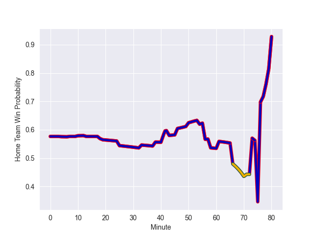

---  
layout: page  
title: Australia at France; 29.0-30.0  
date: 2022-11-05 16:00:00 18:00:00 -0500  
categories: match review  
---
# Australia (1653.08) at France (1787.08); 29.0-30.0

# Prediction: France by 20.4

France by 13.4 on a neutral field
## Scores over Time

## Win Probability over Time

# Pre-Match Prediction: France by 21.2

France by 14.2 on a neutral pitch

|   Away Minutes | Away Player     |   Away elo |   Away Percentile |   Number |   Home Percentile |   Home elo | Home Player       |   Home Minutes |
|---------------:|:----------------|-----------:|------------------:|---------:|------------------:|-----------:|:------------------|---------------:|
|             78 | James Slipper   |     134.69 |                99 |        1 |                94 |     112.58 | Cyril Baille      |             54 |
|             53 | Dave Porecki    |     122.49 |                98 |        2 |                96 |     117.5  | Julien Marchand   |             54 |
|             71 | Taniela Tupou   |     103.9  |                71 |        3 |                98 |     121.05 | Uini Atonio       |             54 |
|             80 | Nick Frost      |      90.64 |                29 |        4 |                41 |      92.34 | Cameron Woki      |             50 |
|             54 | Cadeyrn Neville |     108.96 |                88 |        5 |                96 |     120.75 | Thibaud Flament   |             80 |
|             80 | Jed Holloway    |      90.72 |                27 |        6 |                92 |     117.95 | Anthony Jelonch   |             80 |
|             71 | Michael Hooper  |     131.82 |                99 |        7 |                97 |     124.24 | Charles Ollivon   |             80 |
|             80 | Rob Valetini    |      99.17 |                62 |        8 |                97 |     130.55 | Gregory Alldritt  |             80 |
|             61 | Nic White       |     129.87 |                99 |        9 |                99 |     132.96 | Antoine Dupont    |             80 |
|             72 | Bernard Foley   |     138.39 |                99 |       10 |                92 |     118.59 | Romain Ntamack    |             58 |
|             80 | Tom Wright      |      94.74 |                47 |       11 |                91 |     113.18 | Yoram Moefana     |             80 |
|             25 | Lalakai Foketi  |      84.95 |                13 |       12 |                93 |     115.59 | Jonathan Danty    |             80 |
|             80 | Len Ikitau      |     114.41 |                92 |       13 |                98 |     126.89 | Gael Fickou       |             66 |
|             80 | Andrew Kellaway |     112.48 |                90 |       14 |                93 |     115.69 | Damian Penaud     |             80 |
|             80 | Jock Campbell   |      95.55 |                48 |       15 |                97 |     130.55 | Thomas Ramos      |             80 |
|             27 | Folau Fainga'a  |     123.98 |                98 |       16 |                94 |     114.84 | Peato Mauvaka     |             26 |
|              2 | Matt Gibbon     |     106.53 |                85 |       17 |                75 |     100.25 | Dany Priso        |             26 |
|              9 | Tom Robertson   |      99.49 |                68 |       18 |                87 |     106.97 | Sipili Falatea    |             26 |
|             26 | Will Skelton    |     111.5  |                90 |       19 |                92 |     112.3  | Romain Taofifenua |             30 |
|              9 | Pete Samu       |      94.08 |                45 |       20 |                99 |     130.08 | Matthis Lebel     |             14 |
|             19 | Jake Gordon     |      83.95 |                 9 |       21 |                86 |     109.35 | Sekou Macalou     |              0 |
|             55 | Hunter Paisami  |     112.5  |                89 |       22 |               100 |     140.49 | Maxime Lucu       |              0 |
|              8 | Reece Hodge     |     102.33 |                74 |       23 |                86 |     111.65 | Matthieu Jalibert |             22 |

