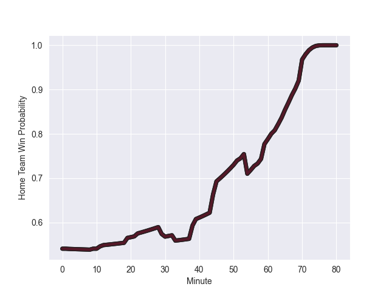

---  
layout: page  
title: Uruguay at Georgia; 18.0-34.0  
date: 2022-11-05 18:00:00 18:00:00 -0500  
categories: match review  
---
# Uruguay (1378.44) at Georgia (1449.42); 18.0-34.0

# Prediction: Georgia by 10.1

Georgia by 7.1 on a neutral field
## Scores over Time

## Win Probability over Time

# Pre-Match Prediction: Georgia by 9.4

Georgia by 6.4 on a neutral pitch

|   Away Minutes | Away Player        |   Away elo |   Away Percentile |   Number |   Home Percentile |   Home elo | Home Player           |   Home Minutes |
|---------------:|:-------------------|-----------:|------------------:|---------:|------------------:|-----------:|:----------------------|---------------:|
|             68 | Mateo Sanguinetti  |      85.77 |                12 |        1 |                73 |     101.37 | Guram Gogichashvili   |             57 |
|             62 | Guillermo Pujadas  |      95.57 |                56 |        2 |                76 |     102.13 | Shalva Mamukashvili   |             52 |
|             70 | Ignacio Peculo     |      96.37 |                52 |        3 |                 8 |      83.11 | Guram Papidze         |             45 |
|             70 | Ignacio Dotti      |      92    |                35 |        4 |               nan |      95    | Vladimeri Chachanidze |             80 |
|             80 | Manuel Leindekar   |     103.9  |                78 |        5 |                 9 |      80.78 | Kote Mikautadze       |             59 |
|             51 | Eric Dosantos      |      93.4  |                42 |        6 |                69 |     100.6  | Beka Gorgadze         |             80 |
|             80 | Santiago Civetta   |      87.74 |                19 |        7 |                37 |      92.45 | Beka Saginadze        |             80 |
|             73 | Manuel Ardao       |      86.18 |                16 |        8 |                65 |     101.01 | Tornike Jalagonia     |             70 |
|             70 | Tomas Inciarte     |      84.19 |                11 |        9 |                30 |      90.56 | Vasil Lobzhanidze     |             76 |
|             80 | Felipe Berchesi    |      89.51 |                24 |       10 |                52 |      96.72 | Tedo Abzhandadze      |             76 |
|             80 | Juan Manuel Alonso |      92.58 |               nan |       11 |                36 |      92.45 | Alexander Todua       |             65 |
|             80 | Andres Vilaseca    |      90.85 |                30 |       12 |                70 |     101.55 | Merab Sharikadze      |             80 |
|             62 | Felipe Arcos Perez |      91.15 |                32 |       13 |                85 |     108.82 | Giorgi Kveseladze     |             80 |
|             80 | Rodrigo Silva      |      91.51 |                33 |       14 |                36 |      92.45 | Aka Tabutsadze        |             80 |
|             80 | Felipe Etcheverry  |      92.79 |                40 |       15 |                50 |      95.67 | Davit Niniashvili     |             80 |
|             18 | Facundo Gattas     |     102.53 |                77 |       16 |                48 |      94.55 | Giorgi Chkoidze       |             28 |
|             12 | Matias Benitez     |      95    |               nan |       17 |                40 |      93.7  | Nika Abuladze         |             23 |
|             10 | Mathias Franco     |      95    |               nan |       18 |               nan |      97.88 | Vakh Abdaladze        |             35 |
|             10 | Diego Magno        |      91.67 |                34 |       19 |                97 |     124.84 | Nodar Cheishvili      |             21 |
|             29 | Lucas Bianchi      |      91.31 |                31 |       20 |                72 |     103.23 | Otar Giorgadze        |             10 |
|              7 | Manuel Diana       |      95    |               nan |       21 |               nan |      95    | Tengiz Peranidze      |              4 |
|             10 | Santiago Alvarez   |      94.67 |               nan |       22 |               nan |      95    | Luka Matkava          |              4 |
|             18 | Juan Zuccarino     |      95    |               nan |       23 |                63 |      98.68 | Demur Tapladze        |             15 |

