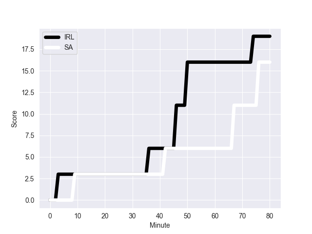
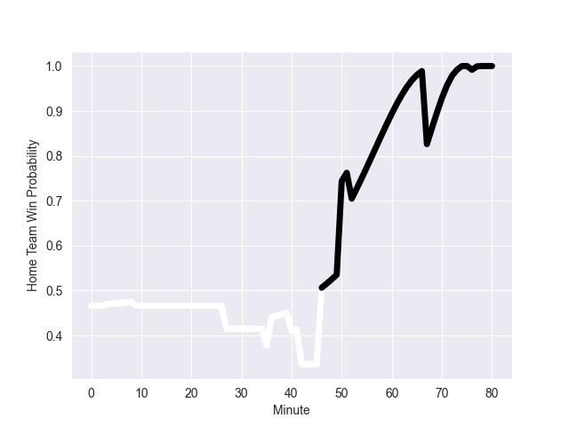

---  
layout: page  
title: SA at IRL; 16-19  
date: 2022-11-05 18:30:00 18:00:00 -0500  
categories: match review  
---
# SA (1736.32) at IRL (1677.33); 16-19

# Prediction: IRL by 1.1

SA by 5.9 on a neutral field
## Scores over Time

## Win Probability over Time

# Pre-Match Prediction: SA by 7.1

IRL by 0.1 on a neutral pitch

|   Away Minutes | Away Player          |   Away elo |   Away Percentile |   Number |   Home Percentile |   Home elo | Home Player         |   Home Minutes |
|---------------:|:---------------------|-----------:|------------------:|---------:|------------------:|-----------:|:--------------------|---------------:|
|             57 | Steven Kitshoff      |     121.99 |                98 |        1 |                82 |     104.78 | Andrew Porter       |             69 |
|             57 | Malcolm Marx         |     116.25 |                95 |        2 |                65 |      98.21 | Dan Sheehan         |             64 |
|             40 | Frans Malherbe       |     104.69 |                82 |        3 |                96 |     116.46 | Tadhg Furlong       |             40 |
|             80 | Eben Etzebeth        |     124.94 |                97 |        4 |                95 |     119.53 | Tadhg Beirne        |             64 |
|             35 | Lood de Jager        |      94.9  |                50 |        5 |                94 |     117.38 | James Ryan          |             80 |
|             80 | Siya Kolisi          |     108.9  |                87 |        6 |                 4 |      78.32 | Peter O'Mahony      |             69 |
|             80 | Pieter-Steph du Toit |      87.13 |                16 |        7 |                97 |     122.34 | Josh van der Flier  |             80 |
|             52 | Jasper Wiese         |     108.58 |                85 |        8 |                94 |     120.55 | Caelan Doris        |             80 |
|             52 | Jaden Hendrikse      |     106.4  |                82 |        9 |                98 |     127.46 | Conor Murray        |             35 |
|             80 | Damian Willemse      |     116.4  |                91 |       10 |                97 |     126.06 | Johnny Sexton       |             77 |
|             80 | Makazole Mapimpi     |     117.36 |                94 |       11 |                80 |     104.67 | Mack Hansen         |             80 |
|             80 | Damian de Allende    |     112.14 |                89 |       12 |                99 |     136.67 | Stuart McCloskey    |             27 |
|             80 | Jesse Kriel          |     123.02 |                96 |       13 |                86 |     108.07 | Garry Ringrose      |             80 |
|             53 | Kurt-Lee Arendse     |     120.03 |                95 |       14 |                68 |      99.23 | Robert Baloucoune   |             80 |
|             80 | Cheslin Kolbe        |     152.42 |               100 |       15 |                96 |     122.71 | Hugo Keenan         |             80 |
|             45 | Franco Mostert       |     125.54 |                97 |       16 |                95 |     117.4  | Jimmy O'Brien       |             53 |
|             40 | Vincent Koch         |      84.79 |                18 |       17 |                93 |     113.02 | Jamison Gibson-Park |             45 |
|             28 | Faf de Klerk         |     111.11 |                89 |       18 |                72 |      99.58 | Finlay Bealham      |             40 |
|             28 | Deon Fourie          |     141.95 |                99 |       19 |                77 |     101.93 | Rob Herring         |             16 |
|             27 | Willie le Roux       |     128.8  |                98 |       20 |                65 |      98.25 | Kieran Treadwell    |             16 |
|             23 | Ox Nche              |     108.03 |                87 |       21 |                99 |     137.77 | Jack Conan          |             11 |
|             23 | Bongi Mbonambi       |     121.78 |                97 |       22 |                91 |     108.79 | Cian Healy          |             11 |
|            nan | nan                  |     nan    |               nan |       23 |                67 |      99.2  | Joey Carbery        |              3 |

