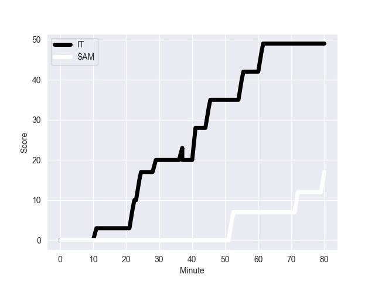

---  
layout: page  
title: SAM at IT; 17-49  
date: 2022-11-05 14:00:00 18:00:00 -0500  
categories: match review  
---
# SAM (1501.49) at IT (1571.43); 17-49

# Prediction: IT by 14.0

IT by 7.0 on a neutral field
## Scores over Time

## Win Probability over Time

# Pre-Match Prediction: IT by 14.0

IT by 7.0 on a neutral pitch

|   Away Minutes | Away Player         |   Away elo |   Away Percentile |   Number |   Home Percentile |   Home elo | Home Player        |   Home Minutes |
|---------------:|:--------------------|-----------:|------------------:|---------:|------------------:|-----------:|:-------------------|---------------:|
|             55 | Jordan Lay          |      91.07 |                27 |        1 |                63 |      98.47 | Danilo Fischetti   |             55 |
|             55 | Seilala Lam         |      79.1  |                 3 |        2 |               nan |      94.15 | Giacomo Nicotera   |             50 |
|             55 | Michael Alaalatoa   |      95.89 |                51 |        3 |                81 |     104.18 | Simone Ferrari     |             64 |
|             46 | Brian Alainu'uese   |     102.9  |                77 |        4 |                73 |     100.88 | David Sisi         |             50 |
|             80 | Chris Vui           |      99.27 |                68 |        5 |                78 |     103.22 | Federico Ruzza     |             80 |
|             80 | Theodore McFarland  |      96.27 |                54 |        6 |                29 |      90.98 | Manuel Zuliani     |             41 |
|             57 | Jordan Taufua       |     116.05 |                93 |        7 |                96 |     120.49 | Michele Lamaro     |             80 |
|             80 | Fritz Lee           |     139.68 |                99 |        8 |                87 |     110.17 | Lorenzo Cannone    |             80 |
|             52 | Ere Enari           |      90.61 |                26 |        9 |                11 |      85.31 | Stephen Varney     |             64 |
|             46 | Rod Iona            |     101.99 |                74 |       10 |                82 |     107.13 | Paolo Garbisi      |             80 |
|             80 | Nigel Ah Wong       |     106.14 |                83 |       11 |                96 |     122.56 | Monty Ioane        |             80 |
|             80 | D'Angelo Leuila     |      93.25 |                39 |       12 |                96 |     121.83 | Luca Morisi        |             50 |
|             80 | Ulupano Seuteni     |      91.45 |                31 |       13 |                85 |     107.81 | Juan Ignacio Brex  |             80 |
|             61 | Alapati Leiua       |      92.61 |                36 |       14 |                66 |      98.85 | Pierre Bruno       |             80 |
|             80 | Danny Toala         |     101.22 |                71 |       15 |                83 |     108.33 | Tommaso Allan      |             50 |
|             25 | Nephi Leatigaga     |      89.19 |                24 |       16 |                36 |      92.94 | Gianmarco Lucchesi |             30 |
|             25 | Manu Leiataua       |      89.54 |                21 |       17 |                66 |     100.3  | Ivan Nemer         |             25 |
|             25 | Jeff Toomaga-Allen  |     108.5  |                93 |       18 |                37 |      93.77 | Pietro Ceccarelli  |             16 |
|             34 | Taleni Seu          |     119.39 |                94 |       19 |                 8 |      80.92 | Niccolo Cannone    |             30 |
|             23 | Talalelei Gray      |      89.33 |                26 |       20 |                82 |     106.82 | Toa Halafihi       |             39 |
|             28 | Jonathan Taumateine |      88.28 |                22 |       21 |                54 |      96.11 | Manfredi Albanese  |             16 |
|             34 | Duncan Paia'aua     |      95.17 |                55 |       22 |                91 |     115.44 | Enrico Lucchin     |             30 |
|             19 | Tomasi Alosio       |     100.03 |                70 |       23 |                80 |     105.77 | Tommaso Menoncello |             30 |

