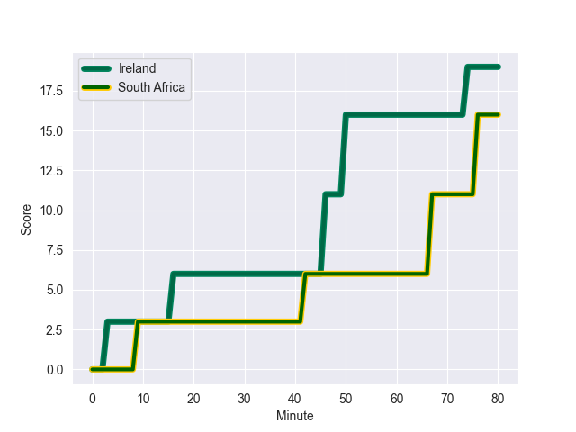
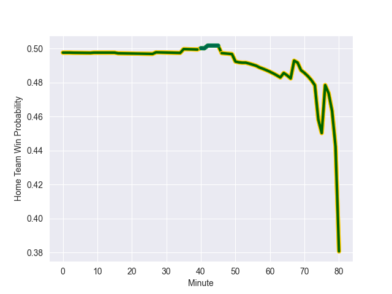

---  
layout: page  
title: South Africa at Ireland; 16.0-19.0  
date: 2022-11-05 13:30:00 18:00:00 -0500  
categories: match review  
---
# South Africa (1710.45) at Ireland (1706.35); 16.0-19.0

# Prediction: Ireland by 6.6

South Africa by 0.4 on a neutral field
## Scores over Time

## Win Probability over Time

# Pre-Match Prediction: South Africa by 10.0

Ireland by 3.0 on a neutral pitch

|   Away Minutes | Away Player          |   Away elo |   Away Percentile |   Number |   Home Percentile |   Home elo | Home Player         |   Home Minutes |
|---------------:|:---------------------|-----------:|------------------:|---------:|------------------:|-----------:|:--------------------|---------------:|
|             57 | Steven Kitshoff      |     120.32 |                98 |        1 |                89 |     106.8  | Andrew Porter       |             69 |
|             57 | Malcolm Marx         |     114.58 |                94 |        2 |                71 |     100.08 | Dan Sheehan         |             64 |
|             46 | Frans Malherbe       |     103.34 |                79 |        3 |                97 |     117.63 | Tadhg Furlong       |             40 |
|             80 | Eben Etzebeth        |     122.6  |                96 |        4 |                97 |     121.4  | Tadhg Beirne        |             64 |
|             35 | Lood de Jager        |      93.88 |                45 |        5 |                95 |     119.73 | James Ryan          |             80 |
|             80 | Siya Kolisi          |     106.55 |                84 |        6 |                 5 |      80.35 | Peter O'Mahony      |             69 |
|             64 | Pieter-Steph du Toit |      85.26 |                12 |        7 |                97 |     124.68 | Josh van der Flier  |             80 |
|             52 | Jasper Wiese         |     107.05 |                82 |        8 |                95 |     122.9  | Caelan Doris        |             80 |
|             52 | Jaden Hendrikse      |     104.88 |                80 |        9 |                98 |     128.49 | Conor Murray        |             35 |
|             80 | Damian Willemse      |     114.06 |                91 |       10 |                97 |     128.32 | Johnny Sexton       |             77 |
|             65 | Makazole Mapimpi     |     115.46 |                92 |       11 |                84 |     107.01 | Mack Hansen         |             80 |
|             80 | Damian de Allende    |     109.8  |                87 |       12 |                99 |     137.46 | Stuart McCloskey    |             27 |
|             80 | Jesse Kriel          |     120.68 |                95 |       13 |                88 |     110.41 | Garry Ringrose      |             80 |
|             68 | Kurt-Lee Arendse     |     118.04 |                95 |       14 |                73 |     101.58 | Robert Baloucoune   |             80 |
|             80 | Cheslin Kolbe        |     150.08 |                99 |       15 |                98 |     125.06 | Hugo Keenan         |             80 |
|             23 | Bongi Mbonambi       |     121.11 |                97 |       16 |                77 |     102.4  | Rob Herring         |             16 |
|             23 | Ox Nche              |     107.35 |                87 |       17 |                91 |     109.11 | Cian Healy          |             11 |
|             34 | Vincent Koch         |      83.79 |                18 |       18 |                72 |     100.76 | Finlay Bealham      |             40 |
|             45 | Franco Mostert       |     124.22 |                97 |       19 |                65 |      98.72 | Kieran Treadwell    |             16 |
|             28 | Kwagga Smith         |     107.04 |                85 |       20 |                98 |     138.09 | Jack Conan          |             11 |
|             16 | Deon Fourie          |     141.48 |                99 |       21 |                93 |     114.34 | Jamison Gibson-Park |             45 |
|             28 | Faf de Klerk         |     110.29 |                89 |       22 |                67 |      99.29 | Joey Carbery        |              3 |
|             27 | Willie le Roux       |     128.01 |                98 |       23 |                95 |     118.96 | Jimmy O'Brien       |             53 |

