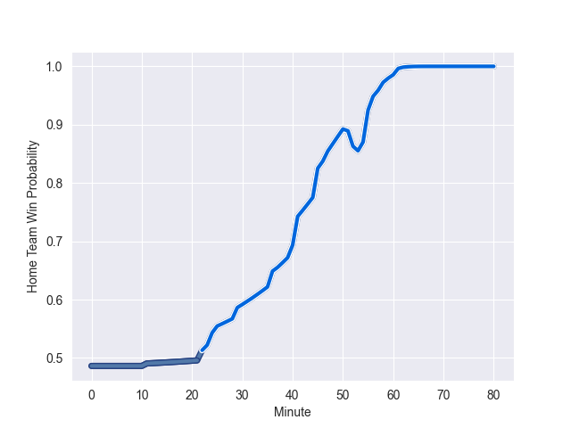

---  
layout: page  
title: Samoa at Italy; 17.0-49.0  
date: 2022-11-05 09:00:00 18:00:00 -0500  
categories: match review  
---
# Samoa (1552.24) at Italy (1528.59); 17.0-49.0

# Prediction: Italy by 4.6

Samoa by 2.4 on a neutral field
## Scores over Time

## Win Probability over Time

# Pre-Match Prediction: Samoa by 5.4

Samoa by 1.6 on a neutral pitch

|   Away Minutes | Away Player         |   Away elo |   Away Percentile |   Number |   Home Percentile |   Home elo | Home Player        |   Home Minutes |
|---------------:|:--------------------|-----------:|------------------:|---------:|------------------:|-----------:|:-------------------|---------------:|
|             56 | Jordan Lay          |      94.14 |                45 |        1 |                49 |      95.4  | Danilo Fischetti   |             56 |
|             56 | Seilala Lam         |      82.17 |                 6 |        2 |               nan |     103.53 | Giacomo Nicotera   |             51 |
|             53 | Michael Alaalatoa   |      98.79 |                64 |        3 |                72 |     100.78 | Simone Ferrari     |             62 |
|             47 | Brian Alainu'uese   |     105.47 |                83 |        4 |                62 |      98.08 | David Sisi         |             51 |
|             80 | Chris Vui           |     103.66 |                80 |        5 |                66 |      98.83 | Federico Ruzza     |             80 |
|             80 | Theo McFarland      |     106    |                84 |        6 |                21 |      88.78 | Manuel Zuliani     |             40 |
|             58 | Jordan Taufua       |     119.23 |                93 |        7 |                93 |     116.1  | Michele Lamaro     |             80 |
|             80 | Fritz Lee           |     144.07 |                99 |        8 |                80 |     105.78 | Lorenzo Cannone    |             80 |
|             53 | Ere Enari           |      93.52 |                40 |        9 |                 6 |      81.75 | Stephen Varney     |             65 |
|             47 | Rodney Iona         |      95    |               nan |       10 |                75 |     102.74 | Paolo Garbisi      |             80 |
|             80 | Nigel Ah Wong       |     110.53 |                88 |       11 |                94 |     118.17 | Monty Ioane        |             80 |
|             80 | D'Angelo Leuila     |      97.64 |                59 |       12 |                95 |     119.03 | Luca Morisi        |             51 |
|             80 | Ulupano Seuteni     |      95.83 |                50 |       13 |                76 |     103.42 | Juan Ignacio Brex  |             80 |
|             62 | Alapati Leiua       |      96.01 |                49 |       14 |                46 |      94.47 | Pierre Bruno       |             80 |
|             80 | Danny Toala         |     105.61 |                81 |       15 |                80 |     105.75 | Tommaso Allan      |             47 |
|             24 | Manu Leiataua       |      90.85 |                21 |       16 |                36 |      91.35 | Gianmarco Lucchesi |             29 |
|             24 | Nephi Leatigaga     |      90.5  |                24 |       17 |                66 |      98.99 | Ivan Nemer         |             24 |
|             27 | Jeff Toomaga-Allen  |     109.98 |                93 |       18 |                37 |      92.78 | Pietro Ceccarelli  |             18 |
|             33 | Taleni Seu          |     121.2  |                94 |       19 |                 8 |      79.33 | Niccolo Cannone    |             29 |
|             22 | Talalelei Gray      |      90.54 |                26 |       20 |                82 |     104.63 | Toa Halafihi       |             40 |
|             27 | Jonathan Taumateine |      89.77 |                22 |       21 |               nan |      95.67 | Manfredi Albanese  |             15 |
|             33 | Duncan Paia'aua     |      96.98 |                54 |       22 |                91 |     113.85 | Enrico Lucchin     |             29 |
|             18 | Tomasi Alosio       |     101.02 |                70 |       23 |                80 |     103.96 | Tommaso Menoncello |             33 |

