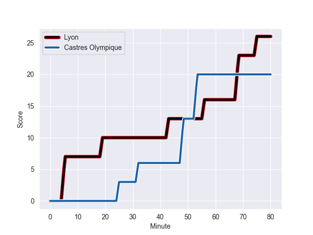
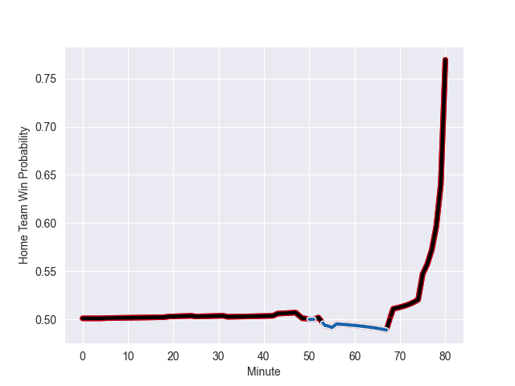

---  
layout: page  
title: Castres Olympique at Lyon; 20-26  
date: 2022-11-05 17:00:00 18:00:00 -0500  
categories: match review  
---
# Castres Olympique (1534.11) at Lyon (1541.34); 20-26

# Prediction: Lyon by 7.7

Lyon by 0.7 on a neutral field
## Scores over Time

## Win Probability over Time

# Pre-Match Prediction: Lyon by 10.1

Lyon by 3.1 on a neutral pitch

|   Away Minutes | Away Player                |   Away elo |   Away Percentile |   Number |   Home Percentile |   Home elo | Home Player                  |   Home Minutes |
|---------------:|:---------------------------|-----------:|------------------:|---------:|------------------:|-----------:|:-----------------------------|---------------:|
|             50 | Quentin Walcker            |      89.19 |                20 |        1 |                 0 |      59.87 | Jerome Rey                   |             52 |
|             80 | Gaetan Barlot              |     108.02 |                88 |        2 |                61 |      97.36 | Yanis Charcosset             |             63 |
|             63 | Wilfrid Hounkpatin         |     107.7  |                89 |        3 |                88 |     107.32 | Feao Fotuaika                |             65 |
|             50 | Ryno Pieterse              |      87.03 |                19 |        4 |                95 |     119.13 | Felix Lambey                 |             79 |
|             63 | Tom Staniforth             |     104.52 |                80 |        5 |                49 |      95.78 | Theo William                 |             80 |
|             63 | Nick Champion de Crespigny |     105.16 |                79 |        6 |                83 |     107.77 | Dylan Cretin                 |             55 |
|             80 | Baptiste Delaporte         |      95.09 |                53 |        7 |                67 |      99.84 | Mickael Guillard             |             80 |
|             80 | Tyler Ardron               |      99.02 |                62 |        8 |                89 |     110.35 | Patrick Sobela               |             80 |
|             59 | Julien Blanc               |      98.88 |                58 |        9 |                95 |     117.11 | Jean-Marc Doussain           |             58 |
|             80 | Benjamin Urdapilleta       |     123.95 |                96 |       10 |                 9 |      83.55 | Fletcher Smith               |             80 |
|             80 | Filipo Nakosi              |     111.27 |                89 |       11 |                72 |     101.07 | Ethan Dumortier              |             80 |
|             80 | Adrien Seguret             |      97.2  |                56 |       12 |                86 |     108.81 | Kyle Godwin                  |             59 |
|             67 | Antoine Zeghdar            |      89.45 |                22 |       13 |                82 |     106.2  | Thibault Regard              |             79 |
|             80 | Geoffrey Palis             |     114.47 |                91 |       14 |                99 |     137.43 | Josua Tuisova Ratulevu       |             80 |
|             80 | Julien Dumora              |      94.4  |                46 |       15 |               nan |      95    | Alexandre Tchaptchet Noutcha |             80 |
|             30 | Florent Vanverberghe       |     102.77 |                76 |       16 |                28 |      91.38 | Hamza Kaabeche               |             28 |
|             30 | Loïs Guerois               |      95    |               nan |       17 |                12 |      83.5  | Maxime Gouzou                |             25 |
|             21 | Gauthier Doubrere          |      99.53 |                69 |       18 |                81 |     105.28 | Jonathan Pelissie            |             22 |
|             17 | Leone Nakarawa             |     113.72 |                89 |       19 |                26 |      90.69 | Tavite Veredamu              |             21 |
|             17 | Levan Chilachava           |     106.74 |               nan |       20 |                89 |     109.18 | Liam Coltman                 |             17 |
|             13 | Louis Le Brun              |      89.41 |                22 |       21 |                25 |      92.8  | Paulo Tafili                 |             15 |
|             17 | Asier Usarraga             |      99.27 |                68 |       22 |                34 |      92.31 | Alfred Parisien              |              1 |
|            nan | nan                        |     nan    |               nan |       23 |               nan |      95    | Ugo Vignolles                |              1 |

