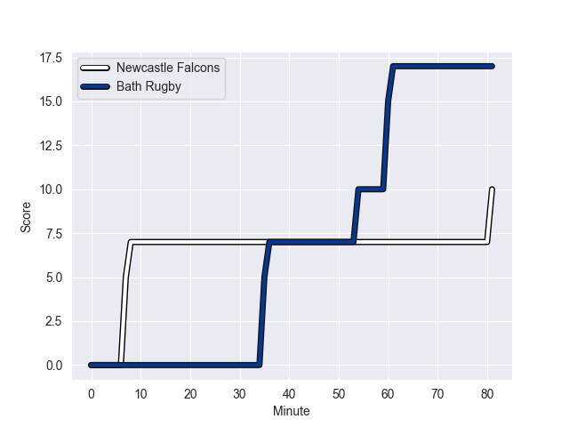
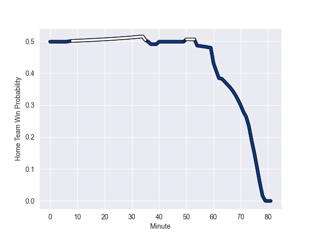

---  
layout: page  
title: Bath Rugby at Newcastle Falcons; 17.0-10.0  
date: 2022-11-05 11:00:00 18:00:00 -0500  
categories: match review  
---
# Bath Rugby (1495.73) at Newcastle Falcons (1503.5); 17.0-10.0

# Prediction: Newcastle Falcons by 3.8

Newcastle Falcons by 0.8 on a neutral field
## Scores over Time

## Win Probability over Time

# Pre-Match Prediction: Newcastle Falcons by 4.0

Newcastle Falcons by 1.0 on a neutral pitch

|   Away Minutes | Away Player           |   Away elo |   Away Percentile |   Number |   Home Percentile |   Home elo | Home Player         |   Home Minutes |
|---------------:|:----------------------|-----------:|------------------:|---------:|------------------:|-----------:|:--------------------|---------------:|
|             50 | Valery Morozov        |      86.77 |                14 |        1 |                53 |      96.57 | Adam Brocklebank    |             55 |
|             77 | Tom Dunn              |     115.46 |                94 |        2 |                54 |      96.15 | Jamie Blamire       |             55 |
|             74 | D'Arcy Rae            |      79.44 |                 6 |        3 |                74 |     102.11 | Richard Palframan   |             62 |
|             81 | Fergus Lee-Warner     |      86.08 |                10 |        4 |                58 |      97.26 | Matthew Dalton      |             37 |
|             81 | Quinn Roux            |     110.84 |                89 |        5 |                63 |      98.81 | Sebastian de Chaves |             81 |
|             81 | Ted Hill              |      92.62 |                35 |        6 |                72 |     103.15 | Freddie Lockwood    |             66 |
|             81 | Miles Reid            |     114.4  |                92 |        7 |                93 |     116    | Connor Collett      |             81 |
|             66 | Richard de Carpentier |     100.63 |                64 |        8 |                66 |      99.79 | Callum Chick        |             81 |
|             81 | Max Green             |      85.67 |                10 |        9 |                99 |     128.8  | Michael Young       |             64 |
|             50 | George Worboys        |     100.2  |                68 |       10 |                10 |      82.89 | Brett Connon        |             81 |
|             37 | Ruaridh McConnochie   |     101.26 |                71 |       11 |                64 |      99.86 | Ben Stevenson       |             81 |
|             81 | Max Ojomoh            |      90.55 |                23 |       12 |                23 |      88.86 | Pete Lucock         |             40 |
|             81 | Ollie Lawrence        |      90.21 |                27 |       13 |                13 |      84.95 | George Wacokecoke   |             50 |
|             63 | Gabriel Hamer-Webb    |     114.32 |                90 |       14 |                92 |     116.46 | Adam Radwan         |             81 |
|             81 | Matt Gallagher        |     126.45 |               nan |       15 |               nan |      95    | Elliott Obatoyinbo  |             81 |
|              4 | Niall Annett          |      90.79 |                17 |       16 |                80 |     104.24 | George McGuigan     |             26 |
|             31 | Arthur Cordwell       |      96.17 |                58 |       17 |                40 |      93.62 | Phil Brantingham    |             26 |
|              7 | Johannes Jonker       |      91.63 |               nan |       18 |                24 |      91.49 | Mark Tampin         |             19 |
|             14 | Tom Ellis             |      90.86 |                29 |       19 |               nan |      86.42 | George Merrick      |             44 |
|             15 | Josh Bayliss          |      85.41 |                13 |       20 |               nan |      96.51 | Guy Pepper          |             15 |
|             18 | Tom Carr-Smith        |      95.92 |               nan |       21 |                 2 |      75.64 | Sam Stuart          |             17 |
|             17 | Billy Searle          |      95.01 |                45 |       22 |                62 |      98.82 | Tian Schoeman       |             31 |
|             44 | Jonathan Joseph       |     114.15 |                90 |       23 |                85 |     109.9  | Tom Penny           |             41 |

