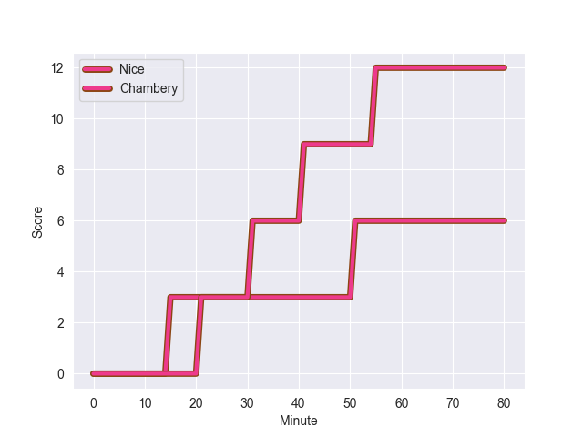
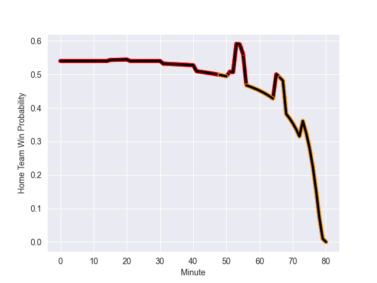

---  
layout: page  
title: Chambery at Nice; 12-6  
date: 2022-11-05 18:00:00 18:00:00 -0500  
categories: match review  
---
# Chambery (1397.24) at Nice (1466.85); 12-6

# Prediction: Nice by 10.0

Nice by 7.0 on a neutral field
## Scores over Time

## Win Probability over Time

# Pre-Match Prediction: Nice by 14.8

Nice by 11.8 on a neutral pitch

|   Away Minutes | Away Player              |   Away elo |   Away Percentile |   Number |   Home Percentile |   Home elo | Home Player           |   Home Minutes |
|---------------:|:-------------------------|-----------:|------------------:|---------:|------------------:|-----------:|:----------------------|---------------:|
|             53 | Pierre-Mathieu Fernandes |      92.95 |               nan |        1 |                85 |     105.89 | Nicolas Lemaire       |             41 |
|             53 | Julien Primault          |      94.46 |                48 |        2 |                18 |      87.7  | Badri Alkhazashvili   |             56 |
|             65 | Giorgi Pertaia           |      95.89 |                50 |        3 |                68 |     100.08 | James Johnston        |             56 |
|             53 | Fabien Witz              |      91.21 |                31 |        4 |                63 |      98.18 | Thibaud Rey           |             80 |
|             65 | Corentin Astier          |     107.95 |                84 |        5 |                81 |     105.23 | Marvin Woki           |             51 |
|             80 | Thomas Coignat           |      96.28 |                53 |        6 |                45 |      94.08 | Nicolas Tachat        |             51 |
|             80 | Colin Lebian             |      87.96 |                19 |        7 |                60 |      97.97 | Arthur Vignolles      |             56 |
|             80 | Jean-Baptiste Grenod     |     109.97 |                85 |        8 |                90 |     116.2  | Laijiasa Bolenaivalu  |             80 |
|             80 | Thibault Dufau           |      86.56 |                14 |        9 |                73 |     102.39 | Mathieu Loree         |             41 |
|             80 | Victor Pisano            |      72.82 |                 2 |       10 |                38 |      93.3  | Mathis Viard          |             80 |
|             80 | Mosese Mawalu            |     105.45 |                81 |       11 |                30 |      91.56 | Hugo Martin           |             80 |
|             80 | Vereniki Goneva          |      69.31 |                 1 |       12 |                87 |     110.35 | Julien Fritz          |             68 |
|             80 | Theo Velten              |      97.69 |                58 |       13 |                14 |      84.14 | Alban Conduche        |             80 |
|             73 | Thomas Hecquet           |      92.39 |                38 |       14 |                54 |      96.82 | Sakiusa Bureitakiyaca |             80 |
|             80 | Jules Dorrival           |      92.27 |                38 |       15 |                68 |     101.34 | Augustin Slowik       |             80 |
|             27 | Enzo Segui               |      95    |               nan |       16 |                55 |      97.27 | Nika Neparidze        |             39 |
|             27 | Gauthier Brute de Remur  |      87.26 |                17 |       17 |                15 |      86.76 | Jemal Shatirishvili   |             24 |
|             15 | Nail Audoire             |      97.03 |                47 |       18 |                14 |      86.28 | Jeronimo Negrotto     |             24 |
|             27 | Pierre-Nicolas Dance     |     113.65 |                92 |       19 |                41 |      93    | Martin Freytes        |             29 |
|             15 | Revan Gautier            |      95.58 |               nan |       20 |                81 |     107.66 | Steffon Armitage      |             29 |
|              7 | Bastien Reymond          |      96.42 |                51 |       21 |                31 |      90.67 | Paul Farret           |             24 |
|            nan | nan                      |     nan    |               nan |       22 |                34 |      91.95 | Louis Peutin          |             39 |
|            nan | nan                      |     nan    |               nan |       23 |                26 |      90.58 | Luca Cutayar          |             12 |

