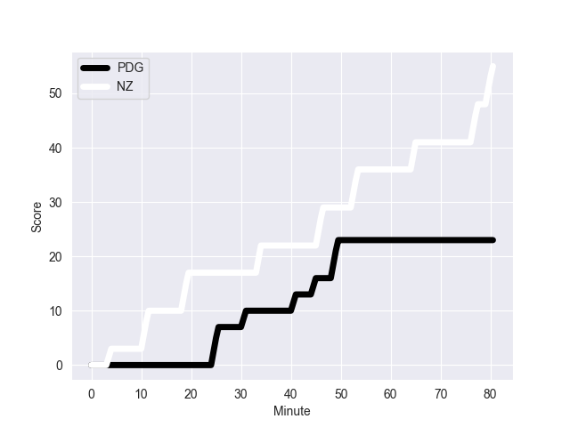
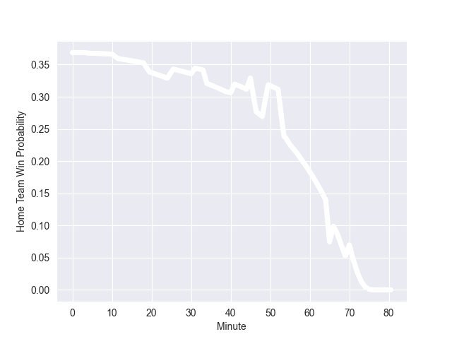

---  
layout: page  
title: NZ at PDG; 55-23  
date: 2022-11-05 16:15:00 18:00:00 -0500  
categories: match review  
---
# NZ (1775.49) at PDG (1542.01); 55-23

# Prediction: NZ by 16.3

NZ by 23.3 on a neutral field
## Scores over Time

## Win Probability over Time

# Pre-Match Prediction: NZ by 15.1

NZ by 22.1 on a neutral pitch

|   Away Minutes | Away Player         |   Away elo |   Away Percentile |   Number |   Home Percentile |   Home elo | Home Player       |   Home Minutes |
|---------------:|:--------------------|-----------:|------------------:|---------:|------------------:|-----------:|:------------------|---------------:|
|             55 | Ethan de Groot      |     110.91 |                93 |        1 |                 7 |      82.56 | Gareth Thomas     |             45 |
|             58 | Codie Taylor        |      94.21 |                47 |        2 |                51 |      95.42 | Ken Owens         |             67 |
|             58 | Tyrel Lomax         |     114.72 |                95 |        3 |                97 |     117.44 | Tomas Francis     |             40 |
|             80 | Samuel Whitelock    |     131.09 |                98 |        4 |                14 |      84.35 | Will Rowlands     |             80 |
|             70 | Scott Barrett       |     124.69 |                97 |        5 |                67 |      99.22 | Adam Beard        |             40 |
|             62 | Shannon Frizell     |     104.03 |                80 |        6 |                95 |     117.74 | Justin Tipuric    |             80 |
|             80 | Dalton Papalii      |     118.92 |                95 |        7 |                98 |     125.11 | Tommy Reffell     |             55 |
|             80 | Ardie Savea         |     125.32 |                96 |        8 |                50 |      96.05 | Taulupe Faletau   |             80 |
|             66 | Aaron Smith         |     110.51 |                88 |        9 |                92 |     112.35 | Tomos Williams    |             66 |
|             71 | Richie Mo'unga      |     129.47 |                97 |       10 |                14 |      86.03 | Rhys Priestland   |             67 |
|             80 | Caleb Clarke        |     100.42 |                71 |       11 |                 1 |      73.55 | Rio Dyer          |             80 |
|             80 | Jordie Barrett      |     137.52 |                99 |       12 |                99 |     132.82 | Nick Tompkins     |             60 |
|             80 | Rieko Ioane         |      97.66 |                58 |       13 |                98 |     128.12 | George North      |             80 |
|             58 | Sevu Reece          |     123.11 |                97 |       14 |                51 |      95.61 | Louis Rees-Zammit |             80 |
|             80 | Beauden Barrett     |     146.93 |                99 |       15 |                70 |     100.64 | Gareth Anscombe   |             80 |
|             25 | Ofa Tu'ungafasi     |     119.28 |                96 |       16 |                98 |     121.17 | Dillon Lewis      |             40 |
|             22 | Samisoni Taukei'aho |     112.51 |                92 |       17 |                90 |     109.64 | Alun Wyn Jones    |             40 |
|             22 | Fletcher Newell     |      92.45 |                17 |       18 |                48 |      92.63 | Nicky Smith       |             35 |
|             22 | Anton Lienert-Brown |     126.65 |                97 |       19 |                35 |      90.82 | Christ Tshiunza   |             25 |
|             18 | Akira Ioane         |     119.03 |                95 |       20 |                90 |     111.92 | Owen Watkin       |             20 |
|             14 | Brad Weber          |     127.62 |                98 |       21 |                75 |     101.62 | Kieran Hardy      |             14 |
|             10 | Tupou Vaa'i         |     103.87 |                78 |       22 |                88 |     106.96 | Ryan Elias        |             13 |
|              9 | David Havili        |     126.89 |                98 |       23 |                 9 |      82.75 | Sam Costelow      |             13 |

