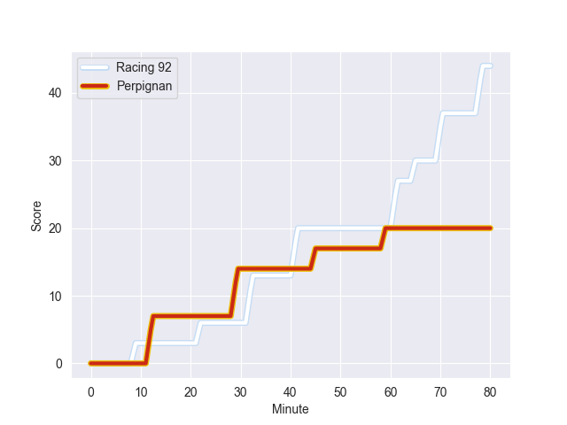
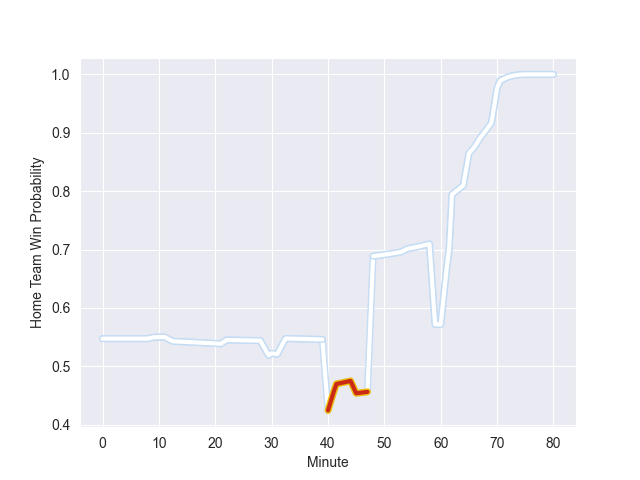

---  
layout: page  
title: Perpignan at Racing 92; 20-44  
date: 2022-11-05 17:00:00 18:00:00 -0500  
categories: match review  
---
# Perpignan (1426.47) at Racing 92 (1508.85); 20-44

# Prediction: Racing 92 by 11.2

Racing 92 by 8.2 on a neutral field
## Scores over Time

## Win Probability over Time

# Pre-Match Prediction: Racing 92 by 10.5

Racing 92 by 7.5 on a neutral pitch

|   Away Minutes | Away Player          |   Away elo |   Away Percentile |   Number |   Home Percentile |   Home elo | Home Player         |   Home Minutes |
|---------------:|:---------------------|-----------:|------------------:|---------:|------------------:|-----------:|:--------------------|---------------:|
|             40 | Giorgi Tetrashvili   |      83.25 |                 7 |        1 |                14 |      86.91 | Hassane Kolingar    |             40 |
|             54 | Victor Montgaillard  |      91.43 |                31 |        2 |                87 |     108.18 | Camille Chat        |             40 |
|             30 | Arthur Joly          |     109.98 |                91 |        3 |                37 |      94.19 | Ali Oz              |             40 |
|             80 | Tristan Labouteley   |      75.92 |                 5 |        4 |                84 |     107.82 | Boris Palu          |             80 |
|             48 | Shahn Eru            |      82.82 |               nan |        5 |                 2 |      69.08 | Fabien Sanconnie    |             59 |
|             80 | Lucas Bachelier      |     109.28 |                87 |        6 |                96 |     120.2  | Wenceslas Lauret    |             80 |
|             67 | Alan Brazo           |     110.22 |                88 |        7 |                45 |      94.06 | Baptiste Chouzenoux |             80 |
|             80 | Joaquin Oviedo       |     107.51 |                84 |        8 |                59 |      99.44 | Anthime Hemery      |             40 |
|             62 | Sadek Deghmache      |      81.09 |                 7 |        9 |                62 |      98.6  | Nolann Le Garrec    |             80 |
|             80 | Tristan Tedder       |      81.52 |                 9 |       10 |                72 |     100.49 | Antoine Gibert      |             40 |
|             80 | Edward Sawailau      |      76.23 |                 3 |       11 |                70 |     100.7  | Christian Wade      |             80 |
|             62 | George Tilsley       |     105.84 |                82 |       12 |                92 |     116.23 | Henry Chavancy      |             59 |
|             80 | Mathieu Acebes       |     141.15 |                99 |       13 |                41 |      93.21 | Francis Saili       |             80 |
|             67 | Lucas Dubois         |      94.69 |                46 |       14 |                62 |      97.94 | Louis Dupichot      |             80 |
|             80 | Boris Goutard        |      66.39 |                 1 |       15 |                78 |     105.73 | Warrick Gelant      |             40 |
|             50 | Siua Halanukonuka    |     102.91 |                76 |       16 |                98 |     123.04 | Eddy Ben Arous      |             40 |
|             40 | Sacha Lotrian        |     104.3  |                79 |       17 |                18 |      88.06 | Cedate Gomes Sa     |             40 |
|             32 | Victor Moreaux       |      85.19 |                15 |       18 |                93 |     120.26 | Finn Russell        |             40 |
|             26 | Lucas Velarte        |      90.46 |                32 |       19 |                59 |      98.39 | Maxime Baudonne     |             40 |
|             18 | Matteo Rodor         |      95.75 |                48 |       20 |                14 |      86.49 | Janick Tarrit       |             40 |
|             18 | Patricio Fernandez   |     103.99 |                76 |       21 |                56 |      97.26 | Max Spring          |             40 |
|             13 | Nino Seguela         |      97.65 |                61 |       22 |                48 |      95.41 | Olivier Klemenczak  |             21 |
|             13 | Genesis Mamea Lemalu |     104.32 |                76 |       23 |                92 |     115.84 | Anton Bresler       |             21 |

