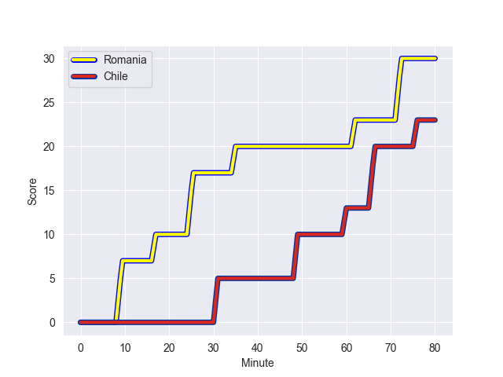
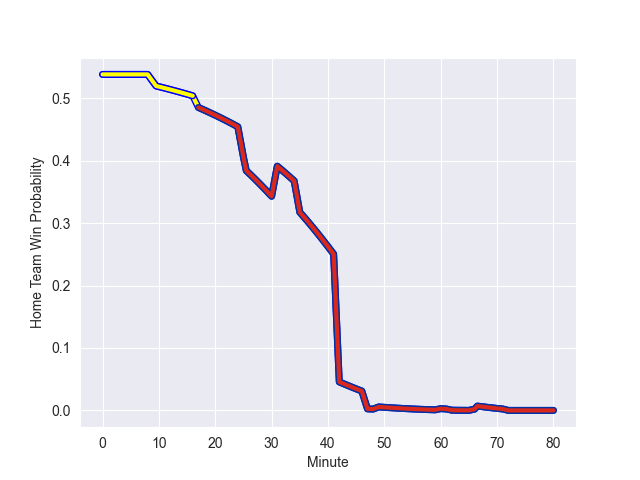

---  
layout: page  
title: Chile at Romania; 23-30  
date: 2022-11-05 12:00:00 18:00:00 -0500  
categories: match review  
---
# Chile (1406.79) at Romania (1473.69); 23-30

# Prediction: Romania by 9.7

Romania by 6.7 on a neutral field
## Scores over Time

## Win Probability over Time

# Pre-Match Prediction: Romania by 0.7

Chile by 3.7 on a neutral pitch

|   Away Minutes | Away Player                     |   Away elo |   Away Percentile |   Number |   Home Percentile |   Home elo | Home Player       |   Home Minutes |
|---------------:|:--------------------------------|-----------:|------------------:|---------:|------------------:|-----------:|:------------------|---------------:|
|             44 | Salvador Lues Soto              |     104.08 |                78 |        1 |                37 |      92.96 | Vasile Balan      |             48 |
|             44 | Tomas Dussaillant               |      95.54 |                52 |        2 |                42 |      93.46 | Tudor Butnariu    |             80 |
|             44 | Matias Dittus                   |      94.25 |                43 |        3 |                27 |      90.98 | Alex Gordas       |             48 |
|             80 | Clemente Saavedra Cartajena     |     101.71 |                66 |        4 |                70 |      97.35 | Florian Rosu      |             80 |
|             67 | Javier Eissmann                 |      88.57 |                23 |        5 |                85 |     108.12 | Johan van Heerden |             80 |
|             80 | Martin Sigren                   |      98.55 |                62 |        6 |                44 |      94.74 | Mihai Macovei     |             80 |
|             63 | Ignacio Silva Aninat            |      77.02 |                 4 |        7 |                11 |      82.64 | Cristian Chirica  |             50 |
|             42 | Alfonso Escobar Alvarez         |      94.73 |                43 |        8 |                51 |      95.75 | Damian Stratila   |             80 |
|             56 | Marcelo Torrealba               |      90.89 |                28 |        9 |                29 |      91.12 | Gabriel Rupanu    |             50 |
|             80 | Rodrigo Fernandez Grosetete     |     101.49 |               nan |       10 |                51 |      96.23 | Tudor Boldor      |             34 |
|             80 | Pablo Casas Suarez              |      96.91 |                54 |       11 |                43 |      93.85 | Atila Septar      |             80 |
|             79 | Inaki Ayarza Saporta            |      90.37 |                28 |       12 |                27 |      90.8  | Vladut Popa       |             80 |
|             80 | Matias Garafulic Schar          |      99.86 |                64 |       13 |                83 |     107.51 | Alexandru Bucur   |             80 |
|             80 | Nicolas Garafulic Schar         |      88.17 |                18 |       14 |                 2 |      70.92 | Marius Simionescu |             80 |
|             80 | Santiago Videla Cambiaso        |      93.84 |                46 |       15 |                24 |      90.31 | Hinckley Vaovasa  |             80 |
|             36 | Javier Carrasco Albornoz        |      88.63 |                20 |       16 |                57 |      97.6  | Alexandru Savin   |             32 |
|             36 | Augusto Bohme Alemparte         |      82.57 |                 7 |       17 |                21 |      89.05 | Ovidiu Cojocaru   |             32 |
|             36 | Inaki Gurruchaga                |      87.89 |                17 |       18 |                66 |      99.57 | Victor Leon       |             32 |
|             13 | Santiago Pedrero Poduje         |     103.18 |                76 |       19 |                 5 |      76.69 | Marius Iftimiciuc |             33 |
|             17 | Joaquin Milesi                  |      95.02 |                37 |       20 |                31 |      91.26 | Kamil Sobota      |             30 |
|             24 | Lukas Carvallo                  |      85.72 |                14 |       21 |                21 |      87.78 | Florin Surugiu    |             30 |
|              1 | Jose Ignacio Larenas Hitschfeld |      88.86 |                23 |       22 |                63 |     100.44 | Nicolas Onutu     |             46 |
|             38 | Raimundo Martinez Amar          |      98.61 |                56 |       23 |               nan |     nan    | nan               |            nan |

