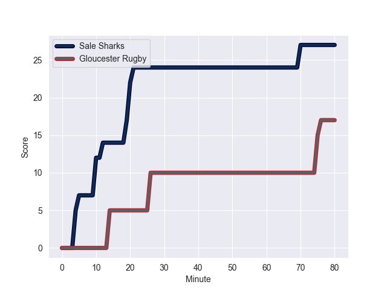
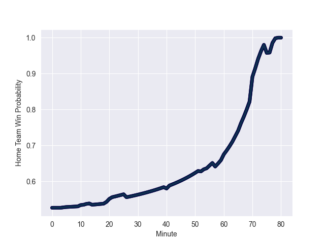

---  
layout: page  
title: Gloucester Rugby at Sale Sharks; 17.0-27.0  
date: 2022-11-05 09:00:00 18:00:00 -0500  
categories: match review  
---
# Gloucester Rugby (1554.29) at Sale Sharks (1578.37); 17.0-27.0

# Prediction: Sale Sharks by 5.4

Sale Sharks by 2.4 on a neutral field
## Scores over Time

## Win Probability over Time

# Pre-Match Prediction: Sale Sharks by 6.3

Sale Sharks by 3.3 on a neutral pitch

|   Away Minutes | Away Player       |   Away elo |   Away Percentile |   Number |   Home Percentile |   Home elo | Home Player       |   Home Minutes |
|---------------:|:------------------|-----------:|------------------:|---------:|------------------:|-----------:|:------------------|---------------:|
|             66 | Harry Elrington   |     103.52 |                78 |        1 |                97 |     121.98 | Ross Harrison     |             40 |
|             78 | Santiago Socino   |     101.26 |                73 |        2 |                54 |      96.3  | Tommy Taylor      |             80 |
|             57 | Fraser Balmain    |      84.33 |                10 |        3 |                34 |      92.39 | Nic Schonert      |             64 |
|             80 | Freddie Clarke    |     109.05 |                86 |        4 |                98 |     132.9  | Jean-Luc du Preez |             80 |
|             57 | Cameron Jordan    |     107.53 |                84 |        5 |                86 |     108.92 | Josh Beaumont     |             80 |
|             80 | Ruan Ackermann    |     123.22 |                97 |        6 |                72 |     101.81 | Jono Ross         |             72 |
|             80 | Lewis Ludlow      |     108.37 |                85 |        7 |                43 |      93.54 | Ben Curry         |             55 |
|             52 | Ben Morgan        |     107.86 |                82 |        8 |                95 |     126.07 | Daniel du Preez   |             80 |
|             54 | Charlie Chapman   |     103.34 |                75 |        9 |                43 |      94.06 | Gus Warr          |             41 |
|             80 | Lloyd Evans       |     119.5  |                94 |       10 |                12 |      83.86 | Robert du Preez   |             80 |
|             80 | Jake Morris       |      95    |               nan |       11 |                88 |     112.13 | Arron Reed        |             60 |
|             80 | Billy Twelvetrees |     112.92 |                88 |       12 |                73 |     102.38 | Sam Hill          |             80 |
|             80 | Jack Reeves       |      85.86 |                16 |       13 |                97 |     126.12 | Sam James         |             80 |
|             57 | Tom Seabrook      |      79.95 |                 5 |       14 |                53 |      96.55 | Tom Roebuck       |             80 |
|             80 | Kyle Moyle        |     101.01 |                67 |       15 |                16 |      85.47 | Joe Carpenter     |             80 |
|              2 | Henry Walker      |     101.31 |               nan |       16 |               nan |      95    | Ethan Caine       |              0 |
|             14 | Ciaran Knight     |      90    |                29 |       17 |                88 |     108.73 | Bevan Rodd        |             40 |
|             23 | Kirill Gotovtsev  |     115.21 |                94 |       18 |               nan |      98.32 | James Harper      |             16 |
|             23 | Andrew Davidson   |      94.4  |                46 |       19 |               nan |     127.83 | Dom Barrow        |              8 |
|             28 | Jordy Reid        |     108.32 |                85 |       20 |                41 |      92.89 | Sam Dugdale       |             25 |
|             26 | Ben Meehan        |     114.17 |                92 |       21 |                73 |     102.39 | Raffi Quirke      |             35 |
|              0 | George Barton     |     100.22 |                68 |       22 |               nan |      93.05 | Tom Curtis        |              4 |
|             23 | Alex Hearle       |      97.87 |                59 |       23 |                98 |     125.5  | Byron McGuigan    |             20 |

