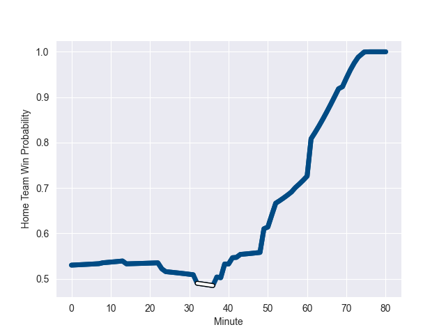

---  
layout: page  
title: Fiji at Scotland; 12.0-28.0  
date: 2022-11-05 09:00:00 18:00:00 -0500  
categories: match review  
---
# Fiji (1534.64) at Scotland (1586.95); 12.0-28.0

# Prediction: Scotland by 12.2

Scotland by 5.2 on a neutral field
## Scores over Time

## Win Probability over Time

# Pre-Match Prediction: Scotland by 11.9

Scotland by 4.9 on a neutral pitch

|   Away Minutes | Away Player        |   Away elo |   Away Percentile |   Number |   Home Percentile |   Home elo | Home Player         |   Home Minutes |
|---------------:|:-------------------|-----------:|------------------:|---------:|------------------:|-----------:|:--------------------|---------------:|
|             58 | Eroni Mawi         |      94.07 |                42 |        1 |                10 |      84.32 | Pierre Schoeman     |             52 |
|             73 | Sam Matavesi       |      99.61 |                70 |        2 |                97 |     119.48 | George Turner       |             32 |
|             51 | Manasa Saulo       |      95    |               nan |        3 |                97 |     118.39 | Zander Fagerson     |             69 |
|             55 | Temo Mayanavanua   |      96.48 |                55 |        4 |                23 |      89.04 | Richie Gray         |             80 |
|             80 | Ratu Rotuisolia    |      91.16 |                32 |        5 |                90 |     110.65 | Grant Gilchrist     |             61 |
|             73 | Albert Tuisue      |     105.68 |                80 |        6 |                94 |     117.24 | Jamie Ritchie       |             80 |
|             73 | Levani Botia       |      95    |               nan |        7 |                63 |      98.11 | Hamish Watson       |             52 |
|             80 | Viliame Mata       |      92.07 |                32 |        8 |                88 |     112.03 | Matt Fagerson       |             80 |
|             65 | Frank Lomani       |      98.37 |                64 |        9 |                71 |     100.27 | Ali Price           |             52 |
|             80 | Vilimoni Botitu    |     100.38 |                67 |       10 |                97 |     127.55 | Adam Hastings       |             43 |
|             80 | Vinaya Habosi      |      96.36 |                53 |       11 |                28 |      91.31 | Duhan van der Merwe |             80 |
|             57 | Kalaveti Ravouvou  |     104.36 |                79 |       12 |                80 |     104.83 | Cameron Redpath     |             80 |
|             80 | Waisea Nayacalevu  |      95    |               nan |       13 |                78 |     104.03 | Chris Harris        |             69 |
|             80 | Setariki Tuicuvu   |     165.27 |               100 |       14 |                94 |     118.19 | Darcy Graham        |             80 |
|             37 | Kini Murimurivalu  |     124.55 |                97 |       15 |                73 |     101.99 | Stuart Hogg         |             80 |
|              7 | Tevita Ikanivere   |      96.72 |                57 |       16 |                46 |      93.56 | Ewan Ashman         |             48 |
|             29 | Livai Natave       |      95    |               nan |       17 |                69 |      98.71 | Rory Sutherland     |             28 |
|             29 | Luke Tagi          |      93.28 |                38 |       18 |               nan |      89.33 | Murphy Walker       |             11 |
|             25 | Api Ratuniyarawa   |      96.49 |                55 |       19 |                66 |      98.84 | Jonny Gray          |             19 |
|              7 | Kitione Kamikamica |      94.18 |                41 |       20 |                 6 |      77.09 | Jack Dempsey        |             28 |
|             15 | Peni Matawalu      |      98.22 |                59 |       21 |                99 |     139.65 | Ben White           |             28 |
|             23 | Teti Tela          |     100.24 |                70 |       22 |                98 |     136.04 | Blair Kinghorn      |             37 |
|             43 | Sireli Maqala      |      95    |               nan |       23 |               nan |      78.49 | Sione Tuipulotu     |             11 |

