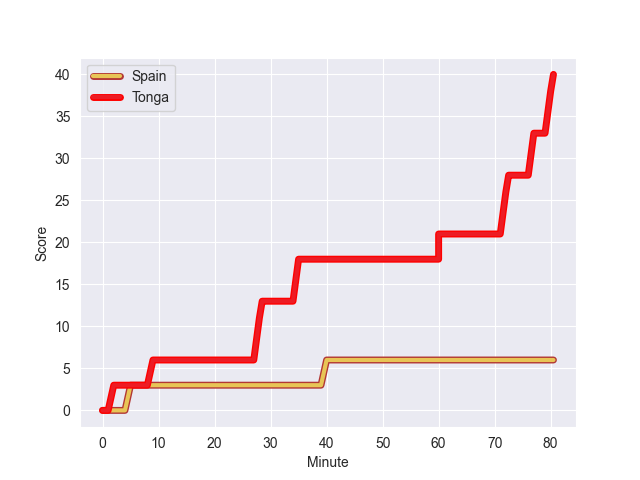
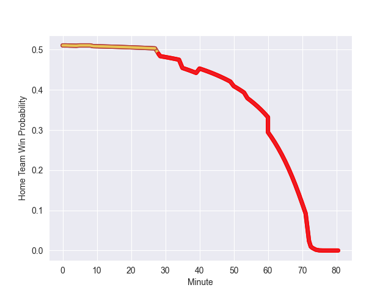

---  
layout: page  
title: Tonga at Spain; 40-6  
date: 2022-11-05 18:30:00 18:00:00 -0500  
categories: match review  
---
# Tonga (1425.61) at Spain (1444.36); 40-6

# Prediction: Spain by 4.9

Spain by 1.9 on a neutral field
## Scores over Time

## Win Probability over Time

# Pre-Match Prediction: Spain by 5.6

Spain by 2.6 on a neutral pitch

|   Away Minutes | Away Player         |   Away elo |   Away Percentile |   Number |   Home Percentile |   Home elo | Home Player               |   Home Minutes |
|---------------:|:--------------------|-----------:|------------------:|---------:|------------------:|-----------:|:--------------------------|---------------:|
|             60 | Tau Koloamatangi    |     100.38 |               nan |        1 |                10 |      84.52 | Thierry Futeu Youtcheu    |             60 |
|             72 | Samiuela Moli       |      71.75 |                 1 |        2 |                92 |     111.43 | Vicente del Hoyo Portoles |             45 |
|             60 | Ben Tameifuna       |     122.72 |                98 |        3 |                78 |     103.65 | Jon Zabala Arrieta        |             54 |
|             67 | Halavela Fifita     |      95    |               nan |        4 |                66 |      99.49 | Manuel Mora Ruiz          |             80 |
|             80 | Vaea Fifita         |     106.91 |                83 |        5 |                71 |     101.02 | Victor Sanchez Borrego    |             50 |
|             67 | Zane Kapeli         |      95.52 |                46 |        6 |                69 |     100.8  | Matthew Foulds            |             80 |
|             80 | Solomone Funaki     |      87.22 |                16 |        7 |                53 |      96.02 | Facundo Nahuel Dominguez  |             80 |
|             80 | Sione Havili        |     101.78 |                67 |        8 |                84 |     109.85 | Afa Tauli                 |             58 |
|             74 | Augustine Pulu      |      95.56 |                51 |        9 |                11 |      84.29 | Kerman Aurrekoetxea       |             72 |
|             80 | William Havili      |      92.1  |                33 |       10 |               nan |      94.2  | Gonzalo Vinuesa           |             62 |
|             68 | Solomone Kata       |      94.95 |                44 |       11 |                65 |      99.03 | Jordi Jorba Jorge         |             80 |
|             80 | George Moala        |     103.9  |                75 |       12 |                32 |      91.86 | Gonzalo Lopez Bontempo    |             80 |
|             80 | Malakai Fekitoa     |     103.96 |                75 |       13 |                34 |      91.63 | Inaki Mateu               |             80 |
|             80 | Tima Fainga'anuku   |      72.01 |                 1 |       14 |               nan |      98.04 | Guillermo Dominguez       |             54 |
|             74 | Otumaka Mausia      |      95    |               nan |       15 |                47 |      94.85 | JW Bell                   |             80 |
|              8 | Jay Fonokalafi      |      95    |               nan |       16 |                16 |      87.27 | Santiago Benjamin Ovejero |             35 |
|             20 | David Lolohea       |      70.68 |                 1 |       17 |                36 |      92.85 | Raul Calzon               |             20 |
|             20 | Phil Kite           |      93.93 |                37 |       18 |                65 |      98.26 | Bittor Aboitiz            |             26 |
|             13 | Tanginoa Halaifonua |      99.12 |                64 |       19 |                40 |      93.82 | Alejandro Suarez          |             22 |
|             13 | Steve Mafi          |      94.91 |                42 |       20 |                40 |      93.5  | Brice Ferrer              |             30 |
|              6 | Aisea Halo          |      95    |               nan |       21 |                79 |     104.73 | Nico Rocaries             |              8 |
|              6 | Afusipa Taumoepeau  |     104.44 |                77 |       22 |                71 |      99.88 | Bautista Guemes           |             18 |
|             12 | Anzelo Tuitavuki    |      80.91 |                 7 |       23 |                29 |      91.35 | Julen Goia Iriberri       |             26 |

