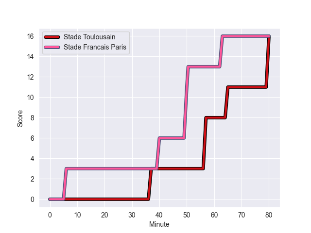
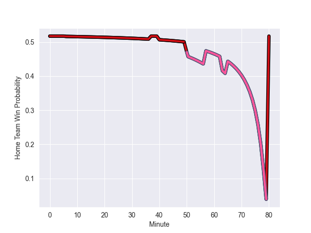

---  
layout: page  
title: Stade Francais Paris at Stade Toulousain; 16-16  
date: 2022-11-05 15:00:00 18:00:00 -0500  
categories: match review  
---
# Stade Francais Paris (1539.28) at Stade Toulousain (1569.77); 16-16

# Prediction: Stade Toulousain by 6.0

Stade Toulousain by 3.0 on a neutral field
## Scores over Time

## Win Probability over Time

# Pre-Match Prediction: Stade Toulousain by 9.7

Stade Toulousain by 6.7 on a neutral pitch

|   Away Minutes | Away Player             |   Away elo |   Away Percentile |   Number |   Home Percentile |   Home elo | Home Player          |   Home Minutes |
|---------------:|:------------------------|-----------:|------------------:|---------:|------------------:|-----------:|:---------------------|---------------:|
|             75 | Clement Castets         |     101.67 |                71 |        1 |                20 |      88.58 | Rodrigue Neti        |             61 |
|             65 | Lucas Peyresblanques    |     104.4  |                78 |        2 |                61 |      97.49 | Guillaume Cramont    |             52 |
|             80 | Giorgi Melikidze        |     103.25 |                76 |        3 |                93 |     112.25 | Dorian Aldegheri     |             52 |
|             80 | Paul Gabrillagues       |      95.95 |                54 |        4 |                15 |      84.94 | Richie Arnold        |             52 |
|             41 | Baptiste Pesenti        |      93.48 |                42 |        5 |                81 |     105.77 | Emmanuel Meafou      |             80 |
|             78 | Mathieu de Giovanni     |      90.42 |                27 |        6 |                57 |      98.9  | Theo Ntamack         |             80 |
|             80 | Romain Briatte          |      91.16 |                30 |        7 |                71 |     101.39 | Yannick Youyoutte    |             73 |
|             80 | Giovanni Habel-Kueffner |     128.28 |                96 |        8 |                97 |     129.98 | Alexandre Roumat     |             80 |
|             72 | Morgan Parra            |      85.21 |                12 |        9 |                97 |     122.65 | Paul Graou           |             52 |
|             80 | Joris Segonds           |     124.08 |                95 |       10 |                90 |     113.59 | Tim Nanai-Williams   |             52 |
|             77 | Stéphane Ahmed          |     114.17 |                91 |       11 |                78 |     103.92 | Nelson Epee          |             80 |
|             43 | Alex Arrate             |      86.88 |                18 |       12 |                80 |     106.04 | Sofiane Guitoune     |             72 |
|             80 | Jeremy Ward             |     104.26 |                76 |       13 |                62 |      99.42 | Pierre-Louis Barassi |             80 |
|             80 | Sione Tui               |      88.99 |                22 |       14 |                74 |     102.18 | Lucas Tauzin         |             80 |
|             80 | Kylan Hamdaoui          |     107.98 |                82 |       15 |                68 |     101.15 | Dimitri Delibes      |             80 |
|             39 | JJ van der Mescht       |     105.38 |                82 |       16 |                99 |     131.7  | Charlie Faumuina     |             28 |
|             37 | Julien Delbouis         |     116.48 |                92 |       17 |                82 |     106.52 | Selevasio Tolofua    |             28 |
|             15 | Laurent Panis           |      86.4  |                13 |       18 |                49 |      95.81 | Martin Page-Relo     |             28 |
|              8 | James Hall              |     121.01 |                95 |       19 |                74 |     102.88 | Arthur Retiere       |             28 |
|              5 | Vasil Kakovin           |      95.03 |                48 |       20 |                34 |      93.3  | Ian Boubila          |             28 |
|              3 | Leo Barre               |     106.26 |                79 |       21 |                43 |      98.23 | Maxime Duprat        |             19 |
|              2 | Juan Martin Scelzo      |      95    |               nan |       22 |                86 |     107.33 | Joel Merkler         |              7 |
|            nan | nan                     |     nan    |               nan |       23 |               nan |      95.53 | Paul Costes          |              8 |

