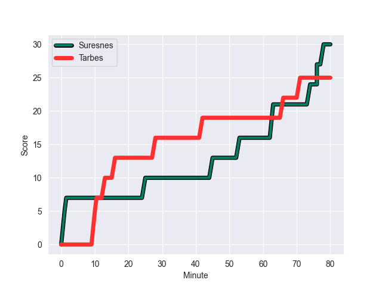
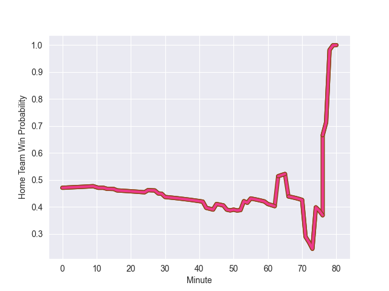

---  
layout: page  
title: Tarbes at Suresnes; 25-30  
date: 2022-11-05 18:00:00 18:00:00 -0500  
categories: match review  
---
# Tarbes (1377.88) at Suresnes (1353.1); 25-30

# Prediction: Suresnes by 0.5

Tarbes by 2.5 on a neutral field
## Scores over Time

## Win Probability over Time

# Pre-Match Prediction: Tarbes by 0.8

Tarbes by 3.8 on a neutral pitch

|   Away Minutes | Away Player               |   Away elo |   Away Percentile |   Number |   Home Percentile |   Home elo | Home Player             |   Home Minutes |
|---------------:|:--------------------------|-----------:|------------------:|---------:|------------------:|-----------:|:------------------------|---------------:|
|             52 | Antoine Palisse           |      98.01 |                61 |        1 |                29 |      91.89 | Lucas Dycke             |             60 |
|             48 | Florian Lamothe           |      88.4  |                19 |        2 |                16 |      87.26 | Thomas Bordes           |             60 |
|             48 | Aleksi Tchitchiashvili    |      94.16 |                36 |        3 |                83 |     106.03 | Leandro Mario Assi      |             60 |
|             80 | Antoine Bousquet          |      98.76 |                63 |        4 |                 4 |      75.97 | Christopher van Leeuwen |             80 |
|             48 | Jone Trevor Seuvou        |      89.48 |                25 |        5 |                73 |     101.52 | Sacha Yahi              |             54 |
|             55 | Léo Saint-Guilhem         |     100.29 |                68 |        6 |                17 |      87.53 | Louis-Mathieu Jazeix    |             50 |
|             80 | Aurelien Ricart           |     114.09 |                92 |        7 |                 3 |      76.55 | Florian Desbordes       |             80 |
|             80 | Len Massyn                |      77.91 |                 6 |        8 |                99 |     139.09 | Antonie Claassen        |             80 |
|             60 | Thibaut Dulucq            |      88.3  |                19 |        9 |                 5 |      80.03 | Enzo Barbarit           |             55 |
|             80 | Anthony Fuertes           |      79.27 |                 5 |       10 |                85 |     110.93 | Ignacio Mieres          |             80 |
|             80 | Jonathan Duffau           |     106.57 |                83 |       11 |                13 |      86.11 | Alexis Clément          |             80 |
|             80 | Josaia Vakacegu           |     103.7  |                75 |       12 |                 0 |      48.18 | Ervin Muric             |             80 |
|             30 | Johan Paulet              |      73.09 |                 1 |       13 |                16 |      85.58 | Arthur Proult           |             80 |
|             80 | Maxime Oltmann            |      70.3  |                 2 |       14 |                11 |      84.34 | Thomas Baudy            |             55 |
|             64 | Thibaut Trotta            |      93.51 |                41 |       15 |                52 |      96.22 | Goulwen Gueho           |             80 |
|             28 | Johan Mees Erasmus        |      90.23 |                24 |       16 |               nan |      95.74 | Elias Coulibaly         |             20 |
|             32 | Enzo Mondon               |      95.9  |                50 |       17 |                20 |      88.05 | Anthony Bajart          |             20 |
|             32 | Mariano Ezequiel Filomeno |      90.76 |                26 |       18 |                 4 |      78.78 | Kakhaber Koberize       |             20 |
|             32 | Jimi Maximin              |     100.82 |                71 |       19 |                45 |      94.07 | Wian Vosloo             |             26 |
|             25 | Paul Sajous               |      75.65 |                 2 |       20 |                52 |      95.86 | Théo David Nathan Tanda |             30 |
|             20 | Thomas Millet             |      74.75 |                 2 |       21 |                21 |      89.59 | Quentin Dauvergne       |             25 |
|             50 | Julien Cantan             |      88.34 |                22 |       22 |                 4 |      77.4  | Clément Amon            |             25 |
|             16 | Théo Belair               |      94.27 |               nan |       23 |               nan |     nan    | nan                     |            nan |

