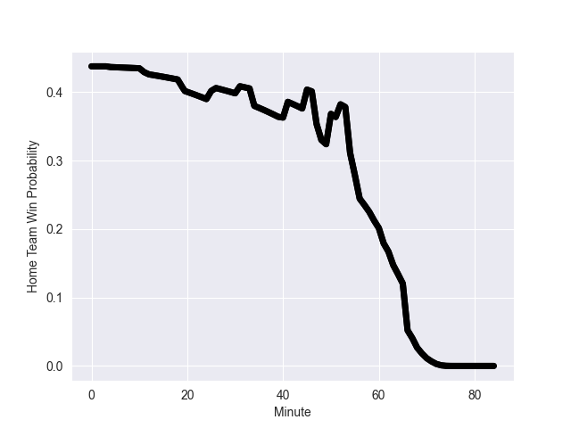

---  
layout: page  
title: New Zealand at Wales; 55.0-23.0  
date: 2022-11-05 11:15:00 18:00:00 -0500  
categories: match review  
---
# New Zealand (1694.13) at Wales (1585.25); 55.0-23.0

# Prediction: New Zealand by 3.9

New Zealand by 10.9 on a neutral field
## Scores over Time

## Win Probability over Time

# Pre-Match Prediction: New Zealand by 3.2

New Zealand by 10.2 on a neutral pitch

|   Away Minutes | Away Player         |   Away elo |   Away Percentile |   Number |   Home Percentile |   Home elo | Home Player       |   Home Minutes |
|---------------:|:--------------------|-----------:|------------------:|---------:|------------------:|-----------:|:------------------|---------------:|
|             56 | Ethan de Groot      |     108.42 |                90 |        1 |                10 |      84.56 | Gareth Thomas     |             45 |
|             59 | Codie Taylor        |      91.58 |                25 |        2 |                65 |      98.44 | Ken Owens         |             68 |
|             59 | Tyrel Lomax         |     112.09 |                93 |        3 |                97 |     119.22 | Tomas Francis     |             40 |
|             84 | Sam Whitelock       |     104.69 |                81 |        4 |                21 |      88.09 | Will Rowlands     |             84 |
|             71 | Scott Barrett       |     121.53 |                97 |        5 |                73 |     101.05 | Adam Beard        |             41 |
|             63 | Shannon Frizell     |     101.23 |                73 |        6 |                97 |     121.48 | Justin Tipuric    |             84 |
|             84 | Dalton Papali'i     |     101.65 |                72 |        7 |                98 |     127.6  | Tommy Reffell     |             56 |
|             84 | Ardie Savea         |     121.58 |                94 |        8 |                65 |      99.79 | Taulupe Faletau   |             84 |
|             68 | Aaron Smith         |     107.48 |                83 |        9 |                94 |     115.37 | Tomos Williams    |             68 |
|             71 | Richie Mo'unga      |     126.31 |                96 |       10 |                20 |      89.06 | Rhys Priestland   |             68 |
|             84 | Caleb Clarke        |      96.68 |                55 |       11 |                 3 |      77.29 | Rio Dyer          |             84 |
|             84 | Jordie Barrett      |     133.78 |                99 |       12 |                99 |     135.54 | Nick Tompkins     |             61 |
|             84 | Rieko Ioane         |      93.92 |                41 |       13 |                99 |     131.86 | George North      |             84 |
|             59 | Sevu Reece          |     120.49 |                95 |       14 |                67 |      99.35 | Louis Rees-Zammit |             84 |
|             84 | Beauden Barrett     |     143.19 |                99 |       15 |                79 |     104.39 | Gareth Anscombe   |             84 |
|             25 | Samisoni Taukei'aho |     111.39 |                92 |       16 |                88 |     107.67 | Ryan Elias        |             16 |
|             28 | Ofa Tu'ungafasi     |     118.03 |                96 |       17 |                47 |      94.37 | Nicky Smith       |             39 |
|             25 | Fletcher Newell     |      91.33 |                17 |       18 |                98 |     123.13 | Dillon Lewis      |             44 |
|             13 | Tupou Vaa'i         |     103.29 |                79 |       19 |                91 |     111.55 | Alun Wyn Jones    |             43 |
|             21 | Akira Ioane         |     118.1  |                95 |       20 |                35 |      92.06 | Christ Tshiunza   |             28 |
|             16 | Brad Weber          |     126.91 |                98 |       21 |                75 |     102.33 | Kieran Hardy      |             16 |
|             13 | David Havili        |     126.31 |                98 |       22 |                 9 |      83.47 | Sam Costelow      |             16 |
|             25 | Anton Lienert-Brown |     125.53 |                97 |       23 |                90 |     112.95 | Owen Watkin       |             23 |

