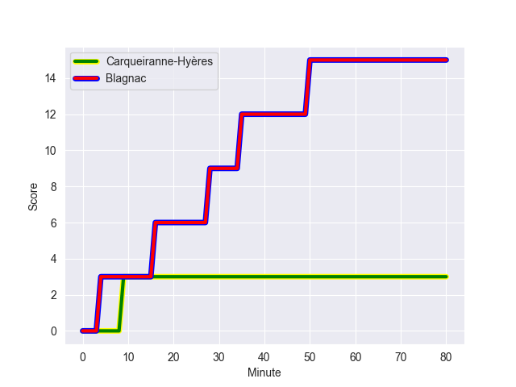
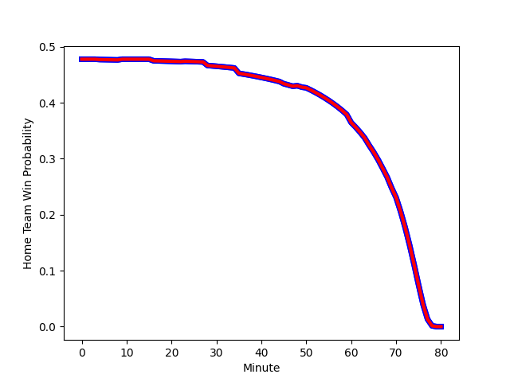

---  
layout: page  
title: Blagnac at Carqueiranne-Hyères; 15-3  
date: 2022-11-06 15:00:00 18:00:00 -0500  
categories: match review  
---
# Blagnac (1418.39) at Carqueiranne-Hyères (1379.84); 15-3

# Prediction: Blagnac by 0.9

Blagnac by 3.9 on a neutral field
## Scores over Time

## Win Probability over Time

# Pre-Match Prediction: Blagnac by 2.6

Blagnac by 5.6 on a neutral pitch

|   Away Minutes | Away Player           |   Away elo |   Away Percentile |   Number |   Home Percentile |   Home elo | Home Player            |   Home Minutes |
|---------------:|:----------------------|-----------:|------------------:|---------:|------------------:|-----------:|:-----------------------|---------------:|
|             50 | Alexis Decaux         |      98.48 |                55 |        1 |                25 |      90.36 | Liam Chad Hendricks    |             68 |
|             50 | Leeroy Cloostermans   |     103.05 |                75 |        2 |                 2 |      77.51 | Michael Tyumenev       |             60 |
|             64 | Fabien Lorenzon       |      90.58 |                25 |        3 |                29 |      92.27 | Lasha Mchelidze        |             23 |
|             50 | Nikita Bekov          |      99.67 |                67 |        4 |                 2 |      69.51 | Lucas Cazac            |             50 |
|             80 | Vincent Mutel         |      90.07 |                25 |        5 |                 1 |      68.66 | Cesar Damiani          |             80 |
|             45 | Paul Ravier           |      95.91 |                52 |        6 |                73 |     102.39 | Florian Munoz Rivero   |             80 |
|             70 | Loïc Verdy            |      98.16 |                61 |        7 |                61 |      98.11 | Joachim Beaumont       |             80 |
|             80 | Mathieu Vachon        |      94.21 |                42 |        8 |                19 |      87.25 | Geoffrey Nouhaillaguet |             50 |
|             80 | Ianis Ponsole         |     102.73 |                74 |        9 |                26 |      90.56 | Rémi Dubié             |             48 |
|             60 | Ugo Seunes            |      92.4  |                30 |       10 |               nan |      95.23 | Théo Defrance          |             80 |
|             80 | Benjamin Daurau Bedin |      77.49 |                 4 |       11 |                 9 |      82.92 | Vincent Alessi         |             80 |
|             80 | Aurelien Labau        |      87.65 |                20 |       12 |                79 |     105.67 | Romain Leveque         |             80 |
|             80 | Clément Vareilles     |      91.53 |                34 |       13 |                95 |     119.46 | Charles Brousse        |             80 |
|             50 | Guilhem Graulle       |      93.87 |                42 |       14 |                40 |      93.2  | Quentin Bourdieu       |             70 |
|             80 | Jean-Andre Vernetti   |     110.67 |                86 |       15 |                49 |      95.39 | Josselyn Bouchon       |             60 |
|             30 | Jean-Baptiste Martin  |      92.19 |                32 |       16 |                44 |      94.73 | Eli Serra-Miglietti    |             12 |
|             30 | Florian Bertrand      |      95.77 |                53 |       17 |                19 |      88.78 | Yan Tabarot            |             20 |
|             30 | Lilian Rousset        |      95.54 |                52 |       18 |                32 |      94.6  | Miguel Mathieu         |             57 |
|             35 | Mateo Ibanez          |     101.05 |                70 |       19 |                33 |      91.57 | Alexander Nowicki      |             30 |
|             10 | Lucas Tolofua         |      82.85 |                12 |       20 |               nan |      84.82 | Sven D'Hooghe          |             30 |
|             20 | Valentin Delpy        |     103.31 |                74 |       21 |                66 |      99.73 | Thomas Sonetti         |             32 |
|             30 | Francois Tardieu      |      78.69 |                 5 |       22 |               nan |      93.26 | Enzo Miot              |             10 |
|             16 | Baptiste Collet       |      96.6  |               nan |       23 |                 4 |      76.1  | David Raikuna          |             20 |

