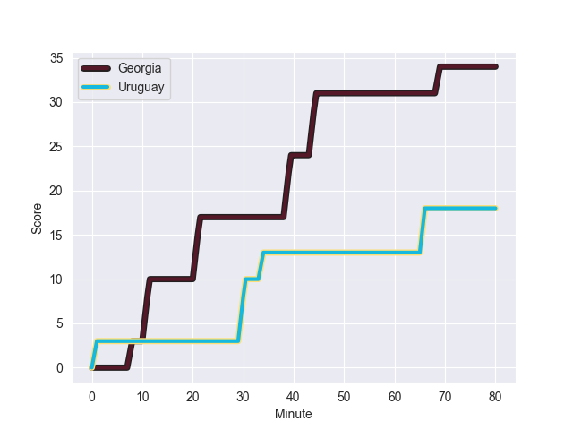
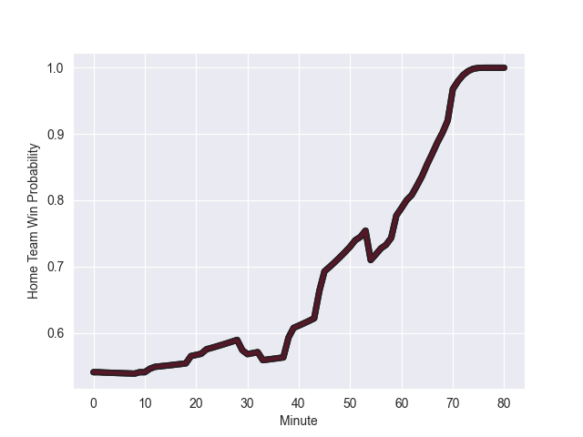

---  
layout: page  
title: Uruguay at Georgia; 18-34  
date: 2022-11-06 15:00:00 18:00:00 -0500  
categories: match review  
---
# Uruguay (1387.52) at Georgia (1478.63); 18-34

# Prediction: Georgia by 12.1

Georgia by 9.1 on a neutral field
## Scores over Time

## Win Probability over Time

# Pre-Match Prediction: Georgia by 15.8

Georgia by 12.8 on a neutral pitch

|   Away Minutes | Away Player                     |   Away elo |   Away Percentile |   Number |   Home Percentile |   Home elo | Home Player         |   Home Minutes |
|---------------:|:--------------------------------|-----------:|------------------:|---------:|------------------:|-----------:|:--------------------|---------------:|
|             67 | Mateo Sanguinetti               |      86.27 |                13 |        1 |                73 |     101.52 | Guram Gogichashvili |             57 |
|             61 | Guillermo Pujadas               |      95.54 |                56 |        2 |                75 |     102.07 | Shalva Mamukashvili |             52 |
|             69 | Ignacio Peculo                  |      96.21 |                52 |        3 |                 7 |      83.04 | Guram Papidze       |             46 |
|             80 | Ignacio Dotti                   |      92.13 |                36 |        4 |                31 |      90.93 | Lado Chachanidze    |             80 |
|             80 | Manuel Leindekar                |     103.82 |                78 |        5 |                10 |      80.7  | Kote Mikautadze     |             58 |
|             51 | Eric Dosantos                   |      93.39 |                43 |        6 |                64 |      99.33 | Beka Gorgadze       |             80 |
|             80 | Santiago Civetta                |      87.6  |                18 |        7 |                81 |     105.73 | Beka Saghinadze     |             80 |
|             72 | Diego Ardao                     |      92.47 |                36 |        8 |                62 |     100.06 | Tornike Jalagonia   |             69 |
|             69 | Tomas Inciarte Rachetti         |      85.33 |                12 |        9 |                36 |      92.5  | Vaso Lobzhanidze    |             75 |
|             80 | Felipe Berchesi Pisano          |      91.72 |                32 |       10 |                51 |      96.79 | Tedo Abzhandadze    |             75 |
|             80 | Juan Manuel Alonso Dieguez      |      91.16 |                29 |       11 |                88 |     111.34 | Sandro Todua        |             64 |
|             80 | Andres Vilaseca Hontou          |      90.18 |                27 |       12 |                70 |     101.51 | Merab Sharikadze    |             80 |
|             80 | Felipe Arcos Perez              |      91.14 |                32 |       13 |                85 |     109.1  | Giorgi Kveseladze   |             80 |
|             80 | Rodrigo Silva Pisano            |      85.5  |                13 |       14 |                58 |      97.78 | Akaki Tabutsadze    |             80 |
|             80 | Felipe Etcheverry               |      92.64 |                38 |       15 |                50 |      95.67 | Davit Niniashvili   |             80 |
|             13 | Edgardo Matias Benitez Santin   |      98.04 |                58 |       16 |                41 |      93.66 | Nika Abuladze       |             23 |
|             19 | Facundo Gattas                  |     102.65 |                76 |       17 |                48 |      94.52 | Giorgi Chkoidze     |             28 |
|             11 | Mathias Franco                  |      96.72 |                54 |       18 |               nan |      95.3  | Vakh Abdaladze      |             34 |
|             29 | Lucas Bianchi Bonfiglio         |     111.19 |                89 |       19 |                97 |     124.94 | Nodar Cheishvili    |             22 |
|              8 | Manuel Diana Olaso              |      97.77 |                54 |       20 |                74 |     103.44 | Otar Giorgadze      |             11 |
|             11 | Santiago Álvarez Viera Da Cunha |      98.2  |                59 |       21 |                62 |      99.11 | Luka Matkava        |              5 |
|            nan | nan                             |     nan    |               nan |       22 |                39 |      93.12 | Tengiz Peranidze    |              5 |
|            nan | nan                             |     nan    |               nan |       23 |                63 |      98.66 | Demur Tapladze      |             16 |

