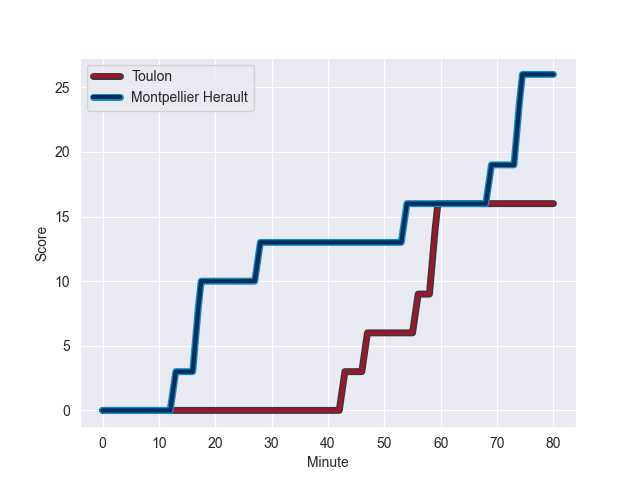
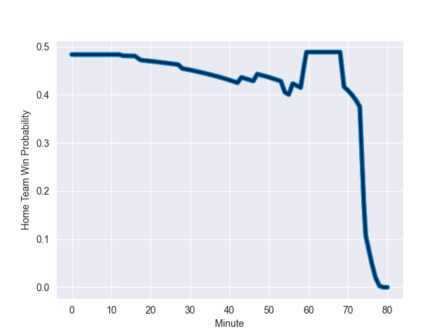

---  
layout: page  
title: Montpellier Herault at Toulon; 26-16  
date: 2022-11-06 21:05:00 18:00:00 -0500  
categories: match review  
---
# Montpellier Herault (1530.49) at Toulon (1501.84); 26-16

# Prediction: Toulon by 0.1

Montpellier Herault by 2.9 on a neutral field
## Scores over Time

## Win Probability over Time

# Pre-Match Prediction: Montpellier Herault by 2.4

Montpellier Herault by 0.6 on a neutral pitch

|   Away Minutes | Away Player              |   Away elo |   Away Percentile |   Number |   Home Percentile |   Home elo | Home Player        |   Home Minutes |
|---------------:|:-------------------------|-----------:|------------------:|---------:|------------------:|-----------:|:-------------------|---------------:|
|             59 | Enzo Forletta            |     107.34 |                86 |        1 |                18 |      87.99 | Bruce Devaux       |             54 |
|             67 | Brandon Paenga-Amosa     |      98.25 |                60 |        2 |                47 |      94.51 | Teddy Baubigny     |             54 |
|             59 | Titi Lamositele          |      91.44 |                29 |        3 |                24 |      90.3  | Kieran Brookes     |             54 |
|             80 | Yacouba Camara           |     115.63 |                93 |        4 |                27 |      90.4  | Swan Rebbadj       |             80 |
|             76 | Bastien Chalureau        |     119.43 |                95 |        5 |                96 |     120.6  | Sitaleki Timani    |             76 |
|             80 | Lenni Nouchi             |      94.44 |               nan |        6 |                58 |      97.37 | Cornell du Preez   |             76 |
|             80 | Alexandre Becognee       |      85.92 |                14 |        7 |                77 |     104.55 | Mathieu Bastareaud |             65 |
|             80 | Zach Mercer              |      99.54 |                59 |        8 |                84 |     109.74 | Sergio Parisse     |             80 |
|             69 | Aubin Eymeri             |      95    |               nan |        9 |                94 |     116.31 | Benoit Paillaugue  |             54 |
|             80 | Louis Carbonel           |     103.22 |                73 |       10 |                82 |     109    | Ihaia West         |             80 |
|             76 | Ben Lam                  |     114.14 |                90 |       11 |                30 |      91.54 | Gaël Dréan         |             80 |
|             76 | Thomas Darmon            |      85.18 |                15 |       12 |                69 |     100.88 | Mathieu Smaili     |             54 |
|             80 | Pierre Lucas             |      92.97 |                42 |       13 |                 7 |      80.15 | Jérémy Sinzelle    |             80 |
|             80 | Vincent Rattez           |     119.86 |                95 |       14 |                63 |      99.27 | Aymeric Luc        |             80 |
|             80 | Anthony Bouthier         |     111.26 |                86 |       15 |                68 |     101.92 | Thomas Salles      |             80 |
|             21 | Simon-Pierre Chauvac     |     100.85 |                68 |       16 |                83 |     103.26 | Emerick Setiano    |             26 |
|             21 | Henry Thomas             |      91.5  |                27 |       17 |                21 |      88.02 | Maëlan Rabut       |             26 |
|             13 | Curtis Langdon           |      97.19 |                58 |       18 |                86 |     107.39 | Beka Gigashvili    |             26 |
|             11 | Louis Foursans-Bourdette |      89.64 |                22 |       19 |                86 |     108.96 | Baptiste Serin     |             26 |
|              4 | Tyler Duguid             |      89.58 |                26 |       20 |                84 |     106.41 | Anthony Etrillard  |             26 |
|              4 | Masivesi Dakuwaqa        |     105.46 |                79 |       21 |                89 |     111.06 | Raphael Lakafia    |             15 |
|              4 | Julien Tisseron          |     112.77 |                90 |       22 |               nan |      92.72 | Adrien Warion      |              4 |
|            nan | nan                      |     nan    |               nan |       23 |                30 |      90.78 | Mathieu Tanguy     |              4 |

