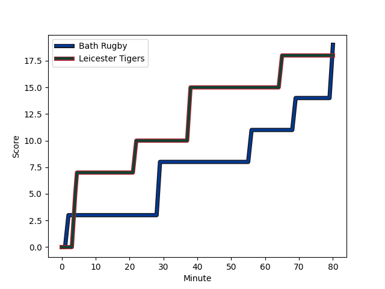
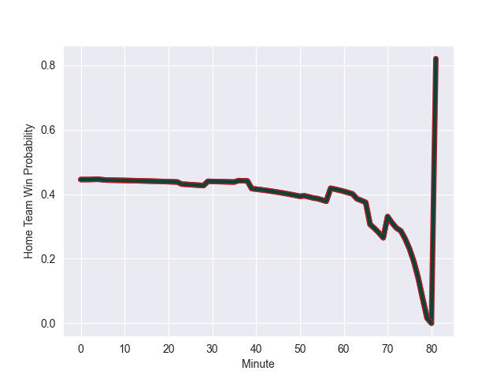

---  
layout: page  
title: Leicester Tigers at Bath Rugby; 18-19  
date: 2022-11-11 20:45:00 18:00:00 -0500  
categories: match review  
---
# Leicester Tigers (1614.09) at Bath Rugby (1514.38); 18-19

# Prediction: Leicester Tigers by 7.0

Leicester Tigers by 10.0 on a neutral field
## Scores over Time

## Win Probability over Time

# Pre-Match Prediction: Leicester Tigers by 0.3

Leicester Tigers by 2.7 on a neutral pitch

|   Away Minutes | Away Player                                                             |   Away elo |   Away Percentile |   Number |   Home Percentile |   Home elo | Home Player                                                              |   Home Minutes |
|---------------:|:------------------------------------------------------------------------|-----------:|------------------:|---------:|------------------:|-----------:|:-------------------------------------------------------------------------|---------------:|
|             57 | [James Cronin](..//playerfiles//JamesCronin_cleaned.md)                 |     108.93 |                88 |        1 |                18 |      88.07 | [Valery Morozov](..//playerfiles//ValeryMorozov_cleaned.md)              |             57 |
|             80 | [Charlie Clare](..//playerfiles//CharlieClare_cleaned.md)               |      89.63 |                23 |        2 |                19 |      91.29 | [Niall Annett](..//playerfiles//NiallAnnett_cleaned.md)                  |             57 |
|             70 | [Dan Cole](..//playerfiles//DanCole_cleaned.md)                         |     102.27 |                74 |        3 |                 7 |      82.86 | [D'Arcy Rae](..//playerfiles//D'ArcyRae_cleaned.md)                      |             36 |
|             80 | [Harry Wells](..//playerfiles//HarryWells_cleaned.md)                   |     122.29 |                96 |        4 |                31 |      90.81 | [Fergus Lee-Warner](..//playerfiles//FergusLee-Warner_cleaned.md)        |             80 |
|             50 | [Calum Green](..//playerfiles//CalumGreen_cleaned.md)                   |      97.42 |                58 |        5 |                89 |     112.21 | [Quinn Roux](..//playerfiles//QuinnRoux_cleaned.md)                      |             62 |
|             80 | [George Martin](..//playerfiles//GeorgeMartin_cleaned.md)               |     103.46 |                76 |        6 |                42 |      93.64 | [Ted Hill](..//playerfiles//TedHill_cleaned.md)                          |             80 |
|             80 | [Hanro Liebenberg](..//playerfiles//HanroLiebenberg_cleaned.md)         |     122.1  |                96 |        7 |                95 |     118.04 | [Miles Reid](..//playerfiles//MilesReid_cleaned.md)                      |             70 |
|             78 | [Olly Cracknell](..//playerfiles//OllyCracknell_cleaned.md)             |      88.37 |                22 |        8 |                64 |     101.22 | [Richard de Carpentier](..//playerfiles//RicharddeCarpentier_cleaned.md) |             56 |
|             80 | [Richard Wigglesworth](..//playerfiles//RichardWigglesworth_cleaned.md) |     116.6  |                94 |        9 |                62 |      98.69 | [Ben Spencer](..//playerfiles//BenSpencer_cleaned.md)                    |             78 |
|             80 | [Freddie Burns](..//playerfiles//FreddieBurns_cleaned.md)               |     126.02 |                95 |       10 |                22 |      88.96 | [Orlando Bailey](..//playerfiles//OrlandoBailey_cleaned.md)              |             80 |
|             72 | [Nemani Nadolo](..//playerfiles//NemaniNadolo_cleaned.md)               |     125.18 |                97 |       11 |                98 |     128.78 | [Matt Gallagher](..//playerfiles//MattGallagher_cleaned.md)              |             80 |
|             80 | [Matt Scott](..//playerfiles//MattScott_cleaned.md)                     |     100.67 |                66 |       12 |                35 |      91.79 | [Ollie Lawrence](..//playerfiles//OllieLawrence_cleaned.md)              |             80 |
|             80 | [Harry Potter](..//playerfiles//HarryPotter_cleaned.md)                 |      98.81 |                61 |       13 |                90 |     115.62 | [Jonathan Joseph](..//playerfiles//JonathanJoseph_cleaned.md)            |             80 |
|             80 | [Chris Ashton](..//playerfiles//ChrisAshton_cleaned.md)                 |     129.06 |                98 |       14 |                78 |     103.99 | [Will Butt](..//playerfiles//WillButt_cleaned.md)                        |             80 |
|             80 | [Anthony Watson](..//playerfiles//AnthonyWatson_cleaned.md)             |      92.51 |                37 |       15 |                79 |     106.83 | [James Shillcock](..//playerfiles//JamesShillcock_cleaned.md)            |             53 |
|             23 | [Francois van Wyk](..//playerfiles//FrancoisvanWyk_cleaned.md)          |     105.72 |                85 |       16 |                60 |      97.8  | [Arthur Cordwell](..//playerfiles//ArthurCordwell_cleaned.md)            |             23 |
|             10 | [Will Hurd](..//playerfiles//WillHurd_cleaned.md)                       |      91.42 |                29 |       17 |                96 |     118.08 | [Tom Dunn](..//playerfiles//TomDunn_cleaned.md)                          |             23 |
|             30 | [Eli Snyman](..//playerfiles//EliSnyman_cleaned.md)                     |      85.53 |                18 |       18 |               nan |      89.47 | [Johannes Jonker](..//playerfiles//JohannesJonker_cleaned.md)            |             44 |
|              2 | [Sean Jansen](..//playerfiles//SeanJansen_cleaned.md)                   |      94.2  |                42 |       19 |                29 |      91.66 | [Tom Ellis](..//playerfiles//TomEllis_cleaned.md)                        |             18 |
|              8 | [Charlie Atkinson](..//playerfiles//CharlieAtkinson_cleaned.md)         |      98.89 |                59 |       20 |                39 |      95.8  | [Wesley White](..//playerfiles//WesleyWhite_cleaned.md)                  |             10 |
|            nan | nan                                                                     |     nan    |               nan |       21 |                14 |      86.08 | [Josh Bayliss](..//playerfiles//JoshBayliss_cleaned.md)                  |             24 |
|            nan | nan                                                                     |     nan    |               nan |       22 |                20 |      88.99 | [Max Green](..//playerfiles//MaxGreen_cleaned.md)                        |              2 |
|            nan | nan                                                                     |     nan    |               nan |       23 |                79 |     105.78 | [Cameron Redpath](..//playerfiles//CameronRedpath_cleaned.md)            |             27 |

