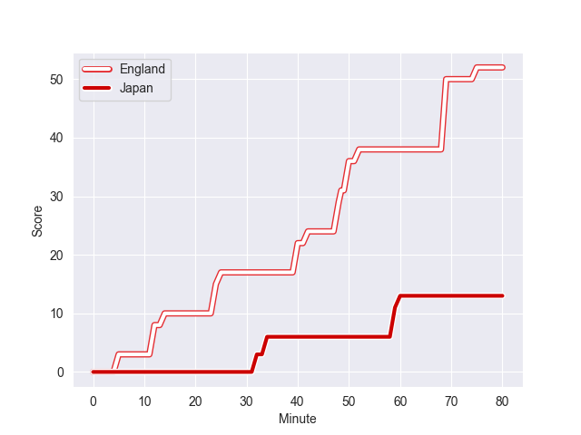
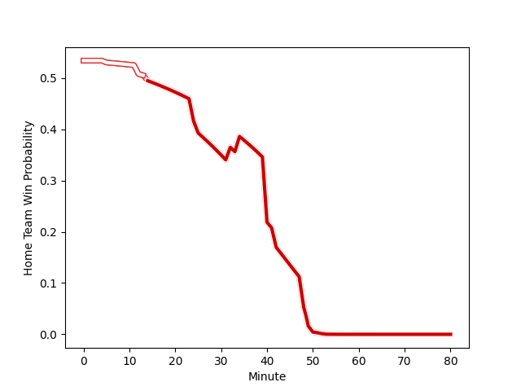

---  
layout: page  
title: Japan at England; 13.0-52.0  
date: 2022-11-11 15:15:00 18:00:00 -0500  
categories: match review  
---
# Japan (1596.31) at England (1672.15); 13.0-52.0

# Prediction: England by 10.6

England by 7.6 on a neutral field
## Scores over Time

## Win Probability over Time

# Pre-Match Prediction: England by 7.2

England by 4.2 on a neutral pitch

|   Away Minutes | Away Player            |   Away elo |   Away Percentile |   Number |   Home Percentile |   Home elo | Home Player         |   Home Minutes |
|---------------:|:-----------------------|-----------:|------------------:|---------:|------------------:|-----------:|:--------------------|---------------:|
|             49 | Keita Inagaki          |     114.98 |                94 |        1 |                85 |     107.04 | Ellis Genge         |             53 |
|             73 | Atsushi Sakate         |     102.2  |                76 |        2 |                87 |     108.56 | Luke Cowan-Dickie   |             53 |
|             73 | Jiwon Koo              |      82.8  |                 7 |        3 |                87 |     107.84 | Kyle Sinckler       |             67 |
|             80 | Warner Dearns          |      99.04 |                64 |        4 |                85 |     108.66 | David Ribbans       |             54 |
|             73 | Jack Cornelsen         |     111.47 |                89 |        5 |                41 |      93.33 | Jonny Hill          |             61 |
|             80 | Michael Leitch         |     116.99 |                94 |        6 |                95 |     117.93 | Maro Itoje          |             80 |
|             80 | Kazuki Himeno          |     103.69 |                76 |        7 |                81 |     105.71 | Tom Curry           |             80 |
|             53 | Tevita Tatafu          |     101.93 |                67 |        8 |                92 |     117.71 | Sam Simmonds        |             80 |
|             54 | Yutaka Nagare          |     111.73 |                90 |        9 |                89 |     109.24 | Jack van Poortvliet |             64 |
|             40 | Takuya Yamasawa        |     125.7  |                96 |       10 |                91 |     117.41 | Marcus Smith        |             80 |
|             49 | Gerhard van den Heever |     120.96 |                96 |       11 |                87 |     110.38 | Jonny May           |             80 |
|             80 | Ryoto Nakamura         |     112.1  |                88 |       12 |               100 |     140.01 | Owen Farrell        |             80 |
|             80 | Dylan Riley            |     116.16 |                92 |       13 |                61 |      98.63 | Guy Porter          |             64 |
|             80 | Kotaro Matsushima      |     125.75 |                97 |       14 |                67 |      99.9  | Joe Cokanasiga      |             64 |
|             80 | Ryohei Yamanaka        |      97.12 |                55 |       15 |                67 |     101.12 | Freddie Steward     |             80 |
|              7 | Kosuke Horikoshi       |     105.09 |                81 |       16 |                99 |     142.3  | Jamie George        |             27 |
|             31 | Craig Millar           |      96.68 |                58 |       17 |                99 |     135.67 | Mako Vunipola       |             27 |
|              7 | Yusuke Kizu            |     105.49 |                84 |       18 |                70 |     100.38 | Joe Heyes           |             13 |
|              7 | Wimpie van der Walt    |     102.14 |                74 |       19 |                 6 |      77.8  | Alex Coles          |             26 |
|             27 | Pieter Labuschagne     |      95    |               nan |       20 |                98 |     135.76 | Billy Vunipola      |             19 |
|             26 | Naoto Saito            |      91.11 |                34 |       21 |                90 |     111.83 | Ben Youngs          |             16 |
|             40 | Seungsin Lee           |      97.22 |                58 |       22 |                93 |     117.75 | Henry Slade         |             16 |
|             31 | Siosaia Fifita         |      76.17 |                 3 |       23 |                95 |     122.12 | Manu Tuilagi        |             16 |

