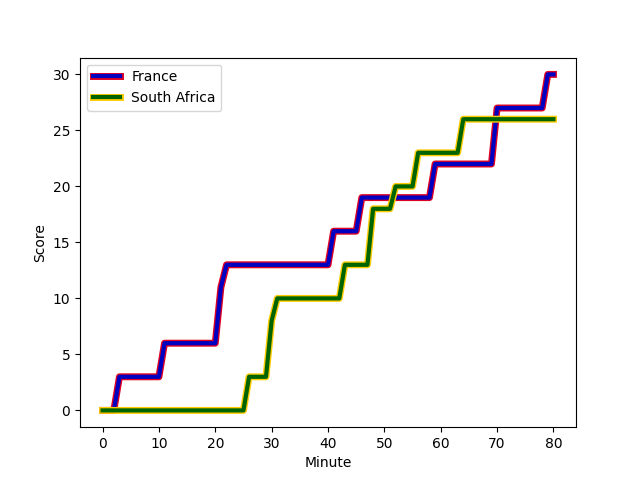
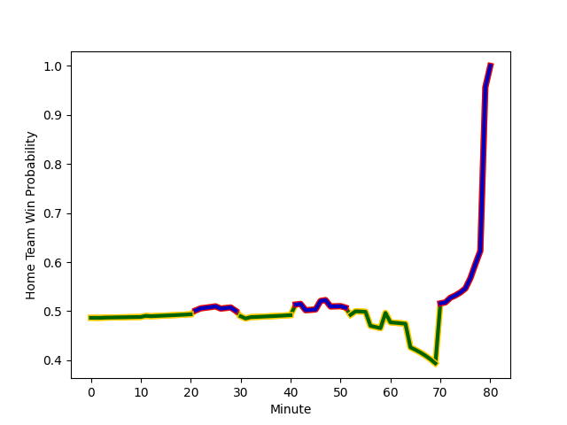

---  
layout: page  
title: South Africa at France; 26.0-30.0  
date: 2022-11-11 21:00:00 18:00:00 -0500  
categories: match review  
---
# South Africa (1746.01) at France (1722.71); 26.0-30.0

# Prediction: France by 0.7

South Africa by 2.3 on a neutral field
## Scores over Time

## Win Probability over Time

# Pre-Match Prediction: South Africa by 0.8

South Africa by 2.2 on a neutral pitch

|   Away Minutes | Away Player          |   Away elo |   Away Percentile |   Number |   Home Percentile |   Home elo | Home Player       |   Home Minutes |
|---------------:|:---------------------|-----------:|------------------:|---------:|------------------:|-----------:|:------------------|---------------:|
|             51 | Ox Nche              |     105.79 |                80 |        1 |                93 |     112.29 | Cyril Baille      |             32 |
|             39 | Bongi Mbonambi       |     115.26 |                93 |        2 |                91 |     110.84 | Julien Marchand   |             60 |
|             51 | Frans Malherbe       |     105.58 |                82 |        3 |                96 |     117.88 | Uini Atonio       |             48 |
|             80 | Eben Etzebeth        |     119.86 |                95 |        4 |                41 |      93.41 | Cameron Woki      |             77 |
|             80 | Franco Mostert       |     126.65 |                98 |        5 |                91 |     113.85 | Thibaud Flament   |             32 |
|             72 | Siya Kolisi          |     105.75 |                81 |        6 |                87 |     109.71 | Anthony Jelonch   |             80 |
|             80 | Pieter-Steph du Toit |      93.99 |                44 |        7 |                97 |     125    | Charles Ollivon   |             80 |
|             60 | Kwagga Smith         |     109.79 |                85 |        8 |                94 |     123.86 | Gregory Alldritt  |             53 |
|             60 | Faf de Klerk         |     113.46 |                91 |        9 |                99 |     126.53 | Antoine Dupont    |             80 |
|             80 | Damian Willemse      |     113.96 |                89 |       10 |                86 |     111.49 | Romain Ntamack    |             71 |
|             80 | Kurt-Lee Arendse     |     119.72 |                95 |       11 |                86 |     109.28 | Yoram Moefana     |             80 |
|             80 | Damian de Allende    |     113.8  |                90 |       12 |                88 |     112.58 | Jonathan Danty    |             12 |
|             76 | Jesse Kriel          |     128.49 |                98 |       13 |                95 |     121.05 | Gael Fickou       |             80 |
|             48 | Cheslin Kolbe        |     154.44 |                99 |       14 |                85 |     107.61 | Damian Penaud     |             80 |
|             80 | Willie le Roux       |     124.77 |                96 |       15 |                96 |     123.98 | Thomas Ramos      |             80 |
|             41 | Malcolm Marx         |     120.66 |                97 |       16 |                95 |     114.24 | Peato Mauvaka     |             20 |
|             29 | Steven Kitshoff      |     121.7  |                98 |       17 |                95 |     116.09 | Reda Wardi        |             48 |
|             29 | Vincent Koch         |      92.23 |                50 |       18 |                83 |     104.08 | Sipili Falatea    |             32 |
|              8 | Marvin Orie          |      92.31 |                36 |       19 |                94 |     115.56 | Romain Taofifenua |             48 |
|             20 | Deon Fourie          |     144.45 |                99 |       20 |                97 |     122.69 | Bastien Chalureau |              3 |
|             20 | Cobus Reinach        |     112.65 |                91 |       21 |                85 |     109.93 | Sekou Macalou     |             68 |
|              4 | Manie Libbok         |     105.85 |                77 |       22 |               100 |     142.1  | Maxime Lucu       |             27 |
|             32 | Makazole Mapimpi     |     116.95 |                93 |       23 |                84 |     108.87 | Matthieu Jalibert |              9 |

