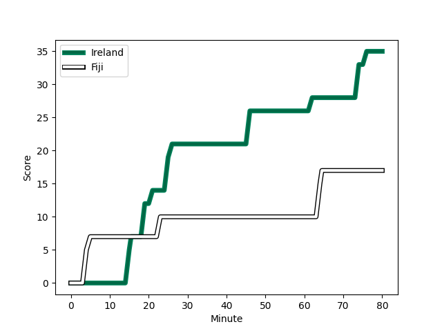

---  
layout: page  
title: Fiji at Ireland; 17.0-35.0  
date: 2022-11-11 13:00:00 18:00:00 -0500  
categories: match review  
---
# Fiji (1499.79) at Ireland (1666.84); 17.0-35.0

# Prediction: Ireland by 19.7

Ireland by 16.7 on a neutral field
## Scores over Time

## Win Probability over Time

# Pre-Match Prediction: Ireland by 21.7

Ireland by 18.7 on a neutral pitch

|   Away Minutes | Away Player                |   Away elo |   Away Percentile |   Number |   Home Percentile |   Home elo | Home Player         |   Home Minutes |
|---------------:|:---------------------------|-----------:|------------------:|---------:|------------------:|-----------:|:--------------------|---------------:|
|             59 | Eroni Mawi                 |      91.6  |                30 |        1 |                93 |     112.02 | Jeremy Loughman     |             62 |
|             76 | Sam Matavesi               |      95.14 |                50 |        2 |                83 |     105.87 | Rob Herring         |             73 |
|             63 | Manasa Saulo Romumu        |     115.55 |                95 |        3 |                94 |     115.11 | Tadhg Furlong       |             50 |
|             80 | Isoa Nasilasila            |      91.6  |                33 |        4 |                69 |      99.87 | Kieran Treadwell    |             50 |
|             24 | Ratu Rotuisolia            |      87.62 |                21 |        5 |                93 |     116.37 | Tadhg Beirne        |             80 |
|             77 | Albert Tuisue              |     101.84 |                73 |        6 |                93 |     121.96 | Caelan Doris        |             60 |
|             55 | Levani Botia               |      92.37 |                37 |        7 |                90 |     111.76 | Nick Timoney        |             80 |
|             80 | Viliame Mata               |      93.19 |                39 |        8 |                96 |     127.31 | Jack Conan          |             80 |
|             48 | Frank Lomani               |      94.89 |                48 |        9 |                95 |     116.9  | Jamison Gibson-Park |             53 |
|             44 | Teti Tela                  |      98.76 |                65 |       10 |                53 |      97.35 | Joey Carbery        |             46 |
|             80 | Vinaya Habosi              |      91.94 |                33 |       11 |                81 |     105.8  | Mack Hansen         |             80 |
|             59 | Kalaveti Ravouvou          |     100.47 |                67 |       12 |                99 |     133.25 | Stuart McCloskey    |             80 |
|             80 | Waisea Nayacalevu          |      92.11 |                37 |       13 |                98 |     128.44 | Robbie Henshaw      |              5 |
|             80 | Jiuta Wainiqolo            |      93.66 |                41 |       14 |                52 |      96.28 | Robert Baloucoune   |             80 |
|             80 | Setariki Tuicuvu           |     163.48 |               100 |       15 |                94 |     117.14 | Jimmy O'Brien       |             77 |
|              0 | Mesulame Kunavula Kunalolo |     102.34 |                73 |       16 |                62 |      98.19 | Dan Sheehan         |              7 |
|             21 | Livai Natave               |      93.95 |               nan |       17 |                95 |     115.14 | Cian Healy          |             18 |
|             20 | Lee-Roy Atalifo            |      87.9  |                20 |       18 |                54 |      97.37 | Tom O'Toole         |             30 |
|             56 | Api Ratuniyarawa           |      98.4  |                64 |       19 |                10 |      84.2  | Cian Prendergast    |             30 |
|             25 | Johnny Dyer                |      75.57 |                 4 |       20 |                88 |     114.59 | Max Deegan          |             20 |
|             32 | Simione Kuruvoli           |      91.99 |                35 |       21 |                70 |     100.82 | Craig Casey         |             30 |
|             36 | Ben Volavola               |      95.45 |                47 |       22 |                63 |      99.33 | Jack Crowley        |             34 |
|             21 | Adrea Cocagi               |     125.08 |                96 |       23 |                84 |     108.13 | Garry Ringrose      |             75 |

