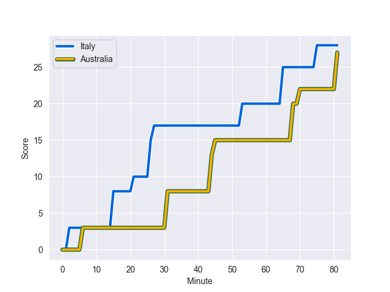
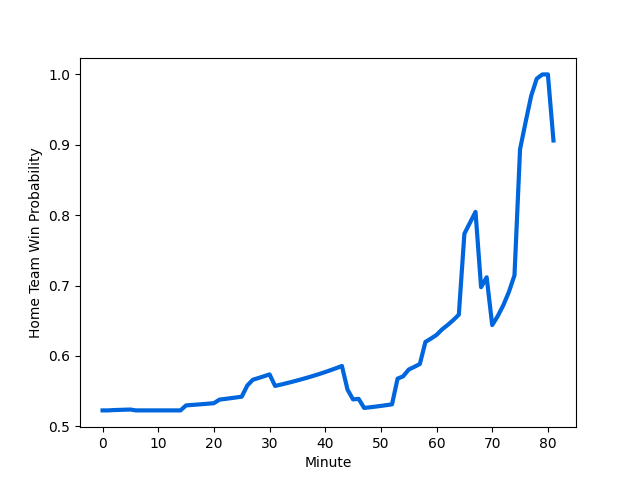

---  
layout: page  
title: Australia at Italy; 27.0-28.0  
date: 2022-11-11 14:00:00 18:00:00 -0500  
categories: match review  
---
# Australia (1516.24) at Italy (1563.28); 27.0-28.0

# Prediction: Italy by 7.7

Italy by 4.7 on a neutral field
## Scores over Time

## Win Probability over Time

# Pre-Match Prediction: Italy by 6.6

Italy by 3.6 on a neutral pitch

|   Away Minutes | Away Player                                                           |   Away elo |   Away Percentile |   Number |   Home Percentile |   Home elo | Home Player                                                         |   Home Minutes |
|---------------:|:----------------------------------------------------------------------|-----------:|------------------:|---------:|------------------:|-----------:|:--------------------------------------------------------------------|---------------:|
|             61 | [Matt Gibbon](..//playerfiles//MattGibbon_cleaned.md)                 |     100.34 |                68 |        1 |                56 |      97.42 | [Danilo Fischetti](..//playerfiles//DaniloFischetti_cleaned.md)     |             58 |
|             55 | [Folau Fainga'a](..//playerfiles//FolauFainga'a_cleaned.md)           |     130.37 |                99 |        2 |                46 |      94.74 | [Gianmarco Lucchesi](..//playerfiles//GianmarcoLucchesi_cleaned.md) |             58 |
|             61 | [Allan Alaalatoa](..//playerfiles//AllanAlaalatoa_cleaned.md)         |     111.93 |                92 |        3 |                80 |     104.94 | [Simone Ferrari](..//playerfiles//SimoneFerrari_cleaned.md)         |             47 |
|             81 | [Darcy Swain](..//playerfiles//DarcySwain_cleaned.md)                 |     104.58 |                82 |        4 |                10 |      81.96 | [Niccolo Cannone](..//playerfiles//NiccoloCannone_cleaned.md)       |             81 |
|             58 | [Will Skelton](..//playerfiles//WillSkelton_cleaned.md)               |     106.43 |                79 |        5 |                81 |     106.01 | [Federico Ruzza](..//playerfiles//FedericoRuzza_cleaned.md)         |             81 |
|             81 | [Ned Hanigan](..//playerfiles//NedHanigan_cleaned.md)                 |      96.8  |                53 |        6 |                12 |      85.31 | [Sebastian Negri](..//playerfiles//SebastianNegri_cleaned.md)       |             58 |
|             81 | [Fraser McReight](..//playerfiles//FraserMcReight_cleaned.md)         |      89.18 |                35 |        7 |                95 |     118.23 | [Michele Lamaro](..//playerfiles//MicheleLamaro_cleaned.md)         |             81 |
|             67 | [Pete Samu](..//playerfiles//PeteSamu_cleaned.md)                     |      99.03 |                62 |        8 |                87 |     112.61 | [Lorenzo Cannone](..//playerfiles//LorenzoCannone_cleaned.md)       |             81 |
|             55 | [Jake Gordon](..//playerfiles//JakeGordon_cleaned.md)                 |      91.69 |                26 |        9 |                13 |      86.28 | [Stephen Varney](..//playerfiles//StephenVarney_cleaned.md)         |             81 |
|             76 | [Noah Lolesio](..//playerfiles//NoahLolesio_cleaned.md)               |      90.67 |                26 |       10 |                81 |     108.54 | [Tommaso Allan](..//playerfiles//TommasoAllan_cleaned.md)           |             70 |
|             81 | [Tom Wright](..//playerfiles//TomWright_cleaned.md)                   |      88.78 |                20 |       11 |                96 |     121.83 | [Monty Ioane](..//playerfiles//MontyIoane_cleaned.md)               |             81 |
|             81 | [Hunter Paisami](..//playerfiles//HunterPaisami_cleaned.md)           |     103.8  |                66 |       12 |                95 |     121.1  | [Luca Morisi](..//playerfiles//LucaMorisi_cleaned.md)               |             47 |
|             81 | [Len Ikitau](..//playerfiles//LenIkitau_cleaned.md)                   |     115.03 |                90 |       13 |                83 |     108.01 | [Juan Ignacio Brex](..//playerfiles//JuanIgnacioBrex_cleaned.md)    |             81 |
|             81 | [Mark Nawaqanitawase](..//playerfiles//MarkNawaqanitawase_cleaned.md) |      94.16 |                44 |       14 |                63 |      98.68 | [Pierre Bruno](..//playerfiles//PierreBruno_cleaned.md)             |             81 |
|             67 | [Jock Campbell](..//playerfiles//JockCampbell_cleaned.md)             |      99.75 |                63 |       15 |                93 |     116.81 | [Ange Capuozzo](..//playerfiles//AngeCapuozzo_cleaned.md)           |             81 |
|             26 | [Lachlan Lonergan](..//playerfiles//LachlanLonergan_cleaned.md)       |      84.29 |                 9 |       16 |                89 |     110    | [Giacomo Nicotera](..//playerfiles//GiacomoNicotera_cleaned.md)     |             23 |
|             20 | [Tom Robertson](..//playerfiles//TomRobertson_cleaned.md)             |     105.87 |                82 |       17 |                65 |     100.58 | [Ivan Nemer](..//playerfiles//IvanNemer_cleaned.md)                 |             23 |
|             20 | [Taniela Tupou](..//playerfiles//TanielaTupou_cleaned.md)             |     114.12 |                94 |       18 |                43 |      94.88 | [Pietro Ceccarelli](..//playerfiles//PietroCeccarelli_cleaned.md)   |             34 |
|             23 | [Cadeyrn Neville](..//playerfiles//CadeyrnNeville_cleaned.md)         |     113.54 |                91 |       19 |                64 |      98.9  | [David Sisi](..//playerfiles//DavidSisi_cleaned.md)                 |             11 |
|             14 | [Langi Gleeson](..//playerfiles//LangiGleeson_cleaned.md)             |      97.03 |                59 |       20 |                85 |     110.04 | [Toa Halafihi](..//playerfiles//ToaHalafihi_cleaned.md)             |             12 |
|             26 | [Tate McDermott](..//playerfiles//TateMcDermott_cleaned.md)           |      99.82 |                67 |       21 |                72 |     101.01 | [Alessandro Garbisi](..//playerfiles//AlessandroGarbisi_cleaned.md) |              0 |
|              5 | [Ben Donaldson](..//playerfiles//BenDonaldson_cleaned.md)             |     103.23 |                69 |       22 |                79 |     107.38 | [Edoardo Padovani](..//playerfiles//EdoardoPadovani_cleaned.md)     |             11 |
|             14 | [Jordan Petaia](..//playerfiles//JordanPetaia_cleaned.md)             |     108.59 |                89 |       23 |                81 |     107.91 | [Tommaso Menoncello](..//playerfiles//TommasoMenoncello_cleaned.md) |             34 |

