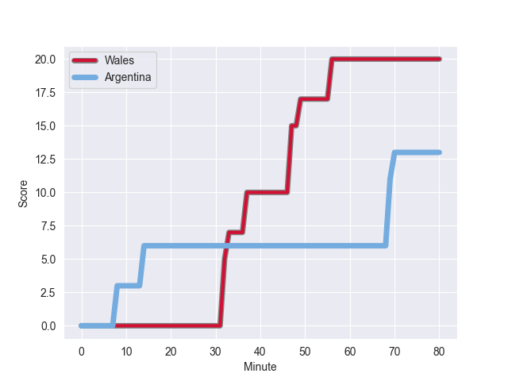
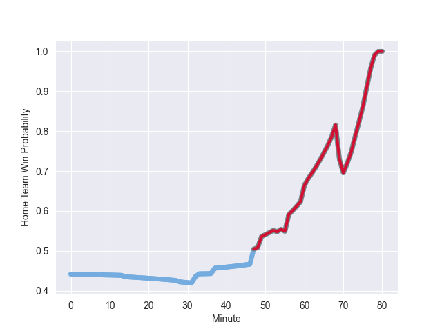

---  
layout: page  
title: Argentina at Wales; 13.0-20.0  
date: 2022-11-11 17:30:00 18:00:00 -0500  
categories: match review  
---
# Argentina (1648.74) at Wales (1549.63); 13.0-20.0

# Prediction: Argentina by 6.9

Argentina by 9.9 on a neutral field
## Scores over Time

## Win Probability over Time

# Pre-Match Prediction: Argentina by 6.4

Argentina by 9.4 on a neutral pitch

|   Away Minutes | Away Player                                                                |   Away elo |   Away Percentile |   Number |   Home Percentile |   Home elo | Home Player                                                       |   Home Minutes |
|---------------:|:---------------------------------------------------------------------------|-----------:|------------------:|---------:|------------------:|-----------:|:------------------------------------------------------------------|---------------:|
|             49 | [Thomas Gallo](..//playerfiles//ThomasGallo_cleaned.md)                    |     108.11 |                87 |        1 |                 9 |      83.84 | [Gareth Thomas](..//playerfiles//GarethThomas_cleaned.md)         |             61 |
|             49 | [Agustin Creevy](..//playerfiles//AgustinCreevy_cleaned.md)                |     108.39 |                86 |        2 |                59 |      97.13 | [Ken Owens](..//playerfiles//KenOwens_cleaned.md)                 |             80 |
|             60 | [Francisco Gomez Kodela](..//playerfiles//FranciscoGomezKodela_cleaned.md) |     116.07 |                95 |        3 |                92 |     110.38 | [Dillon Lewis](..//playerfiles//DillonLewis_cleaned.md)           |             75 |
|             80 | [Matias Alemanno](..//playerfiles//MatiasAlemanno_cleaned.md)              |     123.2  |                96 |        4 |                34 |      91.5  | [Will Rowlands](..//playerfiles//WillRowlands_cleaned.md)         |             73 |
|             55 | [Tomas Lavanini](..//playerfiles//TomasLavanini_cleaned.md)                |     114.09 |                91 |        5 |                58 |      97.25 | [Adam Beard](..//playerfiles//AdamBeard_cleaned.md)               |             70 |
|             80 | [Juan Martin Gonzalez](..//playerfiles//JuanMartinGonzalez_cleaned.md)     |     118.68 |                95 |        6 |                83 |     108.54 | [Dan Lydiate](..//playerfiles//DanLydiate_cleaned.md)             |             28 |
|             66 | [Marcos Kremer](..//playerfiles//MarcosKremer_cleaned.md)                  |      94.4  |                45 |        7 |                95 |     119.06 | [Justin Tipuric](..//playerfiles//JustinTipuric_cleaned.md)       |             80 |
|             80 | [Pablo Matera](..//playerfiles//PabloMatera_cleaned.md)                    |     120.67 |                92 |        8 |                46 |      95.69 | [Taulupe Faletau](..//playerfiles//TaulupeFaletau_cleaned.md)     |             80 |
|             66 | [Gonzalo Bertranou](..//playerfiles//GonzaloBertranou_cleaned.md)          |     102.37 |                73 |        9 |                88 |     111.22 | [Tomos Williams](..//playerfiles//TomosWilliams_cleaned.md)       |             80 |
|             68 | [Santiago Carreras](..//playerfiles//SantiagoCarreras_cleaned.md)          |     129.28 |                97 |       10 |                76 |     106.05 | [Gareth Anscombe](..//playerfiles//GarethAnscombe_cleaned.md)     |             55 |
|             80 | [Emiliano Boffelli](..//playerfiles//EmilianoBoffelli_cleaned.md)          |      93.24 |                40 |       11 |                 1 |      69.95 | [Rio Dyer](..//playerfiles//RioDyer_cleaned.md)                   |             80 |
|             80 | [Jeronimo de la Fuente](..//playerfiles//JeronimodelaFuente_cleaned.md)    |     119.43 |                94 |       12 |                98 |     129.37 | [Nick Tompkins](..//playerfiles//NickTompkins_cleaned.md)         |             53 |
|             60 | [Matias Moroni](..//playerfiles//MatiasMoroni_cleaned.md)                  |     119.46 |                94 |       13 |                98 |     129.12 | [George North](..//playerfiles//GeorgeNorth_cleaned.md)           |             80 |
|             80 | [Mateo Carreras](..//playerfiles//MateoCarreras_cleaned.md)                |      98.26 |                61 |       14 |                94 |     117.44 | [Alex Cuthbert](..//playerfiles//AlexCuthbert_cleaned.md)         |             80 |
|             80 | [Juan Cruz Mallia](..//playerfiles//JuanCruzMallia_cleaned.md)             |     103.55 |                70 |       15 |                57 |      97.33 | [Louis Rees-Zammit](..//playerfiles//LouisRees-Zammit_cleaned.md) |             80 |
|             31 | [Ignacio Ruiz](..//playerfiles//IgnacioRuiz_cleaned.md)                    |      95.18 |               nan |       16 |                89 |     108.29 | [Ryan Elias](..//playerfiles//RyanElias_cleaned.md)               |              7 |
|             31 | [Nahuel Tetaz Chaparro](..//playerfiles//NahuelTetazChaparro_cleaned.md)   |     107.73 |                87 |       17 |                31 |      92.01 | [Rhodri Jones](..//playerfiles//RhodriJones_cleaned.md)           |             19 |
|             20 | [Eduardo Bello](..//playerfiles//EduardoBello_cleaned.md)                  |      97.09 |                51 |       18 |               nan |      93.08 | [Sam Wainwright](..//playerfiles//SamWainwright_cleaned.md)       |              5 |
|             14 | [Lucas Paulos](..//playerfiles//LucasPaulos_cleaned.md)                    |     103.43 |                76 |       19 |                53 |      96.24 | [Ben Carter](..//playerfiles//BenCarter_cleaned.md)               |             10 |
|             25 | [Facundo Isa](..//playerfiles//FacundoIsa_cleaned.md)                      |     120.36 |                95 |       20 |                69 |     100.74 | [Jac Morgan](..//playerfiles//JacMorgan_cleaned.md)               |             52 |
|             14 | [Eliseo Morales](..//playerfiles//EliseoMorales_cleaned.md)                |      95    |               nan |       21 |                88 |     110.76 | [Kieran Hardy](..//playerfiles//KieranHardy_cleaned.md)           |              0 |
|             12 | [Tomas Albornoz](..//playerfiles//TomasAlbornoz_cleaned.md)                |     112.99 |                88 |       22 |                30 |      91.71 | [Rhys Priestland](..//playerfiles//RhysPriestland_cleaned.md)     |             25 |
|             20 | [Matias Orlando](..//playerfiles//MatiasOrlando_cleaned.md)                |      78.43 |                 5 |       23 |                86 |     108.97 | [Owen Watkin](..//playerfiles//OwenWatkin_cleaned.md)             |             27 |

