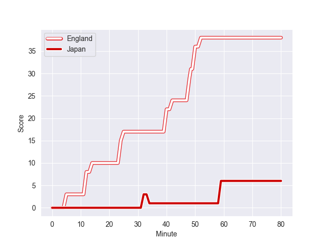

---  
layout: page  
title: Japan at England; 6.0-36.0  
date: 2022-11-12 10:15:00 18:00:00 -0500  
categories: match review  
---
# Japan (1598.7) at England (1654.57); 6.0-36.0

# Prediction: England by 8.6

England by 5.6 on a neutral field
## Scores over Time

## Win Probability over Time

# Pre-Match Prediction: England by 6.9

England by 3.9 on a neutral pitch

|   Away Minutes | Away Player            |   Away elo |   Away Percentile |   Number |   Home Percentile |   Home elo | Home Player         |   Home Minutes |
|---------------:|:-----------------------|-----------:|------------------:|---------:|------------------:|-----------:|:--------------------|---------------:|
|             49 | Keita Inagaki          |     114.58 |                94 |        1 |                85 |     107.05 | Ellis Genge         |             53 |
|             80 | Atsushi Sakate         |     101.84 |                75 |        2 |                87 |     108.53 | Luke Cowan-Dickie   |             53 |
|             80 | Jiwon Koo              |      88.24 |                18 |        3 |                87 |     107.85 | Kyle Sinckler       |             80 |
|             80 | Warner Dearns          |      99    |                64 |        4 |                85 |     108.66 | David Ribbans       |             54 |
|             80 | Jack Cornelsen         |     111.58 |                89 |        5 |                42 |      93.35 | Jonny Hill          |             80 |
|             80 | Michael Leitch         |     116.79 |                94 |        6 |                95 |     117.93 | Maro Itoje          |             80 |
|             80 | Kazuki Himeno          |     103.37 |                76 |        7 |                81 |     105.69 | Tom Curry           |             80 |
|             53 | Tevita Tatafu          |     102.06 |                67 |        8 |                92 |     117.72 | Sam Simmonds        |             80 |
|             54 | Yutaka Nagare          |     111.65 |                90 |        9 |                89 |     109.25 | Jack van Poortvliet |             80 |
|             40 | Takuya Yamasawa        |     125.67 |                96 |       10 |                91 |     117.42 | Marcus Smith        |             80 |
|             49 | Gerhard van den Heever |     121    |                96 |       11 |                87 |     110.4  | Jonny May           |             80 |
|             80 | Ryoto Nakamura         |     111.75 |                87 |       12 |               100 |     140.02 | Owen Farrell        |             80 |
|             80 | Dylan Riley            |     116.17 |                92 |       13 |                60 |      98.62 | Guy Porter          |             80 |
|             80 | Kotaro Matsushima      |     125.63 |                97 |       14 |                67 |      99.91 | Joe Cokanasiga      |             80 |
|             80 | Ryohei Yamanaka        |      96.94 |                55 |       15 |                67 |     101.15 | Freddie Steward     |             80 |
|              0 | Kosuke Horikoshi       |     105.16 |                81 |       16 |                99 |     142.33 | Jamie George        |             27 |
|             31 | Craig Millar           |      96.79 |                58 |       17 |                99 |     135.61 | Mako Vunipola       |             27 |
|              0 | Yusuke Kizu            |     105.53 |                84 |       18 |                70 |     100.38 | Joe Heyes           |              0 |
|              0 | Wimpie van der Walt    |     101.77 |                74 |       19 |                 6 |      77.8  | Alex Coles          |             26 |
|             27 | Pieter Labuschagne     |      95    |               nan |       20 |                98 |     135.73 | Billy Vunipola      |              0 |
|             26 | Naoto Saito            |      91.27 |                34 |       21 |                90 |     111.84 | Ben Youngs          |              0 |
|             40 | Seungsin Lee           |      97.12 |                58 |       22 |                93 |     117.77 | Henry Slade         |              0 |
|             31 | Siosaia Fifita         |      76.11 |                 3 |       23 |                95 |     122.13 | Manu Tuilagi        |              0 |

