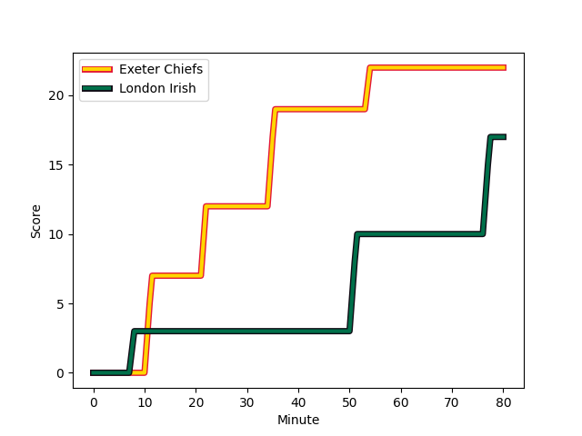
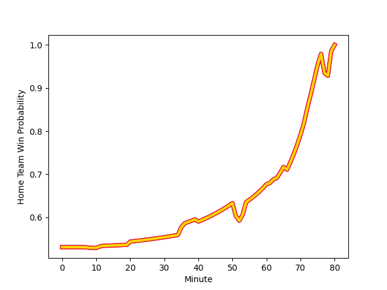

---  
layout: page  
title: London Irish at Exeter Chiefs; 17-22  
date: 2022-11-12 18:00:00 18:00:00 -0500  
categories: match review  
---
# London Irish (1517.8) at Exeter Chiefs (1573.42); 17-22

# Prediction: Exeter Chiefs by 8.6

Exeter Chiefs by 5.6 on a neutral field
## Scores over Time

## Win Probability over Time

# Pre-Match Prediction: Exeter Chiefs by 4.5

Exeter Chiefs by 1.5 on a neutral pitch

|   Away Minutes | Away Player                                                                       |   Away elo |   Away Percentile |   Number |   Home Percentile |   Home elo | Home Player                                                             |   Home Minutes |
|---------------:|:----------------------------------------------------------------------------------|-----------:|------------------:|---------:|------------------:|-----------:|:------------------------------------------------------------------------|---------------:|
|             63 | [Will Goodrick-Clarke](..//playerfiles//WillGoodrick-Clarke_cleaned.md)           |     100.42 |                69 |        1 |                69 |     100.57 | [Alec Hepburn](..//playerfiles//AlecHepburn_cleaned.md)                 |             52 |
|             75 | [Mike Willemse](..//playerfiles//MikeWillemse_cleaned.md)                         |      99.04 |                66 |        2 |                42 |      94.4  | [Jack Innard](..//playerfiles//JackInnard_cleaned.md)                   |             52 |
|             63 | [Lovejoy Chawatama](..//playerfiles//LovejoyChawatama_cleaned.md)                 |      89.19 |                21 |        3 |                95 |     116    | [Harry Williams](..//playerfiles//HarryWilliams_cleaned.md)             |             65 |
|             80 | [Chunya Munga](..//playerfiles//ChunyaMunga_cleaned.md)                           |      92.27 |                36 |        4 |                77 |     104.47 | [Dafydd Jenkins](..//playerfiles//DafyddJenkins_cleaned.md)             |             80 |
|             80 | [Rob Simmons](..//playerfiles//RobSimmons_cleaned.md)                             |     121.91 |                96 |        5 |                91 |     114.31 | [Ruben van Heerden](..//playerfiles//RubenvanHeerden_cleaned.md)        |             60 |
|             41 | [Jack Cooke](..//playerfiles//JackCooke_cleaned.md)                               |      90.03 |               nan |        6 |                98 |     130.66 | [Dave Ewers](..//playerfiles//DaveEwers_cleaned.md)                     |             66 |
|             80 | [Josh Basham](..//playerfiles//JoshBasham_cleaned.md)                             |      95.97 |                52 |        7 |                36 |      92.25 | [Lewis Pearson](..//playerfiles//LewisPearson_cleaned.md)               |             80 |
|             75 | [So'otala Fa'aso'o](..//playerfiles//So'otalaFa'aso'o_cleaned.md)                 |     115.33 |                89 |        8 |                85 |     110.96 | [Jacques Vermeulen](..//playerfiles//JacquesVermeulen_cleaned.md)       |             80 |
|             63 | [Joe Powell](..//playerfiles//JoePowell_cleaned.md)                               |      93.09 |                29 |        9 |                36 |      92.62 | [Jack Maunder](..//playerfiles//JackMaunder_cleaned.md)                 |             61 |
|             80 | [Paddy Jackson](..//playerfiles//PaddyJackson_cleaned.md)                         |     107.16 |                80 |       10 |                92 |     120.59 | [Joe Simmonds](..//playerfiles//JoeSimmonds_cleaned.md)                 |             80 |
|             80 | [Ollie Hassell-Collins](..//playerfiles//OllieHassell-Collins_cleaned.md)         |      89.1  |                21 |       11 |                96 |     121.45 | [Olly Woodburn](..//playerfiles//OllyWoodburn_cleaned.md)               |             80 |
|             80 | [Benhard Janse van Rensburg](..//playerfiles//BenhardJansevanRensburg_cleaned.md) |      90.04 |                27 |       12 |               nan |      95.66 | [Sean O'Brien](..//playerfiles//SeanO'Brien_cleaned.md)                 |             80 |
|             48 | [James Stokes](..//playerfiles//JamesStokes_cleaned.md)                           |      93.26 |                30 |       13 |                73 |     102.71 | [Rory O'Loughlin](..//playerfiles//RoryO'Loughlin_cleaned.md)           |             80 |
|             80 | [Ben Loader](..//playerfiles//BenLoader_cleaned.md)                               |     103.07 |                76 |       14 |                41 |      93.41 | [Dan John](..//playerfiles//DanJohn_cleaned.md)                         |             80 |
|             73 | [Tom Parton](..//playerfiles//TomParton_cleaned.md)                               |     125.88 |                97 |       15 |                30 |      90.75 | [Josh Hodge](..//playerfiles//JoshHodge_cleaned.md)                     |             80 |
|             17 | [Facundo Gigena](..//playerfiles//FacundoGigena_cleaned.md)                       |      90.44 |                22 |       16 |                31 |      92    | [Scott Sio](..//playerfiles//ScottSio_cleaned.md)                       |             28 |
|              5 | [Isaac Miller](..//playerfiles//IsaacMiller_cleaned.md)                           |      91.49 |                36 |       17 |                76 |     105.61 | [Patrick Schickerling](..//playerfiles//PatrickSchickerling_cleaned.md) |             15 |
|             17 | [Oli Hoskins](..//playerfiles//OliHoskins_cleaned.md)                             |     114.9  |                95 |       18 |                98 |     125.17 | [Dan Frost](..//playerfiles//DanFrost_cleaned.md)                       |             28 |
|             39 | [Tom Pearson](..//playerfiles//TomPearson_cleaned.md)                             |     110.87 |                89 |       19 |                65 |      99.06 | [Jack Dunne](..//playerfiles//JackDunne_cleaned.md)                     |             20 |
|              5 | [Josh Caulfield](..//playerfiles//JoshCaulfield_cleaned.md)                       |     109.7  |                87 |       20 |                13 |      83.78 | [Rusiate Tuima](..//playerfiles//RusiateTuima_cleaned.md)               |             14 |
|             17 | [Caolan Englefield](..//playerfiles//CaolanEnglefield_cleaned.md)                 |      97.06 |                56 |       21 |                14 |      87.65 | [Sam Maunder](..//playerfiles//SamMaunder_cleaned.md)                   |             19 |
|             32 | [Will Joseph](..//playerfiles//WillJoseph_cleaned.md)                             |      95.06 |                47 |       22 |               nan |     nan    | nan                                                                     |            nan |
|              7 | [Rory Jennings](..//playerfiles//RoryJennings_cleaned.md)                         |     100.76 |                68 |       23 |               nan |     nan    | nan                                                                     |            nan |

