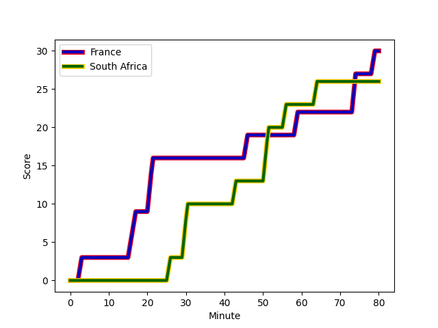
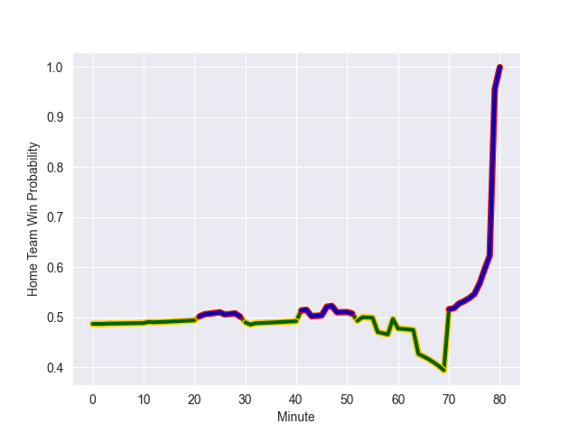

---  
layout: page  
title: South Africa at France; 26-30  
date: 2022-11-12 21:00:00 18:00:00 -0500  
categories: match review  
---
# South Africa (1748.01) at France (1725.81); 26-30

# Prediction: France by 0.8

South Africa by 2.2 on a neutral field
## Scores over Time

## Win Probability over Time

# Pre-Match Prediction: South Africa by 0.8

South Africa by 2.2 on a neutral pitch

|   Away Minutes | Away Player                                                            |   Away elo |   Away Percentile |   Number |   Home Percentile |   Home elo | Home Player                                                       |   Home Minutes |
|---------------:|:-----------------------------------------------------------------------|-----------:|------------------:|---------:|------------------:|-----------:|:------------------------------------------------------------------|---------------:|
|             50 | [Ox Nche](..//playerfiles//OxNche_cleaned.md)                          |     104.2  |                76 |        1 |                92 |     112.2  | [Cyril Baille](..//playerfiles//CyrilBaille_cleaned.md)           |             32 |
|             50 | [Bongi Mbonambi](..//playerfiles//BongiMbonambi_cleaned.md)            |     116.64 |                94 |        2 |                90 |     110.73 | [Julien Marchand](..//playerfiles//JulienMarchand_cleaned.md)     |             59 |
|             50 | [Frans Malherbe](..//playerfiles//FransMalherbe_cleaned.md)            |     104.74 |                80 |        3 |                96 |     117.75 | [Uini Atonio](..//playerfiles//UiniAtonio_cleaned.md)             |             59 |
|             80 | [Eben Etzebeth](..//playerfiles//EbenEtzebeth_cleaned.md)              |     119.02 |                95 |        4 |                37 |      92.39 | [Cameron Woki](..//playerfiles//CameronWoki_cleaned.md)           |             77 |
|             80 | [Franco Mostert](..//playerfiles//FrancoMostert_cleaned.md)            |     128.35 |                98 |        5 |                91 |     113.16 | [Thibaud Flament](..//playerfiles//ThibaudFlament_cleaned.md)     |             31 |
|             70 | [Siya Kolisi](..//playerfiles//SiyaKolisi_cleaned.md)                  |     106.52 |                83 |        6 |                90 |     112.25 | [Anthony Jelonch](..//playerfiles//AnthonyJelonch_cleaned.md)     |             80 |
|             80 | [Pieter-Steph du Toit](..//playerfiles//Pieter-StephduToit_cleaned.md) |      92.55 |                38 |        7 |                94 |     123.6  | [Charles Ollivon](..//playerfiles//CharlesOllivon_cleaned.md)     |             80 |
|             59 | [Kwagga Smith](..//playerfiles//KwaggaSmith_cleaned.md)                |     108.93 |                83 |        8 |                97 |     123.58 | [Gregory Alldritt](..//playerfiles//GregoryAlldritt_cleaned.md)   |             53 |
|             59 | [Faf de Klerk](..//playerfiles//FafdeKlerk_cleaned.md)                 |     115.68 |                93 |        9 |                98 |     126.25 | [Antoine Dupont](..//playerfiles//AntoineDupont_cleaned.md)       |             80 |
|             80 | [Damian Willemse](..//playerfiles//DamianWillemse_cleaned.md)          |     115.85 |                90 |       10 |                88 |     113.57 | [Romain Ntamack](..//playerfiles//RomainNtamack_cleaned.md)       |             70 |
|             80 | [Kurt-Lee Arendse](..//playerfiles//Kurt-LeeArendse_cleaned.md)        |     120.18 |                95 |       11 |                86 |     110.09 | [Yoram Moefana](..//playerfiles//YoramMoefana_cleaned.md)         |             80 |
|             80 | [Damian de Allende](..//playerfiles//DamiandeAllende_cleaned.md)       |     116.14 |                92 |       12 |                88 |     112.19 | [Jonathan Danty](..//playerfiles//JonathanDanty_cleaned.md)       |             13 |
|             76 | [Jesse Kriel](..//playerfiles//JesseKriel_cleaned.md)                  |     126.46 |                97 |       13 |                95 |     121.33 | [Gael Fickou](..//playerfiles//GaelFickou_cleaned.md)             |             80 |
|             49 | [Cheslin Kolbe](..//playerfiles//CheslinKolbe_cleaned.md)              |     151.53 |                99 |       14 |                80 |     105.75 | [Damian Penaud](..//playerfiles//DamianPenaud_cleaned.md)         |             80 |
|             80 | [Willie le Roux](..//playerfiles//WillieleRoux_cleaned.md)             |     124.12 |                96 |       15 |                97 |     127.06 | [Thomas Ramos](..//playerfiles//ThomasRamos_cleaned.md)           |             80 |
|             30 | [Steven Kitshoff](..//playerfiles//StevenKitshoff_cleaned.md)          |     120.64 |                97 |       16 |                84 |     109.98 | [Sekou Macalou](..//playerfiles//SekouMacalou_cleaned.md)         |             67 |
|             30 | [Malcolm Marx](..//playerfiles//MalcolmMarx_cleaned.md)                |     123.39 |                98 |       17 |                99 |     139.42 | [Maxime Lucu](..//playerfiles//MaximeLucu_cleaned.md)             |             27 |
|             30 | [Vincent Koch](..//playerfiles//VincentKoch_cleaned.md)                |      92.01 |                48 |       18 |                93 |     114.78 | [Romain Taofifenua](..//playerfiles//RomainTaofifenua_cleaned.md) |             49 |
|             21 | [Deon Fourie](..//playerfiles//DeonFourie_cleaned.md)                  |     144.21 |                99 |       19 |                94 |     114.47 | [Reda Wardi](..//playerfiles//RedaWardi_cleaned.md)               |             48 |
|             21 | [Cobus Reinach](..//playerfiles//CobusReinach_cleaned.md)              |     113.72 |                91 |       20 |                95 |     115.58 | [Peato Mauvaka](..//playerfiles//PeatoMauvaka_cleaned.md)         |             21 |
|             31 | [Makazole Mapimpi](..//playerfiles//MakazoleMapimpi_cleaned.md)        |     117.84 |                94 |       21 |                80 |     103.53 | [Sipili Falatea](..//playerfiles//SipiliFalatea_cleaned.md)       |             21 |
|             10 | [Marvin Orie](..//playerfiles//MarvinOrie_cleaned.md)                  |      94.27 |                45 |       22 |                86 |     109.94 | [Matthieu Jalibert](..//playerfiles//MatthieuJalibert_cleaned.md) |             10 |
|              4 | [Manie Libbok](..//playerfiles//ManieLibbok_cleaned.md)                |     106.67 |                79 |       23 |                94 |     118.32 | [Bastien Chalureau](..//playerfiles//BastienChalureau_cleaned.md) |              3 |

