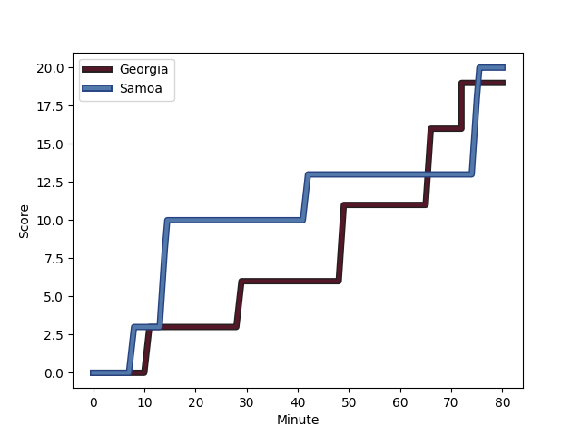
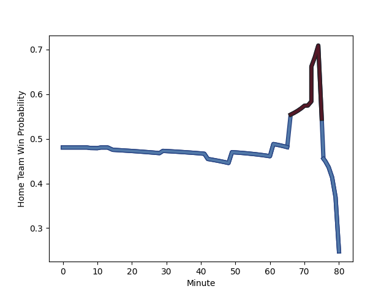

---  
layout: page  
title: Samoa at Georgia; 20-19  
date: 2022-11-12 15:00:00 18:00:00 -0500  
categories: match review  
---
# Samoa (1533.24) at Georgia (1523.15); 20-19

# Prediction: Georgia by 2.0

Samoa by 1.0 on a neutral field
## Scores over Time

## Win Probability over Time

# Pre-Match Prediction: Samoa by 4.0

Samoa by 7.0 on a neutral pitch

|   Away Minutes | Away Player                                                           |   Away elo |   Away Percentile |   Number |   Home Percentile |   Home elo | Home Player                                                           |   Home Minutes |
|---------------:|:----------------------------------------------------------------------|-----------:|------------------:|---------:|------------------:|-----------:|:----------------------------------------------------------------------|---------------:|
|             63 | [Jordan Lay](..//playerfiles//JordanLay_cleaned.md)                   |      89.27 |                21 |        1 |                82 |     105.67 | [Guram Gogichashvili](..//playerfiles//GuramGogichashvili_cleaned.md) |             53 |
|             64 | [Seilala Lam](..//playerfiles//SeilalaLam_cleaned.md)                 |      72.1  |                 1 |        2 |                53 |      96.09 | [Giorgi Chkoidze](..//playerfiles//GiorgiChkoidze_cleaned.md)         |             50 |
|             65 | [Michael Alaalatoa](..//playerfiles//MichaelAlaalatoa_cleaned.md)     |      99.6  |                66 |        3 |                 9 |      84    | [Guram Papidze](..//playerfiles//GuramPapidze_cleaned.md)             |             61 |
|             80 | [Chris Vui](..//playerfiles//ChrisVui_cleaned.md)                     |     100.77 |                70 |        4 |                97 |     127.51 | [Nodar Cheishvili](..//playerfiles//NodarCheishvili_cleaned.md)       |             80 |
|             58 | [Taleni Seu](..//playerfiles//TaleniSeu_cleaned.md)                   |     118.23 |                92 |        5 |                 9 |      80.38 | [Kote Mikautadze](..//playerfiles//KoteMikautadze_cleaned.md)         |             66 |
|             80 | [Piula Faasalele](..//playerfiles//PiulaFaasalele_cleaned.md)         |      99.62 |                67 |        6 |                77 |     105.8  | [Otar Giorgadze](..//playerfiles//OtarGiorgadze_cleaned.md)           |             58 |
|             80 | [Jordan Taufua](..//playerfiles//JordanTaufua_cleaned.md)             |     113.05 |                91 |        7 |                83 |     107.27 | [Beka Saghinadze](..//playerfiles//BekaSaghinadze_cleaned.md)         |             80 |
|             45 | [Fritz Lee](..//playerfiles//FritzLee_cleaned.md)                     |     140.3  |                99 |        8 |                80 |     104.97 | [Beka Gorgadze](..//playerfiles//BekaGorgadze_cleaned.md)             |             80 |
|             57 | [Ere Enari](..//playerfiles//EreEnari_cleaned.md)                     |      91.75 |                32 |        9 |                34 |      91.98 | [Vaso Lobzhanidze](..//playerfiles//VasoLobzhanidze_cleaned.md)       |             80 |
|             80 | [Ulupano Seuteni](..//playerfiles//UlupanoSeuteni_cleaned.md)         |      89.79 |                26 |       10 |                69 |     101.35 | [Tedo Abzhandadze](..//playerfiles//TedoAbzhandadze_cleaned.md)       |             80 |
|             80 | [Nigel Ah Wong](..//playerfiles//NigelAhWong_cleaned.md)              |     112.02 |                88 |       11 |                89 |     112.65 | [Sandro Todua](..//playerfiles//SandroTodua_cleaned.md)               |             80 |
|             80 | [Duncan Paia'aua](..//playerfiles//DuncanPaia'aua_cleaned.md)         |     100.5  |                72 |       12 |                78 |     105.14 | [Merab Sharikadze](..//playerfiles//MerabSharikadze_cleaned.md)       |             80 |
|             80 | [Tumua Manu](..//playerfiles//TumuaManu_cleaned.md)                   |     124.97 |                96 |       13 |                63 |      99.05 | [Demur Tapladze](..//playerfiles//DemurTapladze_cleaned.md)           |             80 |
|             71 | [Tomasi Alosio](..//playerfiles//TomasiAlosio_cleaned.md)             |      98.87 |                63 |       14 |                68 |     100.2  | [Akaki Tabutsadze](..//playerfiles//AkakiTabutsadze_cleaned.md)       |             63 |
|             61 | [Danny Toala](..//playerfiles//DannyToala_cleaned.md)                 |     101.27 |                67 |       15 |                58 |      98.23 | [Davit Niniashvili](..//playerfiles//DavitNiniashvili_cleaned.md)     |             80 |
|             16 | [Manu Leiataua](..//playerfiles//ManuLeiataua_cleaned.md)             |      89.94 |                25 |       16 |                44 |      94.75 | [Nika Abuladze](..//playerfiles//NikaAbuladze_cleaned.md)             |             27 |
|             17 | [Donald Brighouse](..//playerfiles//DonaldBrighouse_cleaned.md)       |      92.59 |                34 |       17 |                80 |     104.65 | [Shalva Mamukashvili](..//playerfiles//ShalvaMamukashvili_cleaned.md) |             30 |
|             15 | [Jeff Toomaga-Allen](..//playerfiles//JeffToomaga-Allen_cleaned.md)   |     112.04 |                94 |       18 |               nan |      93.61 | [Aleksandre Kuntelia](..//playerfiles//AleksandreKuntelia_cleaned.md) |             19 |
|             22 | [Talalelei Gray](..//playerfiles//TalaleleiGray_cleaned.md)           |      92.25 |                40 |       19 |                33 |      91.47 | [Lado Chachanidze](..//playerfiles//LadoChachanidze_cleaned.md)       |             14 |
|             35 | [Afaesetiti Amosa](..//playerfiles//AfaesetitiAmosa_cleaned.md)       |     106.09 |                82 |       20 |                74 |     104.08 | [Tornike Jalagonia](..//playerfiles//TornikeJalagonia_cleaned.md)     |             22 |
|             23 | [Jonathan Taumateine](..//playerfiles//JonathanTaumateine_cleaned.md) |      88.25 |                24 |       21 |                61 |      98.23 | [Miriani Modebadze](..//playerfiles//MirianiModebadze_cleaned.md)     |             17 |
|              9 | [Alapati Leiua](..//playerfiles//AlapatiLeiua_cleaned.md)             |      93.98 |                43 |       22 |               nan |     nan    | nan                                                                   |            nan |
|             19 | [D'Angelo Leuila](..//playerfiles//D'AngeloLeuila_cleaned.md)         |      93.76 |                43 |       23 |               nan |     nan    | nan                                                                   |            nan |

