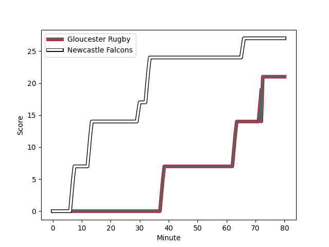
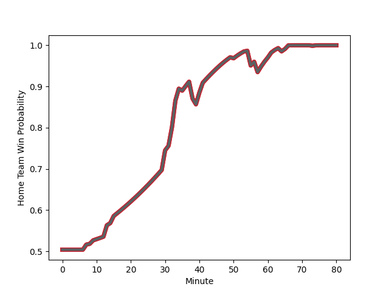

---  
layout: page  
title: Newcastle Falcons at Gloucester Rugby; 27-21  
date: 2022-11-12 16:00:00 18:00:00 -0500  
categories: match review  
---
# Newcastle Falcons (1474.26) at Gloucester Rugby (1537.87); 27-21

# Prediction: Gloucester Rugby by 9.4

Gloucester Rugby by 6.4 on a neutral field
## Scores over Time

## Win Probability over Time

# Pre-Match Prediction: Gloucester Rugby by 11.7

Gloucester Rugby by 8.7 on a neutral pitch

|   Away Minutes | Away Player                                                          |   Away elo |   Away Percentile |   Number |   Home Percentile |   Home elo | Home Player                                                       |   Home Minutes |
|---------------:|:---------------------------------------------------------------------|-----------:|------------------:|---------:|------------------:|-----------:|:------------------------------------------------------------------|---------------:|
|             49 | [Logovi'i Mulipola](..//playerfiles//Logovi'iMulipola_cleaned.md)    |     108.23 |               nan |        1 |                79 |     104.52 | [Harry Elrington](..//playerfiles//HarryElrington_cleaned.md)     |             41 |
|             80 | [George McGuigan](..//playerfiles//GeorgeMcGuigan_cleaned.md)        |     103.86 |                80 |        2 |                73 |     101.7  | [Santiago Socino](..//playerfiles//SantiagoSocino_cleaned.md)     |             41 |
|             57 | [Richard Palframan](..//playerfiles//RichardPalframan_cleaned.md)    |      99.74 |                66 |        3 |                13 |      86.34 | [Fraser Balmain](..//playerfiles//FraserBalmain_cleaned.md)       |             56 |
|             60 | [George Merrick](..//playerfiles//GeorgeMerrick_cleaned.md)          |      86.07 |               nan |        4 |                88 |     110.47 | [Freddie Clarke](..//playerfiles//FreddieClarke_cleaned.md)       |             80 |
|             80 | [Sebastian de Chaves](..//playerfiles//SebastiandeChaves_cleaned.md) |      96.05 |                53 |        5 |                43 |      96.84 | [Andrew Davidson](..//playerfiles//AndrewDavidson_cleaned.md)     |             49 |
|             49 | [Freddie Lockwood](..//playerfiles//FreddieLockwood_cleaned.md)      |     100.7  |                69 |        6 |                87 |     110.7  | [Jordy Reid](..//playerfiles//JordyReid_cleaned.md)               |             56 |
|             67 | [Guy Pepper](..//playerfiles//GuyPepper_cleaned.md)                  |      94.37 |               nan |        7 |                86 |     109.26 | [Lewis Ludlow](..//playerfiles//LewisLudlow_cleaned.md)           |             80 |
|             80 | [Callum Chick](..//playerfiles//CallumChick_cleaned.md)              |      94.2  |                41 |        8 |                97 |     126.8  | [Ruan Ackermann](..//playerfiles//RuanAckermann_cleaned.md)       |             80 |
|             70 | [Michael Young](..//playerfiles//MichaelYoung_cleaned.md)            |     121.9  |                97 |        9 |                75 |     103.15 | [Charlie Chapman](..//playerfiles//CharlieChapman_cleaned.md)     |             53 |
|             80 | [Brett Connon](..//playerfiles//BrettConnon_cleaned.md)              |      74.79 |                 3 |       10 |                94 |     122.95 | [Lloyd Evans](..//playerfiles//LloydEvans_cleaned.md)             |             31 |
|             80 | [Nathan Earle](..//playerfiles//NathanEarle_cleaned.md)              |     116.4  |                93 |       11 |                12 |      84.72 | [Jacob Morris](..//playerfiles//JacobMorris_cleaned.md)           |             80 |
|             34 | [Tom Penny](..//playerfiles//TomPenny_cleaned.md)                    |     109.12 |                85 |       12 |                90 |     115.02 | [Billy Twelvetrees](..//playerfiles//BillyTwelvetrees_cleaned.md) |             80 |
|             80 | [Ben Stevenson](..//playerfiles//BenStevenson_cleaned.md)            |      94.82 |                47 |       13 |                19 |      87.19 | [Jack Reeves](..//playerfiles//JackReeves_cleaned.md)             |             67 |
|             80 | [Adam Radwan](..//playerfiles//AdamRadwan_cleaned.md)                |     120.07 |                95 |       14 |                 9 |      83.29 | [Tom Seabrook](..//playerfiles//TomSeabrook_cleaned.md)           |             80 |
|             80 | [Elliot Obatoyinbo](..//playerfiles//ElliotObatoyinbo_cleaned.md)    |      71.27 |                 2 |       15 |                62 |      99.59 | [Kyle Moyle](..//playerfiles//KyleMoyle_cleaned.md)               |             80 |
|             31 | [Adam Brocklebank](..//playerfiles//AdamBrocklebank_cleaned.md)      |      94.67 |                45 |       16 |                27 |      90.14 | [Ciaran Knight](..//playerfiles//CiaranKnight_cleaned.md)         |             39 |
|             23 | [Mark Tampin](..//playerfiles//MarkTampin_cleaned.md)                |      88.45 |                16 |       17 |                74 |     102.02 | [Jack Singleton](..//playerfiles//JackSingleton_cleaned.md)       |             39 |
|             20 | [Josh Peters](..//playerfiles//JoshPeters_cleaned.md)                |      93.53 |                42 |       18 |                94 |     114.89 | [Kirill Gotovtsev](..//playerfiles//KirillGotovtsev_cleaned.md)   |             24 |
|             31 | [Sean Robinson](..//playerfiles//SeanRobinson_cleaned.md)            |     109.43 |                86 |       19 |                91 |     113.76 | [Cameron Jordan](..//playerfiles//CameronJordan_cleaned.md)       |             31 |
|             13 | [Jamie Blamire](..//playerfiles//JamieBlamire_cleaned.md)            |      94.8  |                50 |       20 |                42 |      95.37 | [Jack Clement](..//playerfiles//JackClement_cleaned.md)           |             24 |
|             10 | [Sam Stuart](..//playerfiles//SamStuart_cleaned.md)                  |      73.54 |                 2 |       21 |                92 |     115.45 | [Ben Meehan](..//playerfiles//BenMeehan_cleaned.md)               |             27 |
|             46 | [Ewan Greenlaw](..//playerfiles//EwanGreenlaw_cleaned.md)            |      95    |               nan |       22 |                65 |      99.7  | [George Barton](..//playerfiles//GeorgeBarton_cleaned.md)         |             49 |
|            nan | nan                                                                  |     nan    |               nan |       23 |                58 |      98.09 | [Alex Hearle](..//playerfiles//AlexHearle_cleaned.md)             |             13 |

