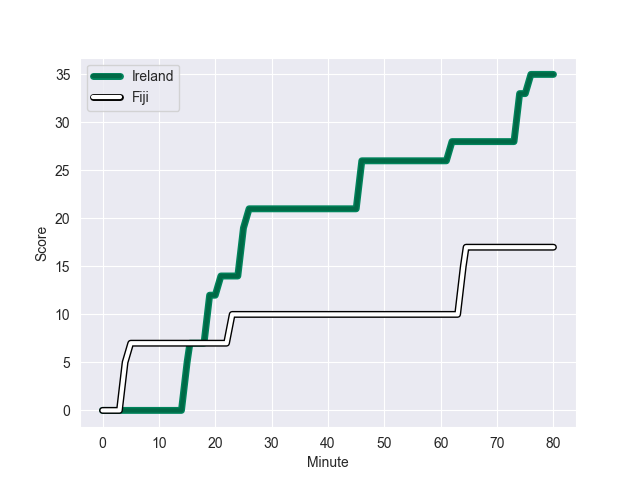
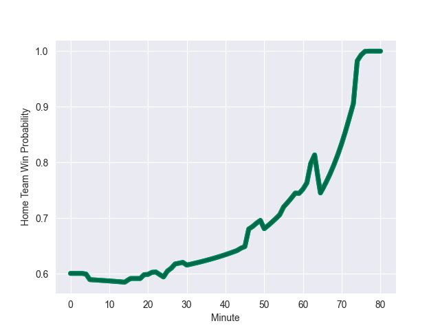

---  
layout: page  
title: Fiji at Ireland; 17.0-35.0  
date: 2022-11-12 08:00:00 18:00:00 -0500  
categories: match review  
---
# Fiji (1489.04) at Ireland (1667.13); 17.0-35.0

# Prediction: Ireland by 20.8

Ireland by 17.8 on a neutral field
## Scores over Time

## Win Probability over Time

# Pre-Match Prediction: Ireland by 23.7

Ireland by 20.7 on a neutral pitch

|   Away Minutes | Away Player       |   Away elo |   Away Percentile |   Number |   Home Percentile |   Home elo | Home Player         |   Home Minutes |
|---------------:|:------------------|-----------:|------------------:|---------:|------------------:|-----------:|:--------------------|---------------:|
|             59 | Eroni Mawi        |      91.78 |                31 |        1 |                93 |     112.04 | Jeremy Loughman     |             62 |
|             76 | Sam Matavesi      |      95.37 |                51 |        2 |                83 |     105.86 | Rob Herring         |             73 |
|             63 | Manasa Saulo      |      93.3  |                38 |        3 |                94 |     115.32 | Tadhg Furlong       |             50 |
|             80 | Isoa Nasilasila   |      91.61 |                32 |        4 |                69 |      99.88 | Kieran Treadwell    |             50 |
|             24 | Ratu Rotuisolia   |      87.85 |                21 |        5 |                93 |     116.61 | Tadhg Beirne        |             80 |
|             77 | Albert Tuisue     |     102.07 |                73 |        6 |                93 |     121.84 | Caelan Doris        |             60 |
|             55 | Levani Botia      |      92.57 |                37 |        7 |                90 |     111.78 | Nick Timoney        |             80 |
|             80 | Viliame Mata      |      93.43 |                40 |        8 |                96 |     127.51 | Jack Conan          |             80 |
|             48 | Frank Lomani      |      95.09 |                48 |        9 |                95 |     116.79 | Jamison Gibson-Park |             53 |
|             44 | Teti Tela         |      98.82 |                65 |       10 |                53 |      97.18 | Joey Carbery        |             46 |
|             80 | Vinaya Habosi     |      92.18 |                34 |       11 |                81 |     105.79 | Mack Hansen         |             80 |
|             59 | Kalaveti Ravouvou |     100.64 |                67 |       12 |                99 |     133.1  | Stuart McCloskey    |             80 |
|             80 | Waisea Nayacalevu |      92.34 |                38 |       13 |                98 |     128.54 | Robbie Henshaw      |              5 |
|             80 | Jiuta Wainiqolo   |      93.67 |                41 |       14 |                52 |      96.3  | Robert Baloucoune   |             80 |
|             80 | Setariki Tuicuvu  |     163.7  |               100 |       15 |                94 |     117.13 | Jimmy O'Brien       |             77 |
|              4 | Mesu Dolokoto     |      93.71 |                40 |       16 |                62 |      98.18 | Dan Sheehan         |              7 |
|             21 | Livai Natave      |      94.04 |               nan |       17 |                95 |     115.13 | Cian Healy          |             18 |
|             20 | Lee-Roy Atalifo   |      87.91 |                20 |       18 |                54 |      97.39 | Tom O'Toole         |             30 |
|             56 | Api Ratuniyarawa  |      98.48 |                65 |       19 |                10 |      84.2  | Cian Prendergast    |             30 |
|             25 | Johnny Dyer       |      75.57 |                 4 |       20 |                88 |     114.6  | Max Deegan          |             20 |
|             32 | Simione Kuruvoli  |      92    |                34 |       21 |                69 |     100.83 | Craig Casey         |             30 |
|             36 | Ben Volavola      |      95.47 |                48 |       22 |                63 |      99.34 | Jack Crowley        |             34 |
|             21 | Adrea Cocagi      |     125.07 |                96 |       23 |                84 |     108.19 | Garry Ringrose      |             75 |

