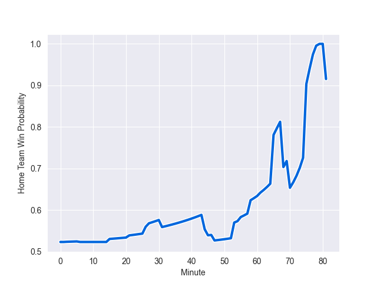

---  
layout: page  
title: Australia at Italy; 27.0-28.0  
date: 2022-11-12 08:00:00 18:00:00 -0500  
categories: match review  
---
# Australia (1519.73) at Italy (1559.84); 27.0-28.0

# Prediction: Italy by 7.0

Italy by 4.0 on a neutral field
## Scores over Time

## Win Probability over Time

# Pre-Match Prediction: Italy by 6.1

Italy by 3.1 on a neutral pitch

|   Away Minutes | Away Player         |   Away elo |   Away Percentile |   Number |   Home Percentile |   Home elo | Home Player        |   Home Minutes |
|---------------:|:--------------------|-----------:|------------------:|---------:|------------------:|-----------:|:-------------------|---------------:|
|             61 | Matt Gibbon         |     104.72 |                79 |        1 |                59 |      98.11 | Danilo Fischetti   |             58 |
|             55 | Folau Fainga'a      |     122.83 |                98 |        2 |                45 |      94.47 | Gianmarco Lucchesi |             58 |
|             61 | Allan Alaalatoa     |     110.2  |                91 |        3 |                85 |     106.57 | Simone Ferrari     |             47 |
|             81 | Darcy Swain         |      94.51 |                53 |        4 |                10 |      82.13 | Niccolo Cannone    |             81 |
|             58 | Will Skelton        |     109.42 |                84 |        5 |                81 |     106.01 | Federico Ruzza     |             81 |
|             81 | Ned Hanigan         |      91.33 |                29 |        6 |                11 |      84.43 | Sebastian Negri    |             58 |
|             81 | Fraser McReight     |      93.48 |                53 |        7 |                95 |     118.9  | Michele Lamaro     |             81 |
|             67 | Pete Samu           |     104.29 |                76 |        8 |                87 |     112.17 | Lorenzo Cannone    |             81 |
|             55 | Jake Gordon         |      85.13 |                10 |        9 |                14 |      86.52 | Stephen Varney     |             81 |
|             76 | Noah Lolesio        |      97.78 |                54 |       10 |                83 |     108.97 | Tommaso Allan      |             70 |
|             81 | Tom Wright          |      92.63 |                36 |       11 |                96 |     122.16 | Monty Ioane        |             81 |
|             81 | Hunter Paisami      |     110.9  |                83 |       12 |                93 |     118.17 | Luca Morisi        |             47 |
|             81 | Len Ikitau          |     116.76 |                92 |       13 |                76 |     104.28 | Juan Ignacio Brex  |             81 |
|             81 | Mark Nawaqanitawase |      87.99 |                18 |       14 |                56 |      97.29 | Pierre Bruno       |             81 |
|             67 | Jock Campbell       |     100.94 |                67 |       15 |                94 |     118.39 | Ange Capuozzo      |             81 |
|             26 | Lachlan Lonergan    |      94.68 |                49 |       16 |                90 |     109.61 | Giacomo Nicotera   |             23 |
|             20 | Tom Robertson       |     101.57 |                71 |       17 |                64 |     100.31 | Ivan Nemer         |             23 |
|             20 | Taniela Tupou       |     109.65 |                90 |       18 |                44 |      95.19 | Pietro Ceccarelli  |             34 |
|             23 | Cadeyrn Neville     |     109.26 |                86 |       19 |                63 |      98.46 | David Sisi         |             11 |
|             14 | Langi Gleeson       |      97.23 |                59 |       20 |                87 |     111.43 | Toa Halafihi       |             12 |
|             26 | Tate McDermott      |     103.46 |                75 |       21 |                71 |     100.64 | Alessandro Garbisi |              0 |
|              5 | Ben Donaldson       |     102.58 |                70 |       22 |                79 |     106.51 | Edoardo Padovani   |             11 |
|             14 | Jordan Petaia       |     111.72 |                91 |       23 |                81 |     107.58 | Tommaso Menoncello |             34 |

