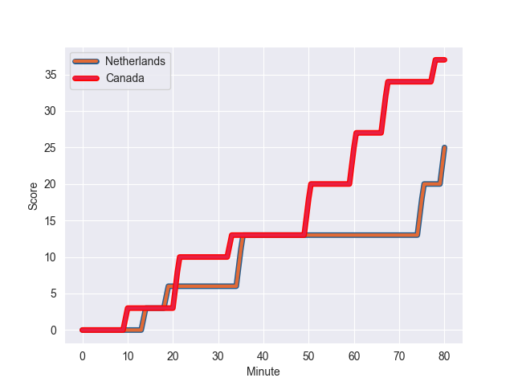
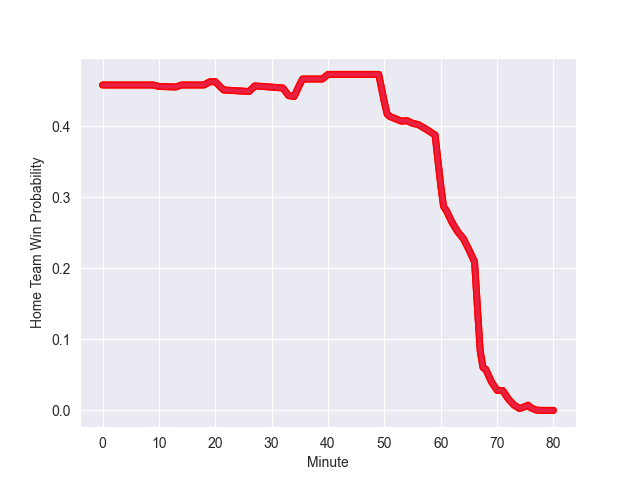

---  
layout: page  
title: Canada at Netherlands; 37-25  
date: 2022-11-12 14:30:00 18:00:00 -0500  
categories: match review  
---
# Canada (1370.58) at Netherlands (1283.25); 37-25

# Prediction: Canada by 5.7

Canada by 8.7 on a neutral field
## Scores over Time

## Win Probability over Time

# Pre-Match Prediction: Canada by 8.0

Canada by 11.0 on a neutral pitch

|   Away Minutes | Away Player                                                           |   Away elo |   Away Percentile |   Number |   Home Percentile |   Home elo | Home Player                                                                          |   Home Minutes |
|---------------:|:----------------------------------------------------------------------|-----------:|------------------:|---------:|------------------:|-----------:|:-------------------------------------------------------------------------------------|---------------:|
|             27 | [Liam Murray](..//playerfiles//LiamMurray_cleaned.md)                 |      85.99 |                12 |        1 |                 0 |      62.85 | [Hugo Langelaan](..//playerfiles//HugoLangelaan_cleaned.md)                          |             68 |
|             56 | [Lindsay Stevens](..//playerfiles//LindsayStevens_cleaned.md)         |      91.47 |                31 |        2 |                 2 |      76.71 | [Ross Bennie-Coulson](..//playerfiles//RossBennie-Coulson_cleaned.md)                |             67 |
|             56 | [Tyler Rowland](..//playerfiles//TylerRowland_cleaned.md)             |     100.12 |                69 |        3 |                 1 |      69.71 | [Andrew Darlington](..//playerfiles//AndrewDarlington_cleaned.md)                    |             40 |
|             80 | [Corey Thomas](..//playerfiles//CoreyThomas_cleaned.md)               |      89.56 |                25 |        4 |                15 |      84.69 | [Louis Bruinsma](..//playerfiles//LouisBruinsma_cleaned.md)                          |             57 |
|             80 | [Josh Larsen](..//playerfiles//JoshLarsen_cleaned.md)                 |      79.73 |                 8 |        5 |                63 |      98.67 | [Koen Bloemen](..//playerfiles//KoenBloemen_cleaned.md)                              |             80 |
|             64 | [Kyle Baillie](..//playerfiles//KyleBaillie_cleaned.md)               |     110.86 |                88 |        6 |                 4 |      78.44 | [Spike Salman](..//playerfiles//SpikeSalman_cleaned.md)                              |             80 |
|             71 | [Lucas Rumball](..//playerfiles//LucasRumball_cleaned.md)             |      88.77 |                22 |        7 |                 4 |      77.15 | [Wolf Van Dijk](..//playerfiles//WolfVanDijk_cleaned.md)                             |             80 |
|             80 | [Siaki Vikilani](..//playerfiles//SiakiVikilani_cleaned.md)           |      91.59 |               nan |        8 |                 5 |      77.08 | [Stijn Albers](..//playerfiles//StijnAlbers_cleaned.md)                              |             54 |
|             62 | [Ross Braude](..//playerfiles//RossBraude_cleaned.md)                 |      88.98 |                20 |        9 |                21 |      89.35 | [Rik van Balkom](..//playerfiles//RikvanBalkom_cleaned.md)                           |             51 |
|             80 | [Robert Povey](..//playerfiles//RobertPovey_cleaned.md)               |     106.77 |                79 |       10 |                91 |     118.24 | [Willie du Plessis](..//playerfiles//WillieduPlessis_cleaned.md)                     |             69 |
|             62 | [Josiah Morra](..//playerfiles//JosiahMorra_cleaned.md)               |      95    |               nan |       11 |               nan |      91    | [Siem Noorman](..//playerfiles//SiemNoorman_cleaned.md)                              |             80 |
|             80 | [Josh Thiel](..//playerfiles//JoshThiel_cleaned.md)                   |      94.19 |               nan |       12 |                 5 |      78.16 | [Daily Owen Limmen](..//playerfiles//DailyOwenLimmen_cleaned.md)                     |             69 |
|             67 | [Ben LeSage](..//playerfiles//BenLeSage_cleaned.md)                   |      91.43 |                33 |       13 |               nan |      82.44 | [Leroy Van Dam](..//playerfiles//LeroyVanDam_cleaned.md)                             |             80 |
|             80 | [Andrew Coe](..//playerfiles//AndrewCoe_cleaned.md)                   |      78.53 |                 5 |       14 |                 0 |      66.53 | [Daan van der Avoird](..//playerfiles//DaanvanderAvoird_cleaned.md)                  |             80 |
|             80 | [Cooper Coats](..//playerfiles//CooperCoats_cleaned.md)               |      84.85 |                15 |       15 |                97 |     125.98 | [Peter Lydon](..//playerfiles//PeterLydon_cleaned.md)                                |             80 |
|             53 | [Djustice Sears-Duru](..//playerfiles//DjusticeSears-Duru_cleaned.md) |      68.8  |                 1 |       16 |                 4 |      80.55 | [Lodi Buijs](..//playerfiles//LodiBuijs_cleaned.md)                                  |             12 |
|             24 | [AJ Quattrin](..//playerfiles//AJQuattrin_cleaned.md)                 |     108.25 |                87 |       17 |                35 |      91.99 | [Jessy Wagemaker](..//playerfiles//JessyWagemaker_cleaned.md)                        |             13 |
|             24 | [Conor Young](..//playerfiles//ConorYoung_cleaned.md)                 |      95    |               nan |       18 |                 7 |      82.91 | [Delano Jansen Van der Sligte](..//playerfiles//DelanoJansenVanderSligte_cleaned.md) |             40 |
|             16 | [Callum Botchar](..//playerfiles//CallumBotchar_cleaned.md)           |      95    |               nan |       19 |                15 |      83.89 | [Jim Boelrijk](..//playerfiles//JimBoelrijk_cleaned.md)                              |             23 |
|              9 | [Matt Klimchuk](..//playerfiles//MattKlimchuk_cleaned.md)             |      95    |               nan |       20 |                12 |      85.09 | [Dirk Wierenga](..//playerfiles//DirkWierenga_cleaned.md)                            |             26 |
|             18 | [Jason Higgins](..//playerfiles//JasonHiggins_cleaned.md)             |      98.24 |                59 |       21 |                14 |      86.67 | [Mark Alexander Coebergh](..//playerfiles//MarkAlexanderCoebergh_cleaned.md)         |             29 |
|             18 | [Brock Webster](..//playerfiles//BrockWebster_cleaned.md)             |      96.96 |                55 |       22 |                12 |      84.35 | [Kevin Lenssen](..//playerfiles//KevinLenssen_cleaned.md)                            |             11 |
|             13 | [David Richard](..//playerfiles//DavidRichard_cleaned.md)             |      95    |               nan |       23 |                 0 |      62.04 | [Te Hauora Campbell](..//playerfiles//TeHauoraCampbell_cleaned.md)                   |             11 |

