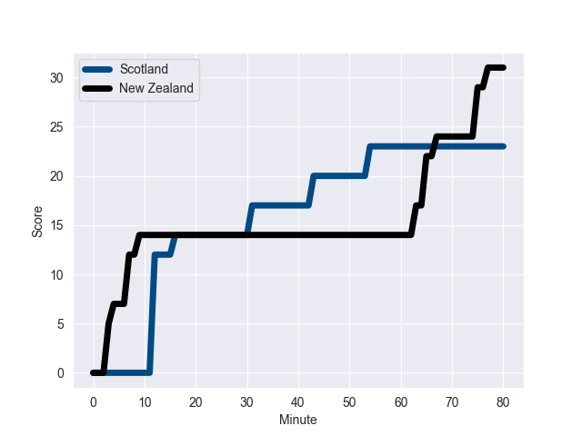
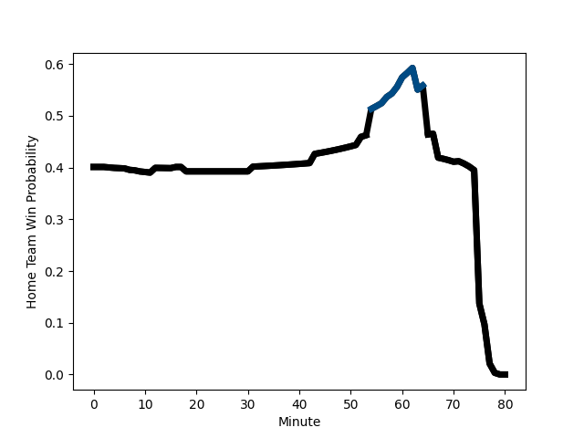

---  
layout: page  
title: New Zealand at Scotland; 31.0-23.0  
date: 2022-11-12 14:15:00 18:00:00 -0500  
categories: match review  
---
# New Zealand (1738.25) at Scotland (1559.0); 31.0-23.0

# Prediction: New Zealand by 14.9

New Zealand by 17.9 on a neutral field
## Scores over Time

## Win Probability over Time

# Pre-Match Prediction: New Zealand by 13.1

New Zealand by 16.1 on a neutral pitch

|   Away Minutes | Away Player                                                           |   Away elo |   Away Percentile |   Number |   Home Percentile |   Home elo | Home Player                                                         |   Home Minutes |
|---------------:|:----------------------------------------------------------------------|-----------:|------------------:|---------:|------------------:|-----------:|:--------------------------------------------------------------------|---------------:|
|             52 | [Ethan de Groot](..//playerfiles//EthandeGroot_cleaned.md)            |     106.16 |                84 |        1 |                17 |      87.75 | [Pierre Schoeman](..//playerfiles//PierreSchoeman_cleaned.md)       |             72 |
|             57 | [Samisoni Taukei'aho](..//playerfiles//SamisoniTaukei'aho_cleaned.md) |     114.14 |                93 |        2 |                94 |     115.59 | [Fraser Brown](..//playerfiles//FraserBrown_cleaned.md)             |             71 |
|             52 | [Nepo Laulala](..//playerfiles//NepoLaulala_cleaned.md)               |     109.59 |                90 |        3 |                95 |     115.64 | [Zander Fagerson](..//playerfiles//ZanderFagerson_cleaned.md)       |             59 |
|             80 | [Sam Whitelock](..//playerfiles//SamWhitelock_cleaned.md)             |     109.28 |                86 |        4 |                24 |      88.67 | [Richie Gray](..//playerfiles//RichieGray_cleaned.md)               |             80 |
|             71 | [Scott Barrett](..//playerfiles//ScottBarrett_cleaned.md)             |     125.68 |                97 |        5 |                85 |     108.7  | [Grant Gilchrist](..//playerfiles//GrantGilchrist_cleaned.md)       |             65 |
|             60 | [Akira Ioane](..//playerfiles//AkiraIoane_cleaned.md)                 |     121.34 |                96 |        6 |                97 |     125.81 | [Jamie Ritchie](..//playerfiles//JamieRitchie_cleaned.md)           |             80 |
|             80 | [Dalton Papali'i](..//playerfiles//DaltonPapali'i_cleaned.md)         |     106.03 |                81 |        7 |                73 |     102.14 | [Hamish Watson](..//playerfiles//HamishWatson_cleaned.md)           |             18 |
|             80 | [Ardie Savea](..//playerfiles//ArdieSavea_cleaned.md)                 |     127.61 |                96 |        8 |                90 |     115.54 | [Matt Fagerson](..//playerfiles//MattFagerson_cleaned.md)           |             80 |
|             57 | [Finlay Christie](..//playerfiles//FinlayChristie_cleaned.md)         |     100.57 |                69 |        9 |                77 |     104.36 | [Ali Price](..//playerfiles//AliPrice_cleaned.md)                   |             65 |
|             79 | [Beauden Barrett](..//playerfiles//BeaudenBarrett_cleaned.md)         |     140.16 |                99 |       10 |                92 |     120.97 | [Finn Russell](..//playerfiles//FinnRussell_cleaned.md)             |             80 |
|             80 | [Caleb Clarke](..//playerfiles//CalebClarke_cleaned.md)               |     103.77 |                78 |       11 |                34 |      91.97 | [Duhan van der Merwe](..//playerfiles//DuhanvanderMerwe_cleaned.md) |             80 |
|             54 | [David Havili](..//playerfiles//DavidHavili_cleaned.md)               |     127.36 |                97 |       12 |                 4 |      77.84 | [Sione Tuipulotu](..//playerfiles//SioneTuipulotu_cleaned.md)       |             77 |
|             80 | [Anton Lienert-Brown](..//playerfiles//AntonLienert-Brown_cleaned.md) |     125.52 |                96 |       13 |                77 |     104.85 | [Chris Harris](..//playerfiles//ChrisHarris_cleaned.md)             |             65 |
|             80 | [Mark Telea](..//playerfiles//MarkTelea_cleaned.md)                   |     118.4  |                94 |       14 |                90 |     113.38 | [Darcy Graham](..//playerfiles//DarcyGraham_cleaned.md)             |             80 |
|             80 | [Jordie Barrett](..//playerfiles//JordieBarrett_cleaned.md)           |     133.69 |                99 |       15 |                77 |     105.38 | [Stuart Hogg](..//playerfiles//StuartHogg_cleaned.md)               |             80 |
|             23 | [Codie Taylor](..//playerfiles//CodieTaylor_cleaned.md)               |      92.34 |                36 |       16 |                43 |      94.76 | [Ewan Ashman](..//playerfiles//EwanAshman_cleaned.md)               |              9 |
|             28 | [George Bower](..//playerfiles//GeorgeBower_cleaned.md)               |      98.25 |                59 |       17 |                50 |      95.68 | [Rory Sutherland](..//playerfiles//RorySutherland_cleaned.md)       |              8 |
|             28 | [Fletcher Newell](..//playerfiles//FletcherNewell_cleaned.md)         |      91.94 |                15 |       18 |               nan |      99.63 | [Willem Nel](..//playerfiles//WillemNel_cleaned.md)                 |             21 |
|              9 | [Tupou Vaa'i](..//playerfiles//TupouVaa'i_cleaned.md)                 |     100.26 |                67 |       19 |                78 |     104.47 | [Jonny Gray](..//playerfiles//JonnyGray_cleaned.md)                 |             15 |
|             20 | [Shannon Frizell](..//playerfiles//ShannonFrizell_cleaned.md)         |     104.76 |                78 |       20 |                 7 |      80    | [Jack Dempsey](..//playerfiles//JackDempsey_cleaned.md)             |             62 |
|             23 | [TJ Perenara](..//playerfiles//TJPerenara_cleaned.md)                 |     109.18 |                86 |       21 |                81 |     107.21 | [Ben White](..//playerfiles//BenWhite_cleaned.md)                   |             15 |
|              1 | [Stephen Perofeta](..//playerfiles//StephenPerofeta_cleaned.md)       |     112.63 |                88 |       22 |                98 |     135.03 | [Blair Kinghorn](..//playerfiles//BlairKinghorn_cleaned.md)         |              3 |
|             26 | [Rieko Ioane](..//playerfiles//RiekoIoane_cleaned.md)                 |      93.6  |                42 |       23 |                88 |     112.61 | [Mark Bennett](..//playerfiles//MarkBennett_cleaned.md)             |             15 |

