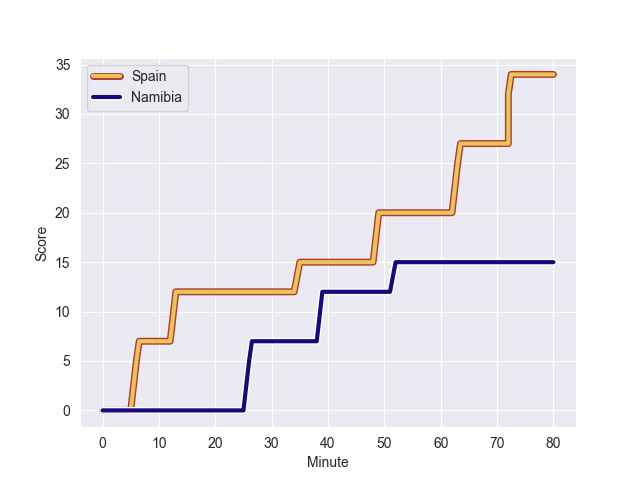
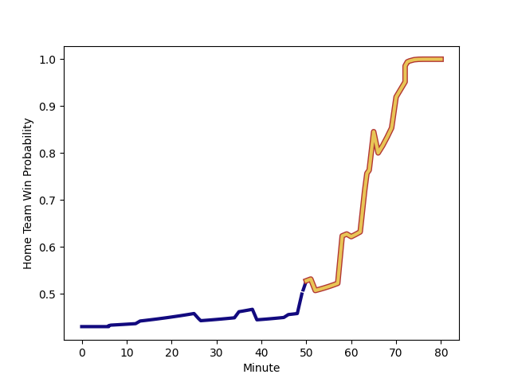

---  
layout: page  
title: Namibia at Spain; 15-34  
date: 2022-11-12 16:00:00 18:00:00 -0500  
categories: match review  
---
# Namibia (1525.01) at Spain (1403.3); 15-34

# Prediction: Namibia by 9.2

Namibia by 12.2 on a neutral field
## Scores over Time

## Win Probability over Time

# Pre-Match Prediction: Namibia by 3.4

Namibia by 6.4 on a neutral pitch

|   Away Minutes | Away Player                                                                       |   Away elo |   Away Percentile |   Number |   Home Percentile |   Home elo | Home Player                                                                     |   Home Minutes |
|---------------:|:----------------------------------------------------------------------------------|-----------:|------------------:|---------:|------------------:|-----------:|:--------------------------------------------------------------------------------|---------------:|
|             74 | [Jason Benade](..//playerfiles//JasonBenade_cleaned.md)                           |      90.24 |                24 |        1 |                 7 |      82.8  | [Thierry Futeu Youtcheu](..//playerfiles//ThierryFuteuYoutcheu_cleaned.md)      |             66 |
|             80 | [Louis van der Westhuizen](..//playerfiles//LouisvanderWesthuizen_cleaned.md)     |     118.02 |                96 |        2 |                90 |     110.06 | [Vicente del Hoyo Portoles](..//playerfiles//VicentedelHoyoPortoles_cleaned.md) |             58 |
|             70 | [Casper Viviers](..//playerfiles//CasperViviers_cleaned.md)                       |     112.51 |               nan |        3 |                86 |     107.47 | [Joel Merkler](..//playerfiles//JoelMerkler_cleaned.md)                         |             60 |
|             50 | [Adriaan Ludick](..//playerfiles//AdriaanLudick_cleaned.md)                       |      93.98 |               nan |        4 |                39 |      92.51 | [Alejandro Suarez](..//playerfiles//AlejandroSuarez_cleaned.md)                 |             80 |
|             80 | [Johan Retief](..//playerfiles//JohanRetief_cleaned.md)                           |      96.84 |               nan |        5 |                51 |      95.61 | [Matthew Foulds](..//playerfiles//MatthewFoulds_cleaned.md)                     |             50 |
|             80 | [Wian Conradie](..//playerfiles//WianConradie_cleaned.md)                         |     118.77 |               nan |        6 |               nan |      95    | [Mario Pichardie](..//playerfiles//MarioPichardie_cleaned.md)                   |             67 |
|             50 | [Janco Venter](..//playerfiles//JancoVenter_cleaned.md)                           |     118.46 |                95 |        7 |                17 |      87.16 | [Facundo Nahuel Dominguez](..//playerfiles//FacundoNahuelDominguez_cleaned.md)  |             80 |
|             70 | [Prince Rivaldo Gino Gaoseb](..//playerfiles//PrinceRivaldoGinoGaoseb_cleaned.md) |      79.95 |                 5 |        8 |                75 |     104.35 | [Afa Tauli](..//playerfiles//AfaTauli_cleaned.md)                               |             80 |
|             80 | [Damian Stevens](..//playerfiles//DamianStevens_cleaned.md)                       |      91.1  |                29 |        9 |                 5 |      80.1  | [Kerman Aurrekoetxea](..//playerfiles//KermanAurrekoetxea_cleaned.md)           |             75 |
|             65 | [Pieter Willem Steenkamp](..//playerfiles//PieterWillemSteenkamp_cleaned.md)      |      95    |               nan |       10 |                26 |      90.52 | [Gonzalo Vinuesa](..//playerfiles//GonzaloVinuesa_cleaned.md)                   |             46 |
|             80 | [Divan Rossouw](..//playerfiles//DivanRossouw_cleaned.md)                         |      99.15 |                62 |       11 |                27 |      90.61 | [Jordi Jorba Jorge](..//playerfiles//JordiJorbaJorge_cleaned.md)                |             60 |
|             80 | [Le Roux Malan](..//playerfiles//LeRouxMalan_cleaned.md)                          |     103.9  |                76 |       12 |                57 |      97.62 | [Alejandro Alonso Munoz](..//playerfiles//AlejandroAlonsoMunoz_cleaned.md)      |             80 |
|             80 | [Johan Deysel (Jnr)](..//playerfiles//JohanDeysel(Jnr)_cleaned.md)                |     110.66 |                87 |       13 |                19 |      86.9  | [Inaki Mateu](..//playerfiles//InakiMateu_cleaned.md)                           |             80 |
|             80 | [Warren Adrienne Ludwig](..//playerfiles//WarrenAdrienneLudwig_cleaned.md)        |      95    |               nan |       14 |                34 |      92.71 | [Martin Alonso Munoz](..//playerfiles//MartinAlonsoMunoz_cleaned.md)            |             80 |
|             80 | [Cliven Loubser](..//playerfiles//ClivenLoubser_cleaned.md)                       |     113.26 |                88 |       15 |                28 |      90.36 | [JW Bell](..//playerfiles//JWBell_cleaned.md)                                   |             80 |
|             10 | [Jano Otto](..//playerfiles//JanoOtto_cleaned.md)                                 |      95    |               nan |       16 |                65 |      96.73 | [Bittor Aboitiz](..//playerfiles//BittorAboitiz_cleaned.md)                     |             20 |
|             30 | [Jan Adriaan Booysen](..//playerfiles//JanAdriaanBooysen_cleaned.md)              |      70.94 |                 1 |       17 |                52 |      94.94 | [Pablo Miejimolle](..//playerfiles//PabloMiejimolle_cleaned.md)                 |             22 |
|             15 | [Andre (Dries) Van der Berg](..//playerfiles//Andre(Dries)VanderBerg_cleaned.md)  |      90.24 |                25 |       18 |                36 |      91.62 | [Raul Calzon](..//playerfiles//RaulCalzon_cleaned.md)                           |             14 |
|             30 | [PJ van Lill](..//playerfiles//PJvanLill_cleaned.md)                              |     121.17 |                96 |       19 |                52 |      95.4  | [Brice Ferrer](..//playerfiles//BriceFerrer_cleaned.md)                         |             30 |
|             10 | [Ruan Ludick](..//playerfiles//RuanLudick_cleaned.md)                             |      68.11 |                 1 |       20 |                77 |     103.95 | [Nico Rocaries](..//playerfiles//NicoRocaries_cleaned.md)                       |              5 |
|              6 | [Lodewikus Jacobs](..//playerfiles//LodewikusJacobs_cleaned.md)                   |      95    |               nan |       21 |               nan |      95    | [Matheo Triki](..//playerfiles//MatheoTriki_cleaned.md)                         |             13 |
|            nan | nan                                                                               |     nan    |               nan |       22 |                74 |     100.38 | [Bautista Guemes](..//playerfiles//BautistaGuemes_cleaned.md)                   |             34 |
|            nan | nan                                                                               |     nan    |               nan |       23 |                21 |      87.46 | [Julen Goia Iriberri](..//playerfiles//JulenGoiaIriberri_cleaned.md)            |             20 |

