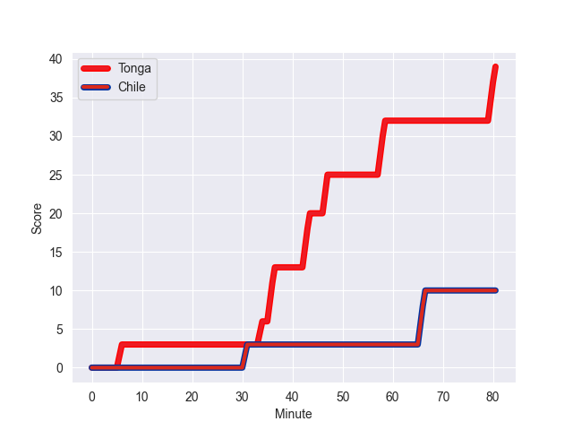
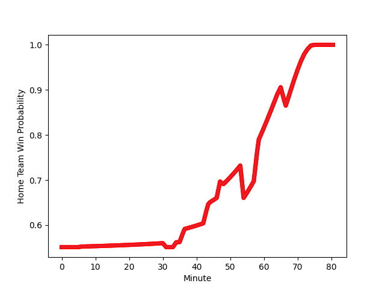

---  
layout: page  
title: Chile at Tonga; 10-39  
date: 2022-11-12 12:00:00 18:00:00 -0500  
categories: match review  
---
# Chile (1394.98) at Tonga (1483.73); 10-39

# Prediction: Tonga by 11.9

Tonga by 8.9 on a neutral field
## Scores over Time

## Win Probability over Time

# Pre-Match Prediction: Tonga by 12.9

Tonga by 9.9 on a neutral pitch

|   Away Minutes | Away Player                     |   Away elo |   Away Percentile |   Number |   Home Percentile |   Home elo | Home Player         |   Home Minutes |
|---------------:|:--------------------------------|-----------:|------------------:|---------:|------------------:|-----------:|:--------------------|---------------:|
|             44 | Javier Carrasco Albornoz        |      88.63 |                20 |        1 |                78 |     104.05 | Tau Koloamatangi    |             48 |
|             44 | Augusto Bohme Alemparte         |      82.57 |                 7 |        2 |                 2 |      76.15 | Samiuela Moli       |             48 |
|             44 | Matias Dittus                   |      92.17 |                32 |        3 |                99 |     126.39 | Ben Tameifuna       |             48 |
|             44 | Santiago Pedrero Poduje         |     103.18 |                77 |        4 |                64 |      99.1  | Halavela Fifita     |             59 |
|             74 | Javier Eissmann                 |      86.49 |                18 |        5 |                60 |      97.96 | Sam Lousi           |             80 |
|             80 | Martin Sigren                   |      98.55 |                63 |        6 |                89 |     111.8  | Vaea Fifita         |             80 |
|             80 | Clemente Saavedra Cartajena     |      99.63 |                67 |        7 |                36 |      92.11 | Solomone Funaki     |             59 |
|             59 | Raimundo Martinez Amar          |      98.61 |                56 |        8 |                80 |     106.67 | Sione Havili        |             80 |
|             48 | Lukas Carvallo                  |      85.72 |                13 |        9 |                68 |     100.09 | Augustine Pulu      |             72 |
|             80 | Rodrigo Fernandez Grosetete     |      99.41 |                63 |       10 |                53 |      97    | William Havili      |             80 |
|             80 | Pablo Casas Suarez              |      94.83 |                47 |       11 |                65 |      99.11 | Solomone Kata       |             54 |
|             45 | Jose Ignacio Larenas Hitschfeld |      88.86 |                23 |       12 |                84 |     108.79 | George Moala        |             65 |
|             80 | Matias Garafulic Schar          |      97.78 |                58 |       13 |                77 |     104.8  | Afusipa Taumoepeau  |             80 |
|             80 | Inaki Ayarza Saporta            |      88.29 |                22 |       14 |                 4 |      76.91 | Tima Fainga'anuku   |             80 |
|             80 | Santiago Videla Cambiaso        |      91.76 |                36 |       15 |                64 |      99.52 | Otumaka Mausia      |             80 |
|             36 | Salvador Lues Soto              |     102    |                73 |       16 |                 1 |      71.9  | David Lolohea       |             32 |
|             36 | Inaki Gurruchaga                |      87.89 |                18 |       17 |               nan |      95.49 | Jay Fonokalafi      |             32 |
|             36 | Diego Escobar Alvarez           |     111.12 |                92 |       18 |                92 |     110.92 | Siate Tokolahi      |             32 |
|             36 | Ignacio Silva Aninat            |      74.94 |                 3 |       19 |                65 |      99.91 | Tanginoa Halaifonua |             21 |
|              6 | Joaquin Milesi                  |      95.02 |                37 |       20 |                66 |      99.61 | Zane Kapeli         |             21 |
|             21 | Pablo Huete Cibrario            |      71.13 |               nan |       21 |                 7 |      81.65 | Anzelo Tuitavuki    |             26 |
|             32 | Marcelo Torrealba               |      90.89 |                28 |       22 |                46 |      94.16 | Manu Paea           |              8 |
|             35 | Nicolas Garafulic Schar         |      86.09 |                14 |       23 |                73 |     101.72 | Fetuli Paea         |             15 |

