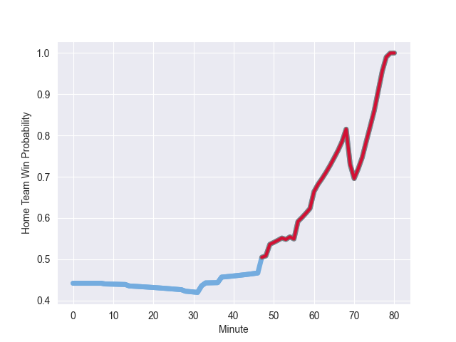

---  
layout: page  
title: Argentina at Wales; 13.0-20.0  
date: 2022-11-12 12:30:00 18:00:00 -0500  
categories: match review  
---
# Argentina (1647.07) at Wales (1545.47); 13.0-20.0

# Prediction: Argentina by 7.2

Argentina by 10.2 on a neutral field
## Scores over Time

## Win Probability over Time

# Pre-Match Prediction: Argentina by 6.8

Argentina by 9.8 on a neutral pitch

|   Away Minutes | Away Player            |   Away elo |   Away Percentile |   Number |   Home Percentile |   Home elo | Home Player       |   Home Minutes |
|---------------:|:-----------------------|-----------:|------------------:|---------:|------------------:|-----------:|:------------------|---------------:|
|             49 | Thomas Gallo           |     108.66 |                88 |        1 |                 6 |      81.51 | Gareth Thomas     |             61 |
|             49 | Agustin Creevy         |     110.3  |                89 |        2 |                65 |      98.72 | Ken Owens         |             80 |
|             60 | Francisco Gomez Kodela |     115.41 |                95 |        3 |                93 |     109.98 | Dillon Lewis      |             75 |
|             80 | Matias Alemanno        |     122.99 |                96 |        4 |                37 |      92.54 | Will Rowlands     |             73 |
|             55 | Tomas Lavanini         |     112.74 |                91 |        5 |                66 |      99.29 | Adam Beard        |             70 |
|             80 | Juan Martin Gonzalez   |     118.64 |                95 |        6 |                84 |     108.3  | Dan Lydiate       |             28 |
|             66 | Marcos Kremer          |      92.87 |                39 |        7 |                95 |     117.61 | Justin Tipuric    |             80 |
|             80 | Pablo Matera           |     121.04 |                93 |        8 |                43 |      94.65 | Taulupe Faletau   |             80 |
|             66 | Gonzalo Bertranou      |     103.15 |                75 |        9 |                86 |     108.96 | Tomos Williams    |             80 |
|             68 | Santiago Carreras      |     129.02 |                97 |       10 |                76 |     105.12 | Gareth Anscombe   |             55 |
|             80 | Emiliano Boffelli      |      93    |                38 |       11 |                 1 |      71.13 | Rio Dyer          |             80 |
|             80 | Jeronimo de la Fuente  |     118.82 |                94 |       12 |                97 |     127.52 | Nick Tompkins     |             53 |
|             60 | Matias Moroni          |     118.24 |                93 |       13 |                96 |     124.8  | George North      |             80 |
|             80 | Mateo Carreras         |      98.17 |                61 |       14 |                94 |     118.6  | Alex Cuthbert     |             80 |
|             80 | Juan Cruz Mallia       |     103.87 |                72 |       15 |                60 |      98.01 | Louis Rees-Zammit |             80 |
|             31 | Ignacio Ruiz           |      95.31 |               nan |       16 |                88 |     108.23 | Ryan Elias        |              7 |
|             31 | Nahuel Tetaz Chaparro  |     108.35 |                88 |       17 |                28 |      91.32 | Rhodri Jones      |             19 |
|             20 | Eduardo Bello          |      96.8  |                48 |       18 |               nan |      93.01 | Sam Wainwright    |              5 |
|             14 | Lucas Paulos           |     103.9  |                78 |       19 |                54 |      95.91 | Ben Carter        |             10 |
|             25 | Facundo Isa            |     121.55 |                96 |       20 |                75 |     102.97 | Jac Morgan        |             52 |
|             14 | Eliseo Morales         |      95    |               nan |       21 |                88 |     108.89 | Kieran Hardy      |              0 |
|             12 | Tomas Albornoz         |     111.43 |                86 |       22 |                29 |      91.59 | Rhys Priestland   |             25 |
|             20 | Matias Orlando         |      78.74 |                 5 |       23 |                87 |     110.35 | Owen Watkin       |             27 |

