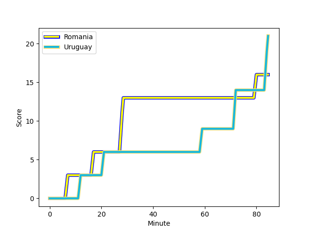
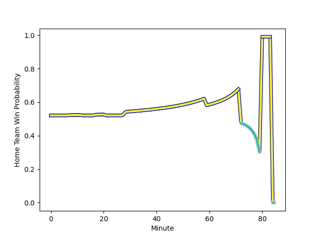

---  
layout: page  
title: Uruguay at Romania; 21-16  
date: 2022-11-13 12:30:00 18:00:00 -0500  
categories: match review  
---
# Uruguay (1366.35) at Romania (1402.41); 21-16

# Prediction: Romania by 6.6

Romania by 3.6 on a neutral field
## Scores over Time

## Win Probability over Time

# Pre-Match Prediction: Romania by 6.2

Romania by 3.2 on a neutral pitch

|   Away Minutes | Away Player                                                                |   Away elo |   Away Percentile |   Number |   Home Percentile |   Home elo | Home Player                                                       |   Home Minutes |
|---------------:|:---------------------------------------------------------------------------|-----------:|------------------:|---------:|------------------:|-----------:|:------------------------------------------------------------------|---------------:|
|             84 | [Mateo Sanguinetti](..//playerfiles//MateoSanguinetti_cleaned.md)          |      84.21 |                10 |        1 |                45 |      94.84 | [Vasile Balan](..//playerfiles//VasileBalan_cleaned.md)           |             84 |
|             84 | [German Kessler Lordon](..//playerfiles//GermanKesslerLordon_cleaned.md)   |      93.56 |                43 |        2 |                21 |      89.07 | [Ovidiu Cojocaru](..//playerfiles//OvidiuCojocaru_cleaned.md)     |             84 |
|             84 | [Ignacio Peculo](..//playerfiles//IgnacioPeculo_cleaned.md)                |      94.77 |                45 |        3 |                13 |      86.31 | [Gheorge Gajion](..//playerfiles//GheorgeGajion_cleaned.md)       |             84 |
|             84 | [Ignacio Dotti](..//playerfiles//IgnacioDotti_cleaned.md)                  |      89.39 |                25 |        4 |                88 |     110    | [Johan van Heerden](..//playerfiles//JohanvanHeerden_cleaned.md)  |             84 |
|             84 | [Manuel Leindekar](..//playerfiles//ManuelLeindekar_cleaned.md)            |     102.06 |                75 |        5 |                 5 |      76.69 | [Marius Iftimiciuc](..//playerfiles//MariusIftimiciuc_cleaned.md) |             84 |
|             84 | [Diego Ardao](..//playerfiles//DiegoArdao_cleaned.md)                      |      92.55 |                37 |        6 |                32 |      91.26 | [Kamil Sobota](..//playerfiles//KamilSobota_cleaned.md)           |             84 |
|             84 | [Santiago Civetta](..//playerfiles//SantiagoCivetta_cleaned.md)            |      85.91 |                13 |        7 |                44 |      94.75 | [Mihai Macovei](..//playerfiles//MihaiMacovei_cleaned.md)         |             84 |
|             84 | [Manuel Diana Olaso](..//playerfiles//ManuelDianaOlaso_cleaned.md)         |      97.94 |                56 |        8 |                11 |      84.53 | [Cristian Chirica](..//playerfiles//CristianChirica_cleaned.md)   |             84 |
|             84 | [Tomas Inciarte](..//playerfiles//TomasInciarte_cleaned.md)                |      82.59 |                 9 |        9 |                22 |      87.79 | [Florin Surugiu](..//playerfiles//FlorinSurugiu_cleaned.md)       |             84 |
|             84 | [Felipe Berchesi](..//playerfiles//FelipeBerchesi_cleaned.md)              |      87.68 |                20 |       10 |                39 |      92.67 | [Vladut Popa](..//playerfiles//VladutPopa_cleaned.md)             |             84 |
|             84 | [Gaston Mieres Valente](..//playerfiles//GastonMieresValente_cleaned.md)   |      87.5  |                21 |       11 |                50 |      95.73 | [Atila Septar](..//playerfiles//AtilaSeptar_cleaned.md)           |             84 |
|             84 | [Andres Vilaseca Hontou](..//playerfiles//AndresVilasecaHontou_cleaned.md) |      90.14 |                27 |       12 |               nan |      96.78 | [Tangimana Fonovai](..//playerfiles//TangimanaFonovai_cleaned.md) |             84 |
|             84 | [Felipe Arcos Perez](..//playerfiles//FelipeArcosPerez_cleaned.md)         |      89.73 |                26 |       13 |                85 |     109.38 | [Alexandru Bucur](..//playerfiles//AlexandruBucur_cleaned.md)     |             84 |
|             84 | [Baltazar Amaya](..//playerfiles//BaltazarAmaya_cleaned.md)                |      97.36 |                57 |       14 |                64 |     100.43 | [Nicolas Onutu](..//playerfiles//NicolasOnutu_cleaned.md)         |             84 |
|             84 | [Felipe Etcheverry](..//playerfiles//FelipeEtcheverry_cleaned.md)          |      90.96 |                32 |       15 |                38 |      92.2  | [Hinckley Vaovasa](..//playerfiles//HinckleyVaovasa_cleaned.md)   |             84 |

