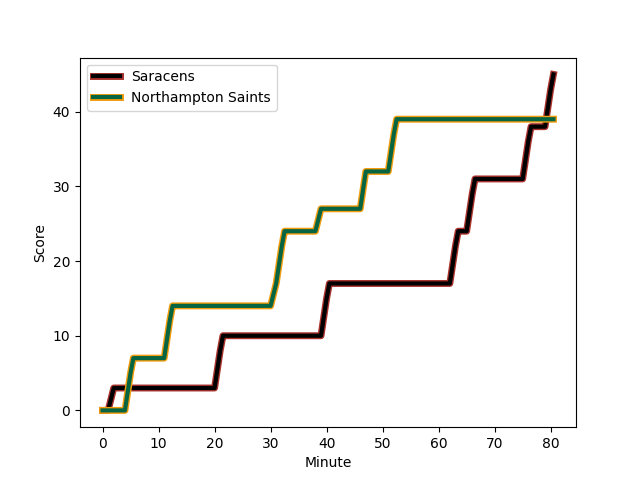
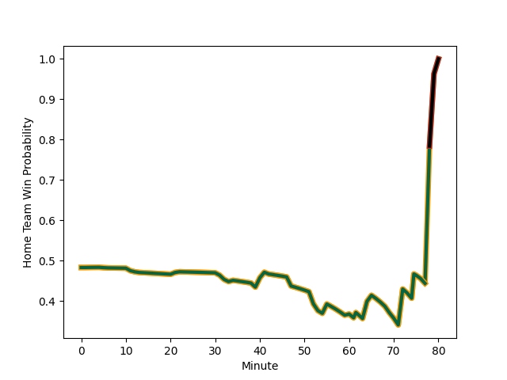

---  
layout: page  
title: Northampton Saints at Saracens; 39-45  
date: 2022-11-13 16:00:00 18:00:00 -0500  
categories: match review  
---
# Northampton Saints (1589.37) at Saracens (1557.99); 39-45

# Prediction: Northampton Saints by 0.1

Northampton Saints by 3.1 on a neutral field
## Scores over Time

## Win Probability over Time

# Pre-Match Prediction: Northampton Saints by 1.1

Northampton Saints by 1.9 on a neutral pitch

|   Away Minutes | Away Player                                                             |   Away elo |   Away Percentile |   Number |   Home Percentile |   Home elo | Home Player                                                         |   Home Minutes |
|---------------:|:------------------------------------------------------------------------|-----------:|------------------:|---------:|------------------:|-----------:|:--------------------------------------------------------------------|---------------:|
|             41 | [Alex Waller](..//playerfiles//AlexWaller_cleaned.md)                   |     131.63 |                99 |        1 |                73 |     102.21 | [Robin Hislop](..//playerfiles//RobinHislop_cleaned.md)             |             10 |
|             59 | [Mike Haywood](..//playerfiles//MikeHaywood_cleaned.md)                 |     128.01 |                99 |        2 |                86 |     108.19 | [Theo Dan](..//playerfiles//TheoDan_cleaned.md)                     |             71 |
|             80 | [Paul Hill](..//playerfiles//PaulHill_cleaned.md)                       |     105.1  |                82 |        3 |                48 |      95.58 | [Marco Riccioni](..//playerfiles//MarcoRiccioni_cleaned.md)         |             41 |
|             80 | [Lukhan Salakaia-Loto](..//playerfiles//LukhanSalakaia-Loto_cleaned.md) |      88.04 |                21 |        4 |                 8 |      79.34 | [Callum Hunter-Hill](..//playerfiles//CallumHunter-Hill_cleaned.md) |             80 |
|             80 | [Alex Moon](..//playerfiles//AlexMoon_cleaned.md)                       |     103.84 |                77 |        5 |                 9 |      80.97 | [Andrew Kitchener](..//playerfiles//AndrewKitchener_cleaned.md)     |             41 |
|             59 | [Angus Scott-Young](..//playerfiles//AngusScott-Young_cleaned.md)       |     110.29 |                88 |        6 |                51 |      95.61 | [Andy Christie](..//playerfiles//AndyChristie_cleaned.md)           |             80 |
|             80 | [Sam Graham](..//playerfiles//SamGraham_cleaned.md)                     |     125.59 |                94 |        7 |                94 |     117.42 | [Ben Earl](..//playerfiles//BenEarl_cleaned.md)                     |             80 |
|             71 | [Juarno Augustus](..//playerfiles//JuarnoAugustus_cleaned.md)           |      94.82 |                43 |        8 |                98 |     133.28 | [Jackson Wray](..//playerfiles//JacksonWray_cleaned.md)             |             80 |
|             71 | [Alex Mitchell](..//playerfiles//AlexMitchell_cleaned.md)               |     112.48 |                90 |        9 |                55 |      96.98 | [Ivan van Zyl](..//playerfiles//IvanvanZyl_cleaned.md)              |             59 |
|             80 | [Fin Smith](..//playerfiles//FinSmith_cleaned.md)                       |      87.59 |                19 |       10 |                94 |     123.56 | [Alex Goode](..//playerfiles//AlexGoode_cleaned.md)                 |             80 |
|             80 | [Courtnall Skosan](..//playerfiles//CourtnallSkosan_cleaned.md)         |     124.45 |                97 |       11 |                98 |     125.23 | [Sean Maitland](..//playerfiles//SeanMaitland_cleaned.md)           |             80 |
|             69 | [Rory Hutchinson](..//playerfiles//RoryHutchinson_cleaned.md)           |      94.82 |                46 |       12 |                51 |      96.22 | [Alex Lozowski](..//playerfiles//AlexLozowski_cleaned.md)           |             80 |
|             80 | [Fraser Dingwall](..//playerfiles//FraserDingwall_cleaned.md)           |      81.4  |                 8 |       13 |                82 |     107.35 | [Elliot Daly](..//playerfiles//ElliotDaly_cleaned.md)               |             80 |
|             80 | [Tommy Freeman](..//playerfiles//TommyFreeman_cleaned.md)               |     114.76 |                92 |       14 |                70 |     100.99 | [Alex Lewington](..//playerfiles//AlexLewington_cleaned.md)         |             71 |
|             80 | [George Furbank](..//playerfiles//GeorgeFurbank_cleaned.md)             |     115.22 |                93 |       15 |                30 |      90.69 | [Max Malins](..//playerfiles//MaxMalins_cleaned.md)                 |             21 |
|             39 | [Emmanuel Iyogun](..//playerfiles//EmmanuelIyogun_cleaned.md)           |     101.29 |                71 |       16 |                12 |      84.49 | [James Flynn](..//playerfiles//JamesFlynn_cleaned.md)               |             23 |
|             21 | [Robbie Smith](..//playerfiles//RobbieSmith_cleaned.md)                 |      79    |               nan |       17 |                15 |      85.82 | [Ollie Stonham](..//playerfiles//OllieStonham_cleaned.md)           |              9 |
|             21 | [Brandon Nansen](..//playerfiles//BrandonNansen_cleaned.md)             |     106.59 |                82 |       18 |                13 |      86.97 | [Ethan Lewis](..//playerfiles//EthanLewis_cleaned.md)               |             39 |
|              9 | [James Ramm](..//playerfiles//JamesRamm_cleaned.md)                     |     108.44 |               nan |       19 |                92 |     113.9  | [Hugh Tizard](..//playerfiles//HughTizard_cleaned.md)               |             39 |
|              9 | [Tom James](..//playerfiles//TomJames_cleaned.md)                       |      82.85 |                 8 |       20 |                64 |      99.32 | [Gareth Simpson](..//playerfiles//GarethSimpson_cleaned.md)         |             21 |
|             11 | [Matt Proctor](..//playerfiles//MattProctor_cleaned.md)                 |     107.57 |                84 |       21 |                 8 |      82.14 | [Tom Howe](..//playerfiles//TomHowe_cleaned.md)                     |              9 |
|            nan | nan                                                                     |     nan    |               nan |       22 |                48 |      95.4  | [Josh Hallett](..//playerfiles//JoshHallett_cleaned.md)             |             59 |
|            nan | nan                                                                     |     nan    |               nan |       23 |                55 |      99.1  | [Alec Clarey](..//playerfiles//AlecClarey_cleaned.md)               |             47 |

