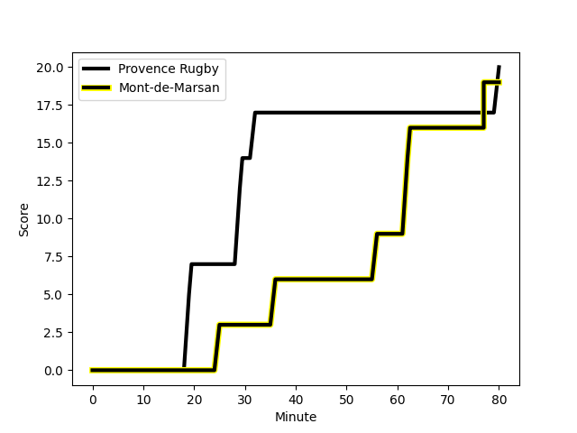
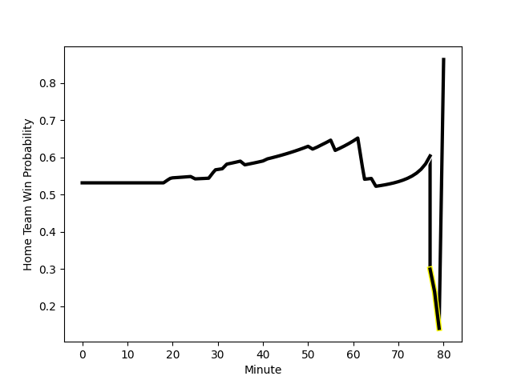

---  
layout: page  
title: Mont-de-Marsan at Provence Rugby; 19-20  
date: 2022-11-17 21:00:00 18:00:00 -0500  
categories: match review  
---
# Mont-de-Marsan (1387.87) at Provence Rugby (1442.11); 19-20

# Prediction: Provence Rugby by 8.4

Provence Rugby by 5.4 on a neutral field
## Scores over Time

## Win Probability over Time

# Pre-Match Prediction: Provence Rugby by 3.9

Provence Rugby by 0.9 on a neutral pitch

|   Away Minutes | Away Player                                                              |   Away elo |   Away Percentile |   Number |   Home Percentile |   Home elo | Home Player                                                               |   Home Minutes |
|---------------:|:-------------------------------------------------------------------------|-----------:|------------------:|---------:|------------------:|-----------:|:--------------------------------------------------------------------------|---------------:|
|             51 | [Jean-Luc Innocente](..//playerfiles//Jean-LucInnocente_cleaned.md)      |      83.97 |                 9 |        1 |                93 |     113.81 | [Federico Wegrzyn](..//playerfiles//FedericoWegrzyn_cleaned.md)           |             80 |
|             51 | [Simon Labouyrie](..//playerfiles//SimonLabouyrie_cleaned.md)            |      78.83 |                 3 |        2 |                 8 |      83.26 | [Loick Jammes](..//playerfiles//LoickJammes_cleaned.md)                   |             53 |
|             58 | [Lasha Macharashvili](..//playerfiles//LashaMacharashvili_cleaned.md)    |      99.12 |                79 |        3 |                24 |      90.42 | [Thomas Vernet](..//playerfiles//ThomasVernet_cleaned.md)                 |             20 |
|             80 | [Romain Durand](..//playerfiles//RomainDurand_cleaned.md)                |      98.69 |                63 |        4 |                76 |     103.2  | [Jérôme Dufour](..//playerfiles//JérômeDufour_cleaned.md)                 |             53 |
|             80 | [Aston Fortuin](..//playerfiles//AstonFortuin_cleaned.md)                |      81.58 |                10 |        5 |                 3 |      75.5  | [Hans N'kinsi](..//playerfiles//HansN'kinsi_cleaned.md)                   |             80 |
|             58 | [Léo Banos](..//playerfiles//LéoBanos_cleaned.md)                        |      81.04 |                 6 |        6 |                 0 |      62.45 | [Jessy Jegerlehner](..//playerfiles//JessyJegerlehner_cleaned.md)         |             53 |
|             41 | [Nicolas Garrault](..//playerfiles//NicolasGarrault_cleaned.md)          |     108.01 |                84 |        7 |                 9 |      85.14 | [Bilel Taieb](..//playerfiles//BilelTaieb_cleaned.md)                     |             80 |
|             80 | [Thibault Tauleigne](..//playerfiles//ThibaultTauleigne_cleaned.md)      |      89.91 |                26 |        8 |                17 |      87.13 | [Carl Axtens](..//playerfiles//CarlAxtens_cleaned.md)                     |             80 |
|             41 | [James Hart](..//playerfiles//JamesHart_cleaned.md)                      |      76.91 |                 3 |        9 |                76 |     103.7  | [Jonathan Ruru](..//playerfiles//JonathanRuru_cleaned.md)                 |             80 |
|             80 | [Joris Pialot](..//playerfiles//JorisPialot_cleaned.md)                  |      91.69 |                38 |       10 |                93 |     121.42 | [Enzo Selponi](..//playerfiles//EnzoSelponi_cleaned.md)                   |             60 |
|             58 | [Pierre Sayerse](..//playerfiles//PierreSayerse_cleaned.md)              |      87.78 |                18 |       11 |                86 |     109.76 | [Nadir Bouhedjeur](..//playerfiles//NadirBouhedjeur_cleaned.md)           |             80 |
|             80 | [Lucas Mensa](..//playerfiles//LucasMensa_cleaned.md)                    |     100.95 |                66 |       12 |                93 |     116.93 | [Louis Marrou](..//playerfiles//LouisMarrou_cleaned.md)                   |             80 |
|             58 | [Simon Renda](..//playerfiles//SimonRenda_cleaned.md)                    |      89.89 |                26 |       13 |                93 |     117.36 | [Peter Betham](..//playerfiles//PeterBetham_cleaned.md)                   |             80 |
|             80 | [Kaminieli Rasaku](..//playerfiles//KaminieliRasaku_cleaned.md)          |      92.48 |                37 |       14 |                15 |      86.64 | [Dorian Bonnin](..//playerfiles//DorianBonnin_cleaned.md)                 |             80 |
|             80 | [Yoann Laousse Azpiazu](..//playerfiles//YoannLaousseAzpiazu_cleaned.md) |     116.91 |                93 |       15 |                 7 |      78.33 | [Adrien Lapegue-Lafaye](..//playerfiles//AdrienLapegue-Lafaye_cleaned.md) |             80 |
|             39 | [Yann Brethous](..//playerfiles//YannBrethous_cleaned.md)                |     109.96 |                87 |       16 |               nan |      92.22 | [Matt Tierney](..//playerfiles//MattTierney_cleaned.md)                   |             45 |
|             39 | [Christophe Loustalot](..//playerfiles//ChristopheLoustalot_cleaned.md)  |      69.65 |                 0 |       17 |                29 |      89.51 | [Charles Malet](..//playerfiles//CharlesMalet_cleaned.md)                 |             27 |
|             29 | [Romain Laterrade](..//playerfiles//RomainLaterrade_cleaned.md)          |      90.16 |                21 |       18 |                50 |      96.93 | [Lucas Martin](..//playerfiles//LucasMartin_cleaned.md)                   |             27 |
|             29 | [Dino Casadei](..//playerfiles//DinoCasadei_cleaned.md)                  |      96.67 |                57 |       19 |                79 |     104.14 | [Clément Chartier](..//playerfiles//ClémentChartier_cleaned.md)           |             27 |
|             22 | [Alexandre de Nardi](..//playerfiles//AlexandredeNardi_cleaned.md)       |      87.14 |                16 |       20 |                17 |      87.04 | [Johnny McPhillips](..//playerfiles//JohnnyMcPhillips_cleaned.md)         |             20 |
|             22 | [Max Curie](..//playerfiles//MaxCurie_cleaned.md)                        |      92.2  |                32 |       21 |               nan |      93.51 | [Mohammed Loukia](..//playerfiles//MohammedLoukia_cleaned.md)             |             15 |
|             22 | [Jules Even](..//playerfiles//JulesEven_cleaned.md)                      |      97.97 |                58 |       22 |               nan |     nan    | nan                                                                       |            nan |
|             22 | [Raphaël Robic](..//playerfiles//RaphaëlRobic_cleaned.md)                |      95    |               nan |       23 |               nan |     nan    | nan                                                                       |            nan |

