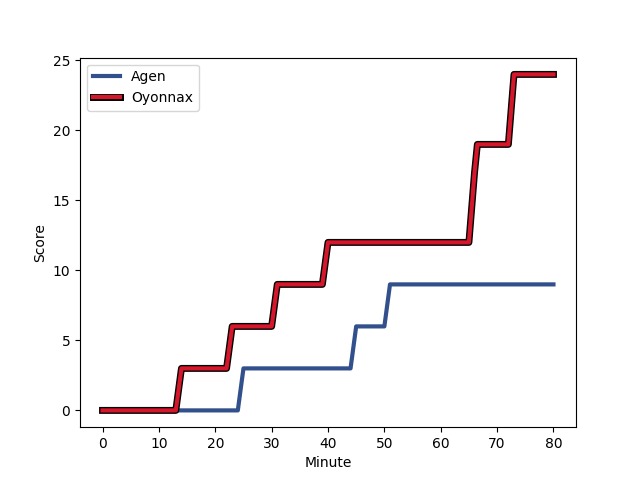
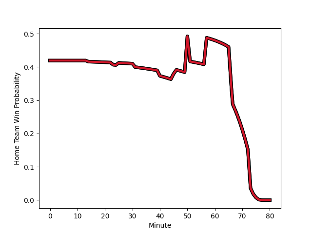

---  
layout: page  
title: Oyonnax at Agen; 24-9  
date: 2022-11-18 21:00:00 18:00:00 -0500  
categories: match review  
---
# Oyonnax (1632.11) at Agen (1491.07); 24-9

# Prediction: Oyonnax by 11.1

Oyonnax by 14.1 on a neutral field
## Scores over Time

## Win Probability over Time

# Pre-Match Prediction: Oyonnax by 10.8

Oyonnax by 13.8 on a neutral pitch

|   Away Minutes | Away Player                                                       |   Away elo |   Away Percentile |   Number |   Home Percentile |   Home elo | Home Player                                                             |   Home Minutes |
|---------------:|:------------------------------------------------------------------|-----------:|------------------:|---------:|------------------:|-----------:|:------------------------------------------------------------------------|---------------:|
|             57 | [Tommy Raynaud](..//playerfiles//TommyRaynaud_cleaned.md)         |      92.33 |                33 |        1 |                 2 |      73.8  | [Florent Guion](..//playerfiles//FlorentGuion_cleaned.md)               |             51 |
|             50 | [Benjamin Geledan](..//playerfiles//BenjaminGeledan_cleaned.md)   |     101.49 |                72 |        2 |                84 |     106.42 | [Clement Martinez](..//playerfiles//ClementMartinez_cleaned.md)         |             46 |
|             46 | [Thomas Laclayat](..//playerfiles//ThomasLaclayat_cleaned.md)     |     102.96 |                72 |        3 |                54 |      96.12 | [Malik Hamadache](..//playerfiles//MalikHamadache_cleaned.md)           |             46 |
|             57 | [Tom Murday](..//playerfiles//TomMurday_cleaned.md)               |     145.91 |                99 |        4 |                17 |      86.14 | [Joe Maksymiw](..//playerfiles//JoeMaksymiw_cleaned.md)                 |             80 |
|             80 | [Phoenix Battye](..//playerfiles//PhoenixBattye_cleaned.md)       |     142.52 |                99 |        5 |                22 |      88.28 | [Evan Olmstead](..//playerfiles//EvanOlmstead_cleaned.md)               |             46 |
|             50 | [Wandrille Picault](..//playerfiles//WandrillePicault_cleaned.md) |      96.59 |                54 |        6 |                92 |     114.05 | [Arnaud Duputs](..//playerfiles//ArnaudDuputs_cleaned.md)               |             80 |
|             57 | [Loïc Credoz](..//playerfiles//LoïcCredoz_cleaned.md)             |      92.36 |                36 |        7 |                69 |      99.87 | [Antoine Erbani](..//playerfiles//AntoineErbani_cleaned.md)             |             80 |
|             80 | [Rory Grice](..//playerfiles//RoryGrice_cleaned.md)               |     137.43 |                99 |        8 |                81 |     107.91 | [Fotu Lokotui](..//playerfiles//FotuLokotui_cleaned.md)                 |             57 |
|             75 | [Charlie Cassang](..//playerfiles//CharlieCassang_cleaned.md)     |     112.27 |                89 |        9 |                47 |      94.74 | [Dorian Bellot](..//playerfiles//DorianBellot_cleaned.md)               |             57 |
|             75 | [Jules Soulan](..//playerfiles//JulesSoulan_cleaned.md)           |     110.88 |                85 |       10 |                18 |      87.33 | [Raphael Lagarde](..//playerfiles//RaphaelLagarde_cleaned.md)           |             75 |
|             80 | [Enzo Reybier](..//playerfiles//EnzoReybier_cleaned.md)           |      98.23 |                61 |       11 |                95 |     119.13 | [Iban Etcheverry](..//playerfiles//IbanEtcheverry_cleaned.md)           |             53 |
|             80 | [Theo Millet](..//playerfiles//TheoMillet_cleaned.md)             |     118.39 |                93 |       12 |                63 |      99.5  | [Kolinio Ramoka](..//playerfiles//KolinioRamoka_cleaned.md)             |             80 |
|             80 | [Florian Vialelle](..//playerfiles//FlorianVialelle_cleaned.md)   |      96.76 |                53 |       13 |                92 |     116    | [Harry Sloan](..//playerfiles//HarrySloan_cleaned.md)                   |             80 |
|             80 | [Darren Sweetnam](..//playerfiles//DarrenSweetnam_cleaned.md)     |     112.8  |                89 |       14 |                53 |      96.5  | [Tevita Railevu](..//playerfiles//TevitaRailevu_cleaned.md)             |             80 |
|             80 | [Tony Ensor](..//playerfiles//TonyEnsor_cleaned.md)               |      74.63 |                 3 |       15 |                67 |     101    | [Jean-Marcelin Buttin](..//playerfiles//Jean-MarcelinButtin_cleaned.md) |             80 |
|             34 | [Thibault Berthaud](..//playerfiles//ThibaultBerthaud_cleaned.md) |      92.45 |                33 |       16 |                85 |     106.92 | [Alex Burin](..//playerfiles//AlexBurin_cleaned.md)                     |             34 |
|             30 | [Teddy Durand](..//playerfiles//TeddyDurand_cleaned.md)           |      98.32 |                58 |       17 |                38 |      92.85 | [Loris Zarantonello](..//playerfiles//LorisZarantonello_cleaned.md)     |             34 |
|             30 | [Kevin Lebreton](..//playerfiles//KevinLebreton_cleaned.md)       |     112.22 |                90 |       18 |                80 |     106    | [William Demotte](..//playerfiles//WilliamDemotte_cleaned.md)           |             34 |
|             23 | [Hugo Fabregue](..//playerfiles//HugoFabregue_cleaned.md)         |     111.38 |                88 |       19 |                87 |     107.87 | [Richard Barrington](..//playerfiles//RichardBarrington_cleaned.md)     |             29 |
|             23 | [Adrien Bordenave](..//playerfiles//AdrienBordenave_cleaned.md)   |      82.16 |                 3 |       20 |                 2 |      74.33 | [Loris Tolot](..//playerfiles//LorisTolot_cleaned.md)                   |             27 |
|             23 | [Filimo Taofifenua](..//playerfiles//FilimoTaofifenua_cleaned.md) |     129.73 |                96 |       21 |                29 |      90.54 | [Theo Idjellidaine](..//playerfiles//TheoIdjellidaine_cleaned.md)       |             23 |
|              5 | [Ilan El Khattabi](..//playerfiles//IlanElKhattabi_cleaned.md)    |      95.38 |                46 |       22 |                88 |     111.94 | [Martin Devergie](..//playerfiles//MartinDevergie_cleaned.md)           |             23 |
|              5 | [Justin Bouraux](..//playerfiles//JustinBouraux_cleaned.md)       |     103.26 |                69 |       23 |                55 |      99.07 | [Emile Dayral](..//playerfiles//EmileDayral_cleaned.md)                 |              5 |

