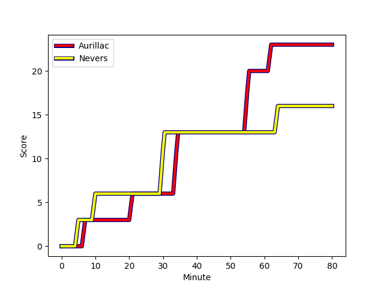
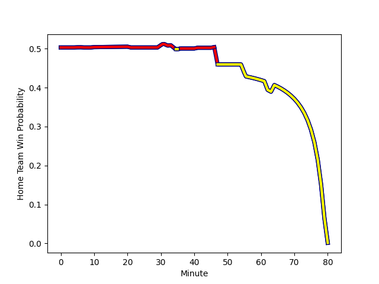

---  
layout: page  
title: Nevers at Aurillac; 16-23  
date: 2022-11-18 19:30:00 18:00:00 -0500  
categories: match review  
---
# Nevers (1425.03) at Aurillac (1430.61); 16-23

# Prediction: Aurillac by 3.6

Aurillac by 0.6 on a neutral field
## Scores over Time

## Win Probability over Time

# Pre-Match Prediction: Aurillac by 0.9

Nevers by 2.1 on a neutral pitch

|   Away Minutes | Away Player                                                                   |   Away elo |   Away Percentile |   Number |   Home Percentile |   Home elo | Home Player                                                               |   Home Minutes |
|---------------:|:------------------------------------------------------------------------------|-----------:|------------------:|---------:|------------------:|-----------:|:--------------------------------------------------------------------------|---------------:|
|             48 | [Tomike Mataradze](..//playerfiles//TomikeMataradze_cleaned.md)               |      83.18 |                 8 |        1 |                76 |     103.09 | [Alexandre Plantier](..//playerfiles//AlexandrePlantier_cleaned.md)       |             54 |
|             47 | [Issam Hamel](..//playerfiles//IssamHamel_cleaned.md)                         |     111.32 |                91 |        2 |                90 |     109.92 | [Adrian Smith](..//playerfiles//AdrianSmith_cleaned.md)                   |             41 |
|             47 | [Ilia Kaikatsishvili](..//playerfiles//IliaKaikatsishvili_cleaned.md)         |      92.07 |                44 |        3 |                35 |      92.73 | [Henzo Kiteau](..//playerfiles//HenzoKiteau_cleaned.md)                   |             32 |
|             80 | [Christiaan van der Merwe](..//playerfiles//ChristiaanvanderMerwe_cleaned.md) |      76.63 |                 5 |        4 |                92 |     114.47 | [Cam Dodson](..//playerfiles//CamDodson_cleaned.md)                       |             46 |
|             80 | [Maka Polutele](..//playerfiles//MakaPolutele_cleaned.md)                     |      80.09 |                 8 |        5 |                13 |      83.76 | [Jean-Baptiste Singer](..//playerfiles//Jean-BaptisteSinger_cleaned.md)   |             54 |
|             36 | [Julien Kazubek](..//playerfiles//JulienKazubek_cleaned.md)                   |      85.93 |                15 |        6 |                51 |      96.03 | [Eoghan Masterson](..//playerfiles//EoghanMasterson_cleaned.md)           |             80 |
|             80 | [Shaun Adendorff](..//playerfiles//ShaunAdendorff_cleaned.md)                 |      94.59 |                45 |        7 |                32 |      91.57 | [Beka Shvangiradze](..//playerfiles//BekaShvangiradze_cleaned.md)         |             80 |
|             56 | [Jason-Colin Fraser](..//playerfiles//Jason-ColinFraser_cleaned.md)           |     118.18 |                92 |        8 |                81 |     106.33 | [Dylan Cretin](..//playerfiles//DylanCretin_cleaned.md)                   |             61 |
|             58 | [Guillaume Manevy](..//playerfiles//GuillaumeManevy_cleaned.md)               |     105.01 |                78 |        9 |                14 |      86.56 | [David Delarue](..//playerfiles//DavidDelarue_cleaned.md)                 |             80 |
|             54 | [Yohan Le Bourhis](..//playerfiles//YohanLeBourhis_cleaned.md)                |      95.05 |                46 |       10 |                12 |      85.06 | [Antoine Aucagne](..//playerfiles//AntoineAucagne_cleaned.md)             |             80 |
|             80 | [Lucas Blanc](..//playerfiles//LucasBlanc_cleaned.md)                         |     102.27 |                74 |       11 |                14 |      85.97 | [AJ Coertzen](..//playerfiles//AJCoertzen_cleaned.md)                     |             41 |
|             58 | [Rudy Derrieux](..//playerfiles//RudyDerrieux_cleaned.md)                     |      81.45 |                 8 |       12 |                13 |      84.22 | [Christa Powell](..//playerfiles//ChristaPowell_cleaned.md)               |             80 |
|             80 | [Alifereti Loaloa](..//playerfiles//AliferetiLoaloa_cleaned.md)               |      72.09 |                 2 |       13 |                 7 |      80.7  | [Jimmy Yobo](..//playerfiles//JimmyYobo_cleaned.md)                       |             80 |
|             80 | [Christian Erasmus](..//playerfiles//ChristianErasmus_cleaned.md)             |     113.43 |                90 |       14 |                77 |     104.45 | [Elijah Niko](..//playerfiles//ElijahNiko_cleaned.md)                     |             80 |
|             80 | [Kylian Jaminet](..//playerfiles//KylianJaminet_cleaned.md)                   |     121.5  |                95 |       15 |                34 |      92.16 | [Giorgi Gogoladze](..//playerfiles//GiorgiGogoladze_cleaned.md)           |             80 |
|             44 | [Maxence Barjaud](..//playerfiles//MaxenceBarjaud_cleaned.md)                 |      93.81 |                46 |       16 |                93 |     113.8  | [Giorgi Kartvelishvili](..//playerfiles//GiorgiKartvelishvili_cleaned.md) |             48 |
|             33 | [Aselo Ikahehegi](..//playerfiles//AseloIkahehegi_cleaned.md)                 |      87.63 |                16 |       17 |                66 |     100.52 | [Marc Palmier](..//playerfiles//MarcPalmier_cleaned.md)                   |             39 |
|             33 | [Elia Elia](..//playerfiles//EliaElia_cleaned.md)                             |      83.46 |                10 |       18 |                83 |     106.24 | [Luka Nioradze](..//playerfiles//LukaNioradze_cleaned.md)                 |             39 |
|             32 | [Aitor Kitutu](..//playerfiles//AitorKitutu_cleaned.md)                       |     108.28 |                90 |       19 |                76 |     102.7  | [Georgi Javakhia](..//playerfiles//GeorgiJavakhia_cleaned.md)             |             34 |
|             26 | [Shaun Reynolds](..//playerfiles//ShaunReynolds_cleaned.md)                   |      84.52 |                12 |       20 |                37 |      92.1  | [Jean-Jacques Gymael](..//playerfiles//Jean-JacquesGymael_cleaned.md)     |             26 |
|             24 | [Luka Plataret](..//playerfiles//LukaPlataret_cleaned.md)                     |      82.4  |                 9 |       21 |                86 |     108.79 | [Yann Tivoli](..//playerfiles//YannTivoli_cleaned.md)                     |             26 |
|             22 | [Leonard Paris](..//playerfiles//LeonardParis_cleaned.md)                     |     111.68 |                88 |       22 |                30 |      89.89 | [Maxime Profit](..//playerfiles//MaximeProfit_cleaned.md)                 |             19 |
|             22 | [Arthurs Barbier](..//playerfiles//ArthursBarbier_cleaned.md)                 |      94.25 |               nan |       23 |               nan |     nan    | nan                                                                       |            nan |

