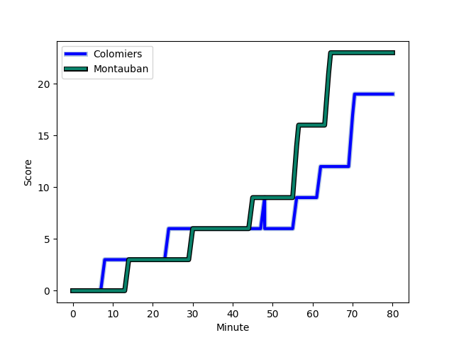
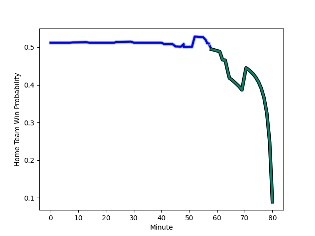

---  
layout: page  
title: Montauban at Colomiers; 23-19  
date: 2022-11-18 19:30:00 18:00:00 -0500  
categories: match review  
---
# Montauban (1410.41) at Colomiers (1430.9); 23-19

# Prediction: Colomiers by 5.0

Colomiers by 2.0 on a neutral field
## Scores over Time

## Win Probability over Time

# Pre-Match Prediction: Colomiers by 13.8

Colomiers by 10.8 on a neutral pitch

|   Away Minutes | Away Player                                                                    |   Away elo |   Away Percentile |   Number |   Home Percentile |   Home elo | Home Player                                                               |   Home Minutes |
|---------------:|:-------------------------------------------------------------------------------|-----------:|------------------:|---------:|------------------:|-----------:|:--------------------------------------------------------------------------|---------------:|
|             55 | [Lucas Seyrolle](..//playerfiles//LucasSeyrolle_cleaned.md)                    |      77.86 |                 2 |        1 |                55 |      97.09 | [Hugo Djehi](..//playerfiles//HugoDjehi_cleaned.md)                       |             41 |
|             58 | [Kevin Firmin](..//playerfiles//KevinFirmin_cleaned.md)                        |      87.34 |                17 |        2 |                93 |     113.31 | [Hika Elliot](..//playerfiles//HikaElliot_cleaned.md)                     |             50 |
|             55 | [Mirian Burduli](..//playerfiles//MirianBurduli_cleaned.md)                    |      82.32 |                 7 |        3 |                89 |     107.77 | [Marco Fepulea'i](..//playerfiles//MarcoFepulea'i_cleaned.md)             |             50 |
|             52 | [Dimitri Vaotoa](..//playerfiles//DimitriVaotoa_cleaned.md)                    |      76.26 |                 4 |        4 |                64 |     101.16 | [Jean Thomas](..//playerfiles//JeanThomas_cleaned.md)                     |             80 |
|             58 | [Kevin Gimeno](..//playerfiles//KevinGimeno_cleaned.md)                        |      63.14 |                 0 |        5 |                21 |      88.13 | [Maxime Granouillet](..//playerfiles//MaximeGranouillet_cleaned.md)       |             55 |
|             80 | [Frédéric Quercy](..//playerfiles//FrédéricQuercy_cleaned.md)                  |      82.55 |                 8 |        6 |                 0 |      63.24 | [Anthony Coletta](..//playerfiles//AnthonyColetta_cleaned.md)             |             80 |
|             58 | [Stéphane Munoz](..//playerfiles//StéphaneMunoz_cleaned.md)                    |      77.96 |                 4 |        7 |                63 |      99.03 | [Aldric Lescure](..//playerfiles//AldricLescure_cleaned.md)               |             80 |
|             80 | [Quentin Witt](..//playerfiles//QuentinWitt_cleaned.md)                        |      90.35 |                29 |        8 |                60 |      98.6  | [Jorick Dastugue](..//playerfiles//JorickDastugue_cleaned.md)             |             55 |
|             80 | [Alexis Bernadet](..//playerfiles//AlexisBernadet_cleaned.md)                  |      98.78 |                63 |        9 |                82 |     106.79 | [Ugo Seguela](..//playerfiles//UgoSeguela_cleaned.md)                     |             68 |
|             80 | [Jérôme Bosviel](..//playerfiles//JérômeBosviel_cleaned.md)                    |     118.33 |                92 |       10 |                34 |      92.31 | [Romuald Séguy](..//playerfiles//RomualdSéguy_cleaned.md)                 |             55 |
|             80 | [Bastien Guillemin](..//playerfiles//BastienGuillemin_cleaned.md)              |      95.02 |                47 |       11 |                21 |      88.91 | [Valentin Saurs](..//playerfiles//ValentinSaurs_cleaned.md)               |             80 |
|             80 | [Taleta Tupuola](..//playerfiles//TaletaTupuola_cleaned.md)                    |      91.7  |                32 |       12 |                77 |     104.25 | [Michele Campagnaro](..//playerfiles//MicheleCampagnaro_cleaned.md)       |             80 |
|             80 | [Paul Bonnefond](..//playerfiles//PaulBonnefond_cleaned.md)                    |      95.35 |                48 |       13 |                80 |     106.03 | [Fabien Perrin](..//playerfiles//FabienPerrin_cleaned.md)                 |             62 |
|             80 | [Semesa Rokoduguni](..//playerfiles//SemesaRokoduguni_cleaned.md)              |     123.81 |                97 |       14 |                66 |      99.4  | [Peni Rokoduguni](..//playerfiles//PeniRokoduguni_cleaned.md)             |             80 |
|             80 | [Maxime Salles](..//playerfiles//MaximeSalles_cleaned.md)                      |     115.76 |                92 |       15 |                12 |      83.22 | [Thomas Girard](..//playerfiles//ThomasGirard_cleaned.md)                 |             80 |
|             22 | [Cyril Deligny](..//playerfiles//CyrilDeligny_cleaned.md)                      |      68.64 |                 0 |       16 |                 3 |      74.21 | [Thomas Dubois](..//playerfiles//ThomasDubois_cleaned.md)                 |             39 |
|             28 | [Alexandre Manukula](..//playerfiles//AlexandreManukula_cleaned.md)            |     108.17 |                85 |       17 |                93 |     114.44 | [Thomas Larrieu](..//playerfiles//ThomasLarrieu_cleaned.md)               |             30 |
|             25 | [Nicolas Agnesi](..//playerfiles//NicolasAgnesi_cleaned.md)                    |     107.84 |                87 |       18 |                34 |      92.52 | [Robin Bellemand](..//playerfiles//RobinBellemand_cleaned.md)             |             30 |
|             25 | [Victor Laval](..//playerfiles//VictorLaval_cleaned.md)                        |      83.77 |                 7 |       19 |                45 |      94.45 | [Alexandre Ricard](..//playerfiles//AlexandreRicard_cleaned.md)           |             25 |
|             22 | [Rodrigo Fernandez Criado](..//playerfiles//RodrigoFernandezCriado_cleaned.md) |     109.6  |                87 |       20 |                17 |      87.31 | [Pierre-Samuel Pacheco](..//playerfiles//Pierre-SamuelPacheco_cleaned.md) |             25 |
|             22 | [Tyrone Viiga](..//playerfiles//TyroneViiga_cleaned.md)                        |      97.07 |                53 |       21 |                35 |      91.58 | [Max Auriac](..//playerfiles//MaxAuriac_cleaned.md)                       |             25 |
|            nan | nan                                                                            |     nan    |               nan |       22 |                86 |     111.23 | [Paul Pimienta](..//playerfiles//PaulPimienta_cleaned.md)                 |             18 |
|            nan | nan                                                                            |     nan    |               nan |       23 |                62 |      98.2  | [Edoardo Gori](..//playerfiles//EdoardoGori_cleaned.md)                   |             12 |

