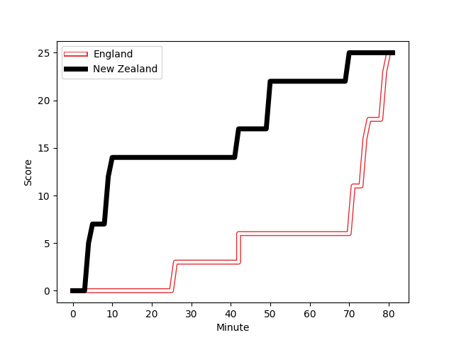
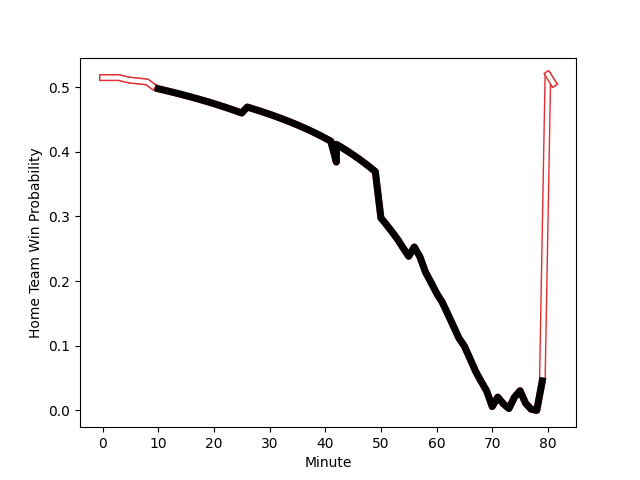

---  
layout: page  
title: New Zealand at England; 25.0-25.0  
date: 2022-11-18 17:30:00 18:00:00 -0500  
categories: match review  
---
# New Zealand (1719.26) at England (1745.07); 25.0-25.0

# Prediction: England by 5.6

England by 2.6 on a neutral field
## Scores over Time

## Win Probability over Time

# Pre-Match Prediction: England by 4.7

England by 1.7 on a neutral pitch

|   Away Minutes | Away Player                                                           |   Away elo |   Away Percentile |   Number |   Home Percentile |   Home elo | Home Player                                                          |   Home Minutes |
|---------------:|:----------------------------------------------------------------------|-----------:|------------------:|---------:|------------------:|-----------:|:---------------------------------------------------------------------|---------------:|
|             61 | [Ethan de Groot](..//playerfiles//EthandeGroot_cleaned.md)            |     105.12 |                81 |        1 |                86 |     107.39 | [Ellis Genge](..//playerfiles//EllisGenge_cleaned.md)                |             56 |
|             58 | [Codie Taylor](..//playerfiles//CodieTaylor_cleaned.md)               |      95.1  |                53 |        2 |                88 |     109.01 | [Luke Cowan-Dickie](..//playerfiles//LukeCowan-Dickie_cleaned.md)    |             56 |
|             58 | [Tyrel Lomax](..//playerfiles//TyrelLomax_cleaned.md)                 |     115.15 |                95 |        3 |                91 |     111.56 | [Kyle Sinckler](..//playerfiles//KyleSinckler_cleaned.md)            |             56 |
|             81 | [Brodie Retallick](..//playerfiles//BrodieRetallick_cleaned.md)       |     117.75 |                94 |        4 |                96 |     122.19 | [Maro Itoje](..//playerfiles//MaroItoje_cleaned.md)                  |             81 |
|             81 | [Sam Whitelock](..//playerfiles//SamWhitelock_cleaned.md)             |     107.45 |                84 |        5 |                43 |      93.78 | [Jonny Hill](..//playerfiles//JonnyHill_cleaned.md)                  |             65 |
|             68 | [Scott Barrett](..//playerfiles//ScottBarrett_cleaned.md)             |     126.18 |                97 |        6 |                93 |     121.65 | [Sam Simmonds](..//playerfiles//SamSimmonds_cleaned.md)              |             67 |
|             73 | [Dalton Papali'i](..//playerfiles//DaltonPapali'i_cleaned.md)         |     104.03 |                77 |        7 |                86 |     109.2  | [Tom Curry](..//playerfiles//TomCurry_cleaned.md)                    |             81 |
|             81 | [Ardie Savea](..//playerfiles//ArdieSavea_cleaned.md)                 |     125.75 |                95 |        8 |                98 |     134.61 | [Billy Vunipola](..//playerfiles//BillyVunipola_cleaned.md)          |             81 |
|             63 | [Aaron Smith](..//playerfiles//AaronSmith_cleaned.md)                 |     112.07 |                89 |        9 |                88 |     111.05 | [Jack van Poortvliet](..//playerfiles//JackvanPoortvliet_cleaned.md) |             54 |
|             81 | [Richie Mo'unga](..//playerfiles//RichieMo'unga_cleaned.md)           |     128.34 |                97 |       10 |                92 |     119.28 | [Marcus Smith](..//playerfiles//MarcusSmith_cleaned.md)              |             81 |
|             73 | [Caleb Clarke](..//playerfiles//CalebClarke_cleaned.md)               |     100.77 |                69 |       11 |                89 |     112.54 | [Jonny May](..//playerfiles//JonnyMay_cleaned.md)                    |             81 |
|             81 | [Jordie Barrett](..//playerfiles//JordieBarrett_cleaned.md)           |     130.93 |                99 |       12 |               100 |     142.65 | [Owen Farrell](..//playerfiles//OwenFarrell_cleaned.md)              |             81 |
|             81 | [Rieko Ioane](..//playerfiles//RiekoIoane_cleaned.md)                 |      95.71 |                53 |       13 |                95 |     122.58 | [Manu Tuilagi](..//playerfiles//ManuTuilagi_cleaned.md)              |             54 |
|             81 | [Mark Telea](..//playerfiles//MarkTelea_cleaned.md)                   |     114.87 |                92 |       14 |                91 |     114.1  | [Jack Nowell](..//playerfiles//JackNowell_cleaned.md)                |             68 |
|             81 | [Beauden Barrett](..//playerfiles//BeaudenBarrett_cleaned.md)         |     137.6  |                99 |       15 |                69 |     102.16 | [Freddie Steward](..//playerfiles//FreddieSteward_cleaned.md)        |             81 |
|             23 | [Samisoni Taukei'aho](..//playerfiles//SamisoniTaukei'aho_cleaned.md) |     113.57 |                93 |       16 |                99 |     141.13 | [Jamie George](..//playerfiles//JamieGeorge_cleaned.md)              |             25 |
|             20 | [George Bower](..//playerfiles//GeorgeBower_cleaned.md)               |      98.5  |                65 |       17 |                99 |     137.92 | [Mako Vunipola](..//playerfiles//MakoVunipola_cleaned.md)            |             25 |
|             23 | [Nepo Laulala](..//playerfiles//NepoLaulala_cleaned.md)               |     109.05 |                88 |       18 |                21 |      89.51 | [Will Stuart](..//playerfiles//WillStuart_cleaned.md)                |             25 |
|             13 | [Shannon Frizell](..//playerfiles//ShannonFrizell_cleaned.md)         |     102.82 |                75 |       19 |                87 |     109.75 | [David Ribbans](..//playerfiles//DavidRibbans_cleaned.md)            |             16 |
|              8 | [Hoskins Sotutu](..//playerfiles//HoskinsSotutu_cleaned.md)           |     126.34 |                95 |       20 |                94 |     117.54 | [Jack Willis](..//playerfiles//JackWillis_cleaned.md)                |             14 |
|             18 | [TJ Perenara](..//playerfiles//TJPerenara_cleaned.md)                 |     112.14 |                91 |       21 |                90 |     113.41 | [Ben Youngs](..//playerfiles//BenYoungs_cleaned.md)                  |             27 |
|              0 | [David Havili](..//playerfiles//DavidHavili_cleaned.md)               |     128.06 |                97 |       22 |                46 |      94.93 | [Guy Porter](..//playerfiles//GuyPorter_cleaned.md)                  |             13 |
|              8 | [Anton Lienert-Brown](..//playerfiles//AntonLienert-Brown_cleaned.md) |     121.88 |                95 |       23 |                93 |     118.46 | [Henry Slade](..//playerfiles//HenrySlade_cleaned.md)                |             27 |

