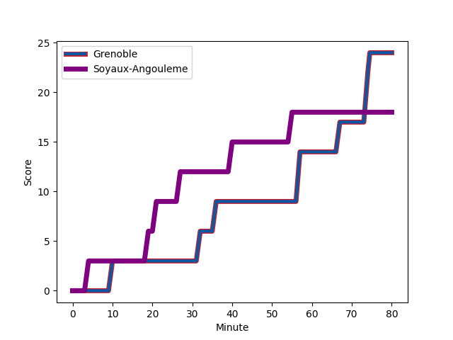
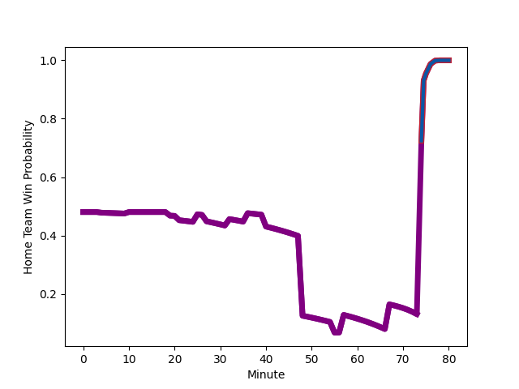

---  
layout: page  
title: Soyaux-Angouleme at Grenoble; 18-24  
date: 2022-11-18 19:30:00 18:00:00 -0500  
categories: match review  
---
# Soyaux-Angouleme (1453.66) at Grenoble (1419.67); 18-24

# Prediction: Soyaux-Angouleme by 0.4

Soyaux-Angouleme by 3.4 on a neutral field
## Scores over Time

## Win Probability over Time

# Pre-Match Prediction: Soyaux-Angouleme by 4.1

Grenoble by 1.1 on a neutral pitch

|   Away Minutes | Away Player                                                         |   Away elo |   Away Percentile |   Number |   Home Percentile |   Home elo | Home Player                                                                         |   Home Minutes |
|---------------:|:--------------------------------------------------------------------|-----------:|------------------:|---------:|------------------:|-----------:|:------------------------------------------------------------------------------------|---------------:|
|             48 | [Khatchik Vartanov](..//playerfiles//KhatchikVartanov_cleaned.md)   |      92.52 |                34 |        1 |                90 |     109.74 | [Zack Gauthier](..//playerfiles//ZackGauthier_cleaned.md)                           |             59 |
|             48 | [Patxi Bidart](..//playerfiles//PatxiBidart_cleaned.md)             |      95.44 |                50 |        2 |                85 |     106.94 | [Lilian Rossi](..//playerfiles//LilianRossi_cleaned.md)                             |             41 |
|             57 | [Seydou Diakité](..//playerfiles//SeydouDiakité_cleaned.md)         |     101.66 |                72 |        3 |                36 |      94.05 | [Irakli Aptsiauri](..//playerfiles//IrakliAptsiauri_cleaned.md)                     |             63 |
|             80 | [Saba Pesvianidze](..//playerfiles//SabaPesvianidze_cleaned.md)     |     104.39 |                79 |        4 |                67 |      99.62 | [Thomas Lainault](..//playerfiles//ThomasLainault_cleaned.md)                       |             80 |
|             80 | [Sikeli Nabou](..//playerfiles//SikeliNabou_cleaned.md)             |     116.56 |                93 |        5 |                79 |     104.95 | [Pio Muarua](..//playerfiles//PioMuarua_cleaned.md)                                 |             63 |
|             65 | [Matt Beukeboom](..//playerfiles//MattBeukeboom_cleaned.md)         |      85.89 |                14 |        6 |                26 |      90.15 | [Antonin Berruyer](..//playerfiles//AntoninBerruyer_cleaned.md)                     |             56 |
|             25 | [Hubert Texier](..//playerfiles//HubertTexier_cleaned.md)           |      98.87 |                60 |        7 |                10 |      83.84 | [Clement Ancely](..//playerfiles//ClementAncely_cleaned.md)                         |             80 |
|             59 | [Yassine Jarmouni](..//playerfiles//YassineJarmouni_cleaned.md)     |      86.9  |                18 |        8 |                 5 |      77.56 | [Thibaut Martel](..//playerfiles//ThibautMartel_cleaned.md)                         |             80 |
|             80 | [Manu Saubusse](..//playerfiles//ManuSaubusse_cleaned.md)           |     106.75 |                81 |        9 |                99 |     131.26 | [Felipe Ezcurra](..//playerfiles//FelipeEzcurra_cleaned.md)                         |             48 |
|             80 | [Matthieu Ugalde](..//playerfiles//MatthieuUgalde_cleaned.md)       |     107.5  |                81 |       10 |                51 |      96.69 | [Romain Barthelemy](..//playerfiles//RomainBarthelemy_cleaned.md)                   |             48 |
|             80 | [Marvin Lestremau](..//playerfiles//MarvinLestremau_cleaned.md)     |      94.77 |                46 |       11 |                19 |      88.17 | [Karim Qadiri](..//playerfiles//KarimQadiri_cleaned.md)                             |             80 |
|             80 | [Mathis Lafon](..//playerfiles//MathisLafon_cleaned.md)             |      99.73 |                64 |       12 |                29 |      90.54 | [Terrence Hepetema](..//playerfiles//TerrenceHepetema_cleaned.md)                   |             80 |
|             80 | [Ledua Mau](..//playerfiles//LeduaMau_cleaned.md)                   |      86.42 |                17 |       13 |                43 |      93.88 | [Romain Fusier](..//playerfiles//RomainFusier_cleaned.md)                           |             56 |
|             61 | [Maxime Laforgue](..//playerfiles//MaximeLaforgue_cleaned.md)       |      98.95 |                63 |       14 |                12 |      83.37 | [Atunaisa Taulanga Vaka Manu](..//playerfiles//AtunaisaTaulangaVakaManu_cleaned.md) |             80 |
|             80 | [Pierre Lafitte](..//playerfiles//PierreLafitte_cleaned.md)         |      88.11 |                18 |       15 |                62 |      99.04 | [Julien Farnoux](..//playerfiles//JulienFarnoux_cleaned.md)                         |             80 |
|             55 | [Gautier Gibouin](..//playerfiles//GautierGibouin_cleaned.md)       |      77.79 |                 4 |       16 |                11 |      86.11 | [Jean Charles Orioli](..//playerfiles//JeanCharlesOrioli_cleaned.md)                |             39 |
|             32 | [Omar Odishvili](..//playerfiles//OmarOdishvili_cleaned.md)         |     104.4  |                79 |       17 |                22 |      89.55 | [Thomas Fortunel](..//playerfiles//ThomasFortunel_cleaned.md)                       |             32 |
|             32 | [Kevin Le Guen](..//playerfiles//KevinLeGuen_cleaned.md)            |     105.08 |                80 |       18 |                52 |      96.72 | [Eric Escande](..//playerfiles//EricEscande_cleaned.md)                             |             32 |
|             23 | [Yassine Boutemane](..//playerfiles//YassineBoutemane_cleaned.md)   |      86.49 |                13 |       19 |                65 |     100.17 | [Bautista Ezcurra](..//playerfiles//BautistaEzcurra_cleaned.md)                     |             24 |
|             21 | [Matt Va'ai](..//playerfiles//MattVa'ai_cleaned.md)                 |      83.69 |                14 |       20 |               nan |      95.66 | [Marko Gazzotti](..//playerfiles//MarkoGazzotti_cleaned.md)                         |             24 |
|             19 | [Rémi Brosset](..//playerfiles//RémiBrosset_cleaned.md)             |      92.97 |                40 |       21 |                44 |      96.06 | [Luka Goginava](..//playerfiles//LukaGoginava_cleaned.md)                           |             21 |
|             15 | [Enzo Morand-Bruyat](..//playerfiles//EnzoMorand-Bruyat_cleaned.md) |      95    |               nan |       22 |                28 |      90.44 | [Adrien Vigne](..//playerfiles//AdrienVigne_cleaned.md)                             |             17 |
|            nan | nan                                                                 |     nan    |               nan |       23 |               nan |      93.29 | [Vincent Vial](..//playerfiles//VincentVial_cleaned.md)                             |             17 |

