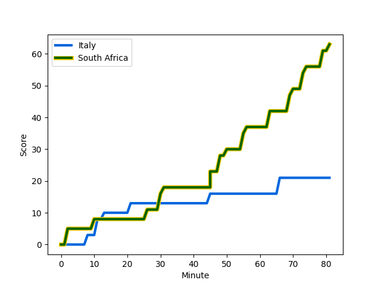
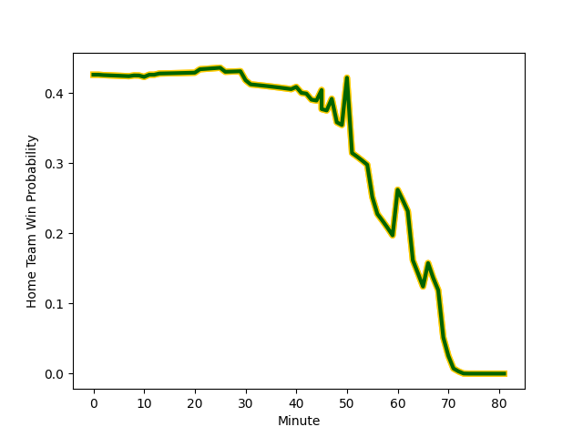

---  
layout: page  
title: South Africa at Italy; 63.0-21.0  
date: 2022-11-18 14:00:00 18:00:00 -0500  
categories: match review  
---
# South Africa (1697.71) at Italy (1568.68); 63.0-21.0

# Prediction: South Africa by 9.9

South Africa by 12.9 on a neutral field
## Scores over Time

## Win Probability over Time

# Pre-Match Prediction: South Africa by 13.3

South Africa by 16.3 on a neutral pitch

|   Away Minutes | Away Player                                                       |   Away elo |   Away Percentile |   Number |   Home Percentile |   Home elo | Home Player                                                                       |   Home Minutes |
|---------------:|:------------------------------------------------------------------|-----------:|------------------:|---------:|------------------:|-----------:|:----------------------------------------------------------------------------------|---------------:|
|             50 | [Ox Nche](..//playerfiles//OxNche_cleaned.md)                     |     102.47 |                74 |        1 |                45 |      94.84 | [Danilo Fischetti](..//playerfiles//DaniloFischetti_cleaned.md)                   |             51 |
|             50 | [Bongi Mbonambi](..//playerfiles//BongiMbonambi_cleaned.md)       |     115    |                94 |        2 |                90 |     108.99 | [Giacomo Nicotera](..//playerfiles//GiacomoNicotera_cleaned.md)                   |             41 |
|             50 | [Frans Malherbe](..//playerfiles//FransMalherbe_cleaned.md)       |     103.03 |                76 |        3 |                43 |      93.4  | [Pietro Ceccarelli](..//playerfiles//PietroCeccarelli_cleaned.md)                 |             40 |
|             43 | [Salmaan Moerat](..//playerfiles//SalmaanMoerat_cleaned.md)       |     100.29 |                70 |        4 |                 6 |      78.34 | [Niccolo Cannone](..//playerfiles//NiccoloCannone_cleaned.md)                     |             81 |
|             51 | [Marvin Orie](..//playerfiles//MarvinOrie_cleaned.md)             |      94.27 |                45 |        5 |                75 |     102.56 | [Federico Ruzza](..//playerfiles//FedericoRuzza_cleaned.md)                       |             68 |
|             81 | [Siya Kolisi](..//playerfiles//SiyaKolisi_cleaned.md)             |     104.82 |                79 |        6 |               nan |      95    | [Sebastian Negri da Ollegio](..//playerfiles//SebastianNegridaOllegio_cleaned.md) |             81 |
|             81 | [Franco Mostert](..//playerfiles//FrancoMostert_cleaned.md)       |     126.65 |                97 |        7 |                92 |     114.69 | [Michele Lamaro](..//playerfiles//MicheleLamaro_cleaned.md)                       |             81 |
|             60 | [Jasper Wiese](..//playerfiles//JasperWiese_cleaned.md)           |     110.1  |                85 |        8 |                83 |     108.97 | [Lorenzo Cannone](..//playerfiles//LorenzoCannone_cleaned.md)                     |             81 |
|             68 | [Faf de Klerk](..//playerfiles//FafdeKlerk_cleaned.md)            |     113.96 |                92 |        9 |                 8 |      82.73 | [Stephen Varney](..//playerfiles//StephenVarney_cleaned.md)                       |             60 |
|             81 | [Damian Willemse](..//playerfiles//DamianWillemse_cleaned.md)     |     114.16 |                89 |       10 |                77 |     105.42 | [Tommaso Allan](..//playerfiles//TommasoAllan_cleaned.md)                         |             81 |
|             81 | [Kurt-Lee Arendse](..//playerfiles//Kurt-LeeArendse_cleaned.md)   |     118.45 |                94 |       11 |                94 |     118.25 | [Monty Ioane](..//playerfiles//MontyIoane_cleaned.md)                             |             81 |
|             81 | [Andre Esterhuizen](..//playerfiles//AndreEsterhuizen_cleaned.md) |     109.25 |                85 |       12 |                94 |     119.22 | [Luca Morisi](..//playerfiles//LucaMorisi_cleaned.md)                             |             51 |
|             81 | [Damian de Allende](..//playerfiles//DamiandeAllende_cleaned.md)  |     114.45 |                90 |       13 |                77 |     104.41 | [Juan Ignacio Brex](..//playerfiles//JuanIgnacioBrex_cleaned.md)                  |             81 |
|             47 | [Cheslin Kolbe](..//playerfiles//CheslinKolbe_cleaned.md)         |     149.81 |                99 |       14 |                48 |      95.15 | [Pierre Bruno](..//playerfiles//PierreBruno_cleaned.md)                           |             78 |
|             81 | [Willie le Roux](..//playerfiles//WillieleRoux_cleaned.md)        |     122.4  |                95 |       15 |                91 |     113.27 | [Ange Capuozzo](..//playerfiles//AngeCapuozzo_cleaned.md)                         |             81 |
|             31 | [Malcolm Marx](..//playerfiles//MalcolmMarx_cleaned.md)           |     123.38 |                98 |       16 |                36 |      92.2  | [Gianmarco Lucchesi](..//playerfiles//GianmarcoLucchesi_cleaned.md)               |             40 |
|             31 | [Steven Kitshoff](..//playerfiles//StevenKitshoff_cleaned.md)     |     120.64 |                97 |       17 |                64 |      99.56 | [Ivan Nemer](..//playerfiles//IvanNemer_cleaned.md)                               |             30 |
|             31 | [Vincent Koch](..//playerfiles//VincentKoch_cleaned.md)           |      92.17 |                49 |       18 |                76 |     102.98 | [Simone Ferrari](..//playerfiles//SimoneFerrari_cleaned.md)                       |             41 |
|             38 | [Eben Etzebeth](..//playerfiles//EbenEtzebeth_cleaned.md)         |     117.32 |                93 |       19 |                64 |      98.4  | [David Sisi](..//playerfiles//DavidSisi_cleaned.md)                               |             13 |
|             30 | [Kwagga Smith](..//playerfiles//KwaggaSmith_cleaned.md)           |     107.27 |                81 |       20 |                37 |      92.39 | [Manuel Zuliani](..//playerfiles//ManuelZuliani_cleaned.md)                       |             31 |
|             21 | [Evan Roos](..//playerfiles//EvanRoos_cleaned.md)                 |     102.18 |                68 |       21 |                72 |     101    | [Alessandro Garbisi](..//playerfiles//AlessandroGarbisi_cleaned.md)               |             21 |
|             13 | [Cobus Reinach](..//playerfiles//CobusReinach_cleaned.md)         |     113.74 |                91 |       22 |                80 |     107.1  | [Edoardo Padovani](..//playerfiles//EdoardoPadovani_cleaned.md)                   |              3 |
|             34 | [Manie Libbok](..//playerfiles//ManieLibbok_cleaned.md)           |     106.67 |                80 |       23 |                81 |     106.43 | [Tommaso Menoncello](..//playerfiles//TommasoMenoncello_cleaned.md)               |             30 |

