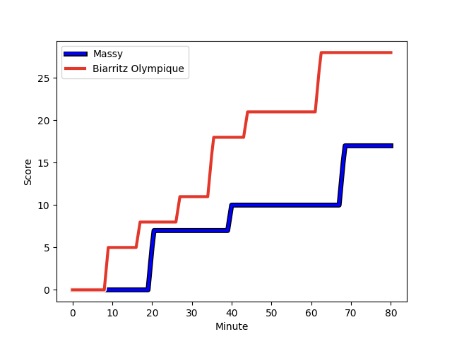
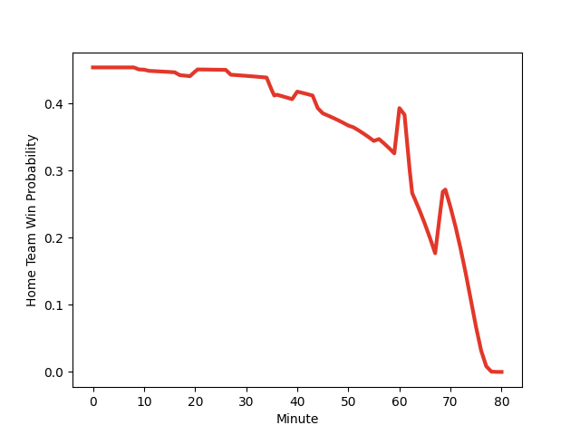

---  
layout: page  
title: Biarritz Olympique at Massy; 28-17  
date: 2022-11-18 19:00:00 18:00:00 -0500  
categories: match review  
---
# Biarritz Olympique (1434.56) at Massy (1354.45); 28-17

# Prediction: Biarritz Olympique by 5.0

Biarritz Olympique by 8.0 on a neutral field
## Scores over Time

## Win Probability over Time

# Pre-Match Prediction: Biarritz Olympique by 2.0

Biarritz Olympique by 5.0 on a neutral pitch

|   Away Minutes | Away Player                                                           |   Away elo |   Away Percentile |   Number |   Home Percentile |   Home elo | Home Player                                                              |   Home Minutes |
|---------------:|:----------------------------------------------------------------------|-----------:|------------------:|---------:|------------------:|-----------:|:-------------------------------------------------------------------------|---------------:|
|             60 | [Baptiste Erdocio](..//playerfiles//BaptisteErdocio_cleaned.md)       |      90.3  |                24 |        1 |                 1 |      67.17 | [Ushangi Tcheishvili](..//playerfiles//UshangiTcheishvili_cleaned.md)    |             36 |
|             69 | [Thomas Sauveterre](..//playerfiles//ThomasSauveterre_cleaned.md)     |      91.24 |                30 |        2 |                30 |      91.13 | [Mamoudou Meite](..//playerfiles//MamoudouMeite_cleaned.md)              |             51 |
|             80 | [Guy Millar](..//playerfiles//GuyMillar_cleaned.md)                   |     117.08 |                96 |        3 |                77 |     103.69 | [Guiterembi Vickos](..//playerfiles//GuiterembiVickos_cleaned.md)        |             36 |
|             80 | [Dave O'Callaghan](..//playerfiles//DaveO'Callaghan_cleaned.md)       |      87    |                19 |        4 |                 7 |      79.09 | [Andrew Chauveau](..//playerfiles//AndrewChauveau_cleaned.md)            |             80 |
|             60 | [Josh Tyrell](..//playerfiles//JoshTyrell_cleaned.md)                 |      96.62 |                55 |        5 |                 9 |      80.43 | [Dion Evrard Oulai](..//playerfiles//DionEvrardOulai_cleaned.md)         |             51 |
|             11 | [Simon Augry](..//playerfiles//SimonAugry_cleaned.md)                 |      91.36 |                31 |        6 |                44 |      94.19 | [Jean Maurice Decubber](..//playerfiles//JeanMauriceDecubber_cleaned.md) |             80 |
|             80 | [Thomas Hebert](..//playerfiles//ThomasHebert_cleaned.md)             |      97.5  |                57 |        7 |                 6 |      76.66 | [Ewan Coetzee](..//playerfiles//EwanCoetzee_cleaned.md)                  |             56 |
|             80 | [Elliot Dixon](..//playerfiles//ElliotDixon_cleaned.md)               |      94.92 |                46 |        8 |                32 |      91.26 | [Clement Lanen](..//playerfiles//ClementLanen_cleaned.md)                |             80 |
|             69 | [Barnabe Couilloud](..//playerfiles//BarnabeCouilloud_cleaned.md)     |      82.06 |                 8 |        9 |                84 |     108.09 | [Benjamin Prier](..//playerfiles//BenjaminPrier_cleaned.md)              |             45 |
|             69 | [Baptiste Germain](..//playerfiles//BaptisteGermain_cleaned.md)       |      90.12 |                25 |       10 |                61 |      99.09 | [Massimo Ortolan](..//playerfiles//MassimoOrtolan_cleaned.md)            |             80 |
|             80 | [Steeve Barry](..//playerfiles//SteeveBarry_cleaned.md)               |      92.22 |                35 |       11 |                10 |      83.49 | [Uwanakaro Tawalo](..//playerfiles//UwanakaroTawalo_cleaned.md)          |             41 |
|             60 | [Francois Vergnaud](..//playerfiles//FrancoisVergnaud_cleaned.md)     |      80.67 |                 7 |       12 |                 8 |      81.3  | [Mathieu Guillomot](..//playerfiles//MathieuGuillomot_cleaned.md)        |             80 |
|             80 | [Tyler Morgan](..//playerfiles//TylerMorgan_cleaned.md)               |     107.69 |                82 |       13 |                46 |      94.91 | [Victorien Jacomme](..//playerfiles//VictorienJacomme_cleaned.md)        |             80 |
|             80 | [Henry Speight](..//playerfiles//HenrySpeight_cleaned.md)             |     120.51 |                95 |       14 |                23 |      88.33 | [Yanis Dit Robaglia](..//playerfiles//YanisDitRobaglia_cleaned.md)       |             80 |
|             80 | [Joe Jonas](..//playerfiles//JoeJonas_cleaned.md)                     |      93.17 |                43 |       15 |                56 |      97.3  | [Romain Clouté](..//playerfiles//RomainClouté_cleaned.md)                |             56 |
|             69 | [Temo Matiu](..//playerfiles//TemoMatiu_cleaned.md)                   |      94.31 |               nan |       16 |                 7 |      82.1  | [Fernandez Correa](..//playerfiles//FernandezCorrea_cleaned.md)          |             44 |
|             20 | [Luka Tchelidze](..//playerfiles//LukaTchelidze_cleaned.md)           |      89.92 |                21 |       17 |               nan |      93.36 | [Julien Brosse](..//playerfiles//JulienBrosse_cleaned.md)                |             44 |
|             20 | [Baptiste Fariscot](..//playerfiles//BaptisteFariscot_cleaned.md)     |     100.44 |                68 |       18 |                68 |     100.18 | [Kimami Sitauti](..//playerfiles//KimamiSitauti_cleaned.md)              |             39 |
|             20 | [Johan Aliouat](..//playerfiles//JohanAliouat_cleaned.md)             |      95.3  |                53 |       19 |                57 |      97.68 | [Gaetan Pichon](..//playerfiles//GaetanPichon_cleaned.md)                |             35 |
|             11 | [Clement Renaud](..//playerfiles//ClementRenaud_cleaned.md)           |      94.57 |                45 |       20 |                68 |      98.99 | [Randy Grelleaud](..//playerfiles//RandyGrelleaud_cleaned.md)            |             29 |
|             11 | [Gilles Bosch](..//playerfiles//GillesBosch_cleaned.md)               |      48.41 |                 0 |       21 |                47 |      94.99 | [Abongile Nonkontwana](..//playerfiles//AbongileNonkontwana_cleaned.md)  |             29 |
|             11 | [Kerman Aurrekoetxea](..//playerfiles//KermanAurrekoetxea_cleaned.md) |      84.38 |                11 |       22 |                46 |      92.57 | [Juan Kotze](..//playerfiles//JuanKotze_cleaned.md)                      |             24 |
|            nan | nan                                                                   |     nan    |               nan |       23 |               nan |      95    | [Andy Timo](..//playerfiles//AndyTimo_cleaned.md)                        |             24 |

