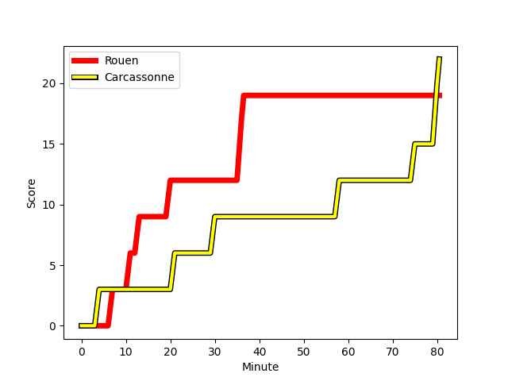
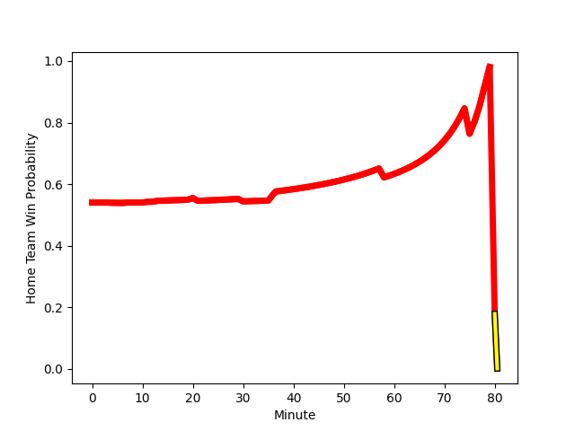

---  
layout: page  
title: Carcassonne at Rouen; 22-19  
date: 2022-11-18 19:30:00 18:00:00 -0500  
categories: match review  
---
# Carcassonne (1370.01) at Rouen (1439.09); 22-19

# Prediction: Rouen by 9.9

Rouen by 6.9 on a neutral field
## Scores over Time

## Win Probability over Time

# Pre-Match Prediction: Rouen by 10.4

Rouen by 7.4 on a neutral pitch

|   Away Minutes | Away Player                                                           |   Away elo |   Away Percentile |   Number |   Home Percentile |   Home elo | Home Player                                                           |   Home Minutes |
|---------------:|:----------------------------------------------------------------------|-----------:|------------------:|---------:|------------------:|-----------:|:----------------------------------------------------------------------|---------------:|
|             21 | [Sami Mavinga](..//playerfiles//SamiMavinga_cleaned.md)               |      91.9  |                30 |        1 |                82 |     104.34 | [Antoine Fournier](..//playerfiles//AntoineFournier_cleaned.md)       |             54 |
|             24 | [Raphael Carbou](..//playerfiles//RaphaelCarbou_cleaned.md)           |      78.89 |                 3 |        2 |                93 |     113.93 | [Mathieu Bonnot](..//playerfiles//MathieuBonnot_cleaned.md)           |             54 |
|             21 | [Vakhtangi Akhobadze](..//playerfiles//VakhtangiAkhobadze_cleaned.md) |      62.35 |                 0 |        3 |                34 |      93.69 | [Hugo Ndiaye](..//playerfiles//HugoNdiaye_cleaned.md)                 |             58 |
|             80 | [Rob Harley](..//playerfiles//RobHarley_cleaned.md)                   |     113.89 |                91 |        4 |                 0 |      57.3  | [John-Charles Astle](..//playerfiles//John-CharlesAstle_cleaned.md)   |             45 |
|             80 | [Rynard Landman](..//playerfiles//RynardLandman_cleaned.md)           |      92.61 |                38 |        5 |                68 |      99.88 | [Toby Salmon](..//playerfiles//TobySalmon_cleaned.md)                 |             80 |
|             80 | [Simon Meka](..//playerfiles//SimonMeka_cleaned.md)                   |      85.37 |                15 |        6 |                56 |      97.17 | [Jean Leleu](..//playerfiles//JeanLeleu_cleaned.md)                   |             80 |
|             65 | [Stephane Onambele](..//playerfiles//StephaneOnambele_cleaned.md)     |      65.41 |                 0 |        7 |                 1 |      66.81 | [Abdelkarim Fofana](..//playerfiles//AbdelkarimFofana_cleaned.md)     |             80 |
|             80 | [Etienne Herjean](..//playerfiles//EtienneHerjean_cleaned.md)         |      85.81 |                13 |        8 |                11 |      82.61 | [Tino Mapapalangi](..//playerfiles//TinoMapapalangi_cleaned.md)       |             56 |
|             34 | [Pierre Pages](..//playerfiles//PierrePages_cleaned.md)               |      99.18 |                64 |        9 |                10 |      83.94 | [Florent Campeggia](..//playerfiles//FlorentCampeggia_cleaned.md)     |             68 |
|             80 | [Dorian Jones](..//playerfiles//DorianJones_cleaned.md)               |      99.62 |                64 |       10 |                95 |     122.66 | [Pete Lydon](..//playerfiles//PeteLydon_cleaned.md)                   |             80 |
|             68 | [Clément Clavières](..//playerfiles//ClémentClavières_cleaned.md)     |      82.22 |                12 |       11 |                93 |     116.39 | [Benito Masilevu](..//playerfiles//BenitoMasilevu_cleaned.md)         |             80 |
|             80 | [Nick Grigg](..//playerfiles//NickGrigg_cleaned.md)                   |      95.14 |                47 |       12 |                58 |      98.01 | [Taylor Gontineac](..//playerfiles//TaylorGontineac_cleaned.md)       |             80 |
|             80 | [Pierre Aguillon](..//playerfiles//PierreAguillon_cleaned.md)         |      84.17 |                13 |       13 |                70 |     101.85 | [Alex Luatua](..//playerfiles//AlexLuatua_cleaned.md)                 |             65 |
|             80 | [Benoit Jasmin](..//playerfiles//BenoitJasmin_cleaned.md)             |     117.81 |                94 |       14 |                79 |     104.69 | [Malcolm Bertschy](..//playerfiles//MalcolmBertschy_cleaned.md)       |             80 |
|             50 | [Maxime Gianet](..//playerfiles//MaximeGianet_cleaned.md)             |      95.24 |                49 |       15 |                20 |      85.66 | [Kevin Milhorat](..//playerfiles//KevinMilhorat_cleaned.md)           |             80 |
|             59 | [Youssef Amrouni](..//playerfiles//YoussefAmrouni_cleaned.md)         |      80.03 |                 4 |       16 |                26 |      89.5  | [Raphaël Vieilledent](..//playerfiles//RaphaëlVieilledent_cleaned.md) |             35 |
|             59 | [Soso Bekoshvili](..//playerfiles//SosoBekoshvili_cleaned.md)         |      83.95 |                 9 |       17 |                81 |     105.17 | [Soulemane Camara](..//playerfiles//SoulemaneCamara_cleaned.md)       |             26 |
|             56 | [Luka Petriashvili](..//playerfiles//LukaPetriashvili_cleaned.md)     |      93.41 |               nan |       18 |                16 |      88.72 | [Efitusi Ma'afu](..//playerfiles//EfitusiMa'afu_cleaned.md)           |             26 |
|             46 | [Damien Añon](..//playerfiles//DamienAñon_cleaned.md)                 |     101.17 |                72 |       19 |                78 |     104.35 | [Willy N'Diaye](..//playerfiles//WillyN'Diaye_cleaned.md)             |             24 |
|             30 | [Baptiste Mouchous](..//playerfiles//BaptisteMouchous_cleaned.md)     |      83.8  |                13 |       20 |                73 |     102.01 | [Cody Thomas](..//playerfiles//CodyThomas_cleaned.md)                 |             22 |
|             15 | [Gregory Annetta](..//playerfiles//GregoryAnnetta_cleaned.md)         |      81.91 |                 7 |       21 |                 8 |      80.98 | [JT Jackson](..//playerfiles//JTJackson_cleaned.md)                   |             15 |
|             12 | [Martin Dulon](..//playerfiles//MartinDulon_cleaned.md)               |     102.98 |                76 |       22 |                 3 |      78.03 | [Theo Nanette](..//playerfiles//TheoNanette_cleaned.md)               |             12 |

